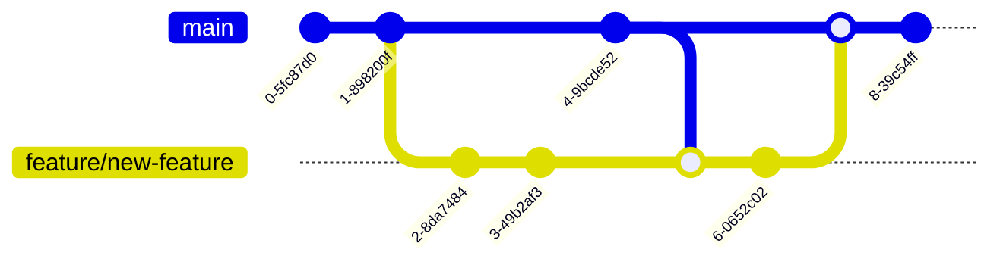

# Contributing to QLLM

First off, thank you for considering contributing to QLLM! It's people like you that make QLLM such a great tool.

## Table of Contents

- [Code of Conduct](#code-of-conduct)
- [Getting Started](#getting-started)
- [How Can I Contribute?](#how-can-i-contribute)
  - [Reporting Bugs](#reporting-bugs)
  - [Suggesting Enhancements](#suggesting-enhancements)
  - [Your First Code Contribution](#your-first-code-contribution)
  - [Pull Requests](#pull-requests)
- [Styleguides](#styleguides)
  - [Git Commit Messages](#git-commit-messages)
  - [JavaScript Styleguide](#javascript-styleguide)
  - [TypeScript Styleguide](#typescript-styleguide)
  - [Documentation Styleguide](#documentation-styleguide)
- [Project Structure](#project-structure)
- [Development Workflow](#development-workflow)
- [Feature Branch Process](#feature-branch-process)
- [Squash and Merge](#squash-and-merge)

## Code of Conduct

This project and everyone participating in it is governed by the [QLLM Code of Conduct](CODE_OF_CONDUCT.md). By participating, you are expected to uphold this code. Please report unacceptable behavior to [raphael.mansuy@quantalogic.app](mailto:raphael.mansuy@quantalogic.app).

## Getting Started

1. Fork the repository on GitHub
2. Clone your fork locally
   ```bash
   git clone https://github.com/your-username/qllm.git
   cd qllm
   ```
3. Install dependencies
   ```bash
   pnpm install
   ```
4. Create a branch for your feature or fix
   ```bash
   git checkout -b feature/your-feature-name
   ```

## How Can I Contribute?

### Reporting Bugs

- Ensure the bug was not already reported by searching on GitHub under [Issues](https://github.com/quantalogic/qllm/issues).
- If you're unable to find an open issue addressing the problem, [open a new one](https://github.com/quantalogic/qllm/issues/new). Be sure to include a title and clear description, as much relevant information as possible, and a code sample or an executable test case demonstrating the expected behavior that is not occurring.

### Suggesting Enhancements

- Open a new issue with a clear title and detailed description of the suggested enhancement.
- Provide any relevant examples or mock-ups if applicable.

### Your First Code Contribution

Unsure where to begin contributing to QLLM? You can start by looking through these `beginner` and `help-wanted` issues:

- [Beginner issues](https://github.com/quantalogic/qllm/labels/beginner) - issues which should only require a few lines of code, and a test or two.
- [Help wanted issues](https://github.com/quantalogic/qllm/labels/help%20wanted) - issues which should be a bit more involved than `beginner` issues.

### Pull Requests

1. Ensure any install or build dependencies are removed before the end of the layer when doing a build.
2. Update the README.md with details of changes to the interface, this includes new environment variables, exposed ports, useful file locations and container parameters.
3. Increase the version numbers in any examples files and the README.md to the new version that this Pull Request would represent. The versioning scheme we use is [SemVer](http://semver.org/).
4. You may merge the Pull Request in once you have the sign-off of two other developers, or if you do not have permission to do that, you may request the second reviewer to merge it for you.

## Styleguides

### Git Commit Messages

- Use the present tense ("Add feature" not "Added feature")
- Use the imperative mood ("Move cursor to..." not "Moves cursor to...")
- Limit the first line to 72 characters or less
- Reference issues and pull requests liberally after the first line

### JavaScript Styleguide

All JavaScript must adhere to [JavaScript Standard Style](https://standardjs.com/).

### TypeScript Styleguide

- Use TypeScript for all new code
- Follow the [TypeScript Deep Dive Style Guide](https://basarat.gitbook.io/typescript/styleguide)
- Naming Conventions:
  - Use kebab-case for file names (e.g., `my-component.ts`)
  - Use camelCase for variable and function names (e.g., `myVariable`, `myFunction()`)
  - Use UpperCamelCase (PascalCase) for classes, types, and interfaces (e.g., `MyClass`, `MyType`, `MyInterface`)

### Documentation Styleguide

- Use [Markdown](https://daringfireball.net/projects/markdown/) for documentation.
- Reference functions, classes, and modules in backticks.

## Project Structure

```
qllm/
├── packages/
│   ├── qllm-core/
│   ├── qllm-cli/
│   └── ...
├── docs/
├── tests/
└── ...
```

- Place new features or fixes in the appropriate package under `packages/`.
- Add tests for your changes in the `tests/` directory.
- Update documentation in the `docs/` directory if necessary.
## Feature Branch Process

We use a feature branch process for development. Here's a visual representation of the process:



1. Create a new branch for your feature or fix.
2. Make your changes in the appropriate package(s).
3. Write or update tests for your changes.
4. Ensure all tests pass by running `pnpm run test`.
5. Update documentation if necessary.
6. Create a changeset to document your changes:
   ```bash
   pnpm changeset
   ```
7. Commit your changes and push to your fork.
8. Open a pull request with a clear title and description.

## How to apply the Feature Branch process

1. Create a new branch from `main` for your feature or fix:
   ```bash
   git checkout -b feature/your-feature-name
   ```
   Use a descriptive name for your branch, prefixed with `feature/` for new features or `fix/` for bug fixes.

2. Develop your feature or fix on this branch, making regular commits.

3. Keep your feature branch updated with the latest changes from `main`:
   ```bash
   git checkout main
   git pull origin main
   git checkout feature/your-feature-name
   git merge main
   ```

4. When your feature is complete, push your branch to your fork and create a pull request.


## Squash and Merge

When your pull request is approved and ready to be merged:

1. We use the "Squash and merge" strategy to keep our commit history clean.
2. All commits in your feature branch will be combined into a single commit.
3. Write a clear and concise commit message for the squashed commit, summarizing the changes.
4. The commit message should follow our [Git Commit Messages](#git-commit-messages) guidelines.
5. After squashing and merging, delete your feature branch.

This process helps maintain a clean and readable commit history in the main branch.

### Detailled explanation of "Squash and Merge"

Here's a visual representation of the process:


1. All commits in your feature branch (C, D, E) will be combined into a single commit (F).
2. Write a clear and concise commit message for the squashed commit, summarizing the changes.
3. The commit message should follow our [Git Commit Messages](#git-commit-messages) guidelines.
4. After squashing and merging, delete your feature branch.

This process helps maintain a clean and readable commit history in the main branch. Here's what happens:

- Commits A and B represent the state of the main branch.
- Commits C, D, and E are individual commits in your feature branch.
- Commit F is the result of squashing commits C, D, and E into a single commit on the main branch.
- Commit G represents subsequent work on the main branch.

When squashing:

1. Combine all the commit messages from your feature branch into a single, comprehensive message.
2. Ensure the squashed commit message clearly describes all the changes introduced by your feature.
3. Reference any relevant issue numbers in the commit message.

Example of a good squashed commit message:

```
Implement user authentication feature (#123)

- Add login and registration forms
- Implement JWT token-based authentication
- Create user profile page
- Add tests for authentication flow
- Update documentation with new auth endpoints
```

This strategy keeps the main branch's history clean and easy to follow, while still preserving the detailed development history in the pull request itself.


Thank you for contributing to QLLM!
