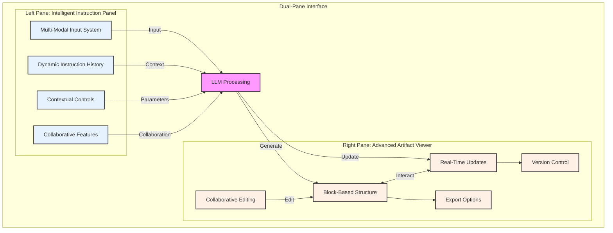
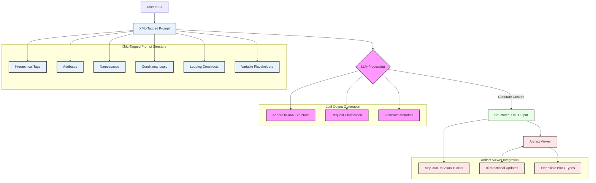

## The Evolution of LLM Chat Interfaces: Addressing Limitations and Envisioning Future Innovations

### Introduction

Imagine a world where your interaction with artificial intelligence is as intuitive and dynamic as your own thought process. A world where complex problem-solving, creative ideation, and collaborative work seamlessly blend with the power of Large Language Models (LLMs). This isn't a distant future—it's the potential we're on the brink of unlocking.

LLMs have revolutionized our interaction with artificial intelligence, offering unprecedented capabilities in natural language processing and generation. However, as these models become increasingly sophisticated, the interfaces we use to interact with them have struggled to keep pace. This disparity was aptly highlighted by Maxime LABONNE in a recent tweet:

> "2024: LLM chat interfaces are still ridiculously bad. There is no tree representation of the current conversation. You can't edit messages containing artifacts with Claude. Writing prompts is still 100% manual, and most users are terrible at it …"
> 

This article explores the current limitations of LLM chat interfaces, proposes innovative solutions to enhance user experience and productivity, and envisions the future of AI-human interactions. We'll examine the current state of interfaces, present detailed solutions with practical examples, and discuss their potential impact on various user groups and industries.

### The Current State and Limitations of LLM Chat Interfaces

Despite the remarkable capabilities of LLMs like GPT-4 and Claude, the interfaces we use to interact with them remain surprisingly rudimentary. Most chat interfaces offer a simple, linear conversation flow that fails to capture the complex, non-linear nature of human thought processes and problem-solving approaches. This limitation stems from how LLMs use chat history as their memory, relying on the entire conversation history to generate coherent responses.

### Key Limitations:

1. Lack of conversation visualization
2. Limited editing capabilities
3. Manual prompt engineering
4. Inflexible conversation flow
5. Poor adaptation to creative work workflows
6. Lack of task-specific optimizations

**Example:**
Imagine you are using an LLM chat interface to draft a report on renewable energy. You start by asking, "What are the key benefits of renewable energy?" The LLM responds with a list of benefits. You then ask, "Can you provide more details on the environmental benefits?" The LLM uses the previous conversation about renewable energy to generate a detailed response focusing on environmental benefits.

Later, you want to know about the economic benefits. You ask, "What are the economic benefits of renewable energy?" Here, the LLM again refers to the initial context of renewable energy and provides relevant information about economic benefits.

However, if you suddenly shift the topic and ask, "What are the challenges of implementing renewable energy in developing countries?" the LLM has to consider the entire conversation history to generate a coherent response. This reliance on the full chat history can make it difficult to isolate specific parts of the conversation or switch topics smoothly, leading to potential frustration in managing complex dialogues.

A software developer debugging a complex issue might start a conversation about a specific error, then branch into discussions about architecture, best practices, and alternative implementations. Current interfaces make it challenging to navigate this non-linear thought process effectively.

### User Personas

To better understand the impact of these limitations and the potential of proposed solutions, let's consider several user personas:

1. **The Developer**: Sarah, a software engineer working on complex systems
2. **The Business Analyst**: Michael, a strategic planner in a multinational corporation
3. **The Creative Professional**: Emma, a UX designer working on innovative interfaces
4. **The Researcher**: Dr. Chen, a scientist exploring cutting-edge renewable energy technologies

### Innovative Solutions for Enhanced User Experience

To address these limitations and unlock the full potential of LLMs, we propose the following solutions:

### 1. Tree-Based Conversation Visualization

Implementing a tree-based structure for conversations would allow users to visualize the flow of their interaction with the LLM. This could include:

- Interactive node-based representation of conversation turns
- Ability to create and navigate branches
- Collapsible/expandable sections for better organization
- Color-coding to differentiate user inputs from AI responses

**Example:**
A marketing strategist developing a campaign could use the tree structure to explore multiple concepts simultaneously. The main branch might focus on overall strategy, with sub-branches for different platforms (e.g., social media, email, PPC), target demographics, and creative directions. This allows for a comprehensive view of the entire campaign development process.

### 2. Advanced Editing Interface

To improve the editing of complex messages, especially those containing artifacts, we propose:

- A versioning system for edited messages
- Protected artifact zones within the editing interface
- Options to replace or remove artifacts without affecting surrounding text

**Example:**
A data analyst working with an LLM to generate and refine SQL queries could edit the natural language description of their data needs without accidentally altering the SQL syntax. The interface would protect the SQL code blocks while allowing free editing of the surrounding text.

### 3. AI-Assisted Prompt Engineering

To improve the quality of user prompts and reduce the learning curve, we suggest:

- AI-powered prompt suggestions based on user intent
- A library of customizable prompt templates for common tasks
- A visual prompt builder with drag-and-drop components
- Real-time feedback on prompt quality and potential improvements

**Example:**
A teacher preparing a lesson plan could start with a template for "Create an interactive history lesson." The AI might suggest adding components like "Include 3 discussion questions," "Add a timeline of events," or "Incorporate a role-playing scenario." As the teacher builds the prompt, the system provides real-time feedback on clarity and potential improvements.

### 4. Multi-Modal Interaction

Expanding beyond text-based interaction can significantly enhance the user experience:

- Voice-to-text and text-to-voice capabilities for hands-free interaction
- Image and sketch input for visual context

**Example:**
An interior designer could upload photos of a room, sketch potential layouts directly onto the image, and use voice commands to describe desired styles or color schemes. The LLM could then generate textual descriptions, suggest furniture arrangements, and even create mock-ups based on this multi-modal input.

### 5. Collaborative Conversation Spaces

For team environments, collaborative features could greatly enhance productivity:

- Shared conversation rooms for team brainstorming
- Real-time collaboration on conversation trees
- Task assignment and input requests within the chat
- Version control for collaborative prompts and responses

**Example:**
A game development team could use a collaborative space to brainstorm storylines. One team member might start a branch for character development, another for world-building, and a third for game mechanics. They could assign tasks like "Flesh out protagonist backstory" or "Design level 1 environment" within the chat, with the LLM assisting in generating and refining ideas across all branches.

### 6. Integrated Knowledge Management

To leverage the wealth of information generated through LLM interactions:

- Automatic categorization and tagging of conversation content
- Personal knowledge base that grows with each interaction
- Easy export and integration with external note-taking tools
- Smart search functionality across all past conversations and generated content

**Example:**
A scientific researcher could build a personal knowledge base over time. When discussing a new experiment with the LLM, the system could automatically surface relevant information from past conversations about similar methodologies, potential pitfalls, or related findings, enhancing the researcher's ability to design and execute studies effectively.

### A Dual-Pane Interface for Dynamic LLM Interaction

To address the complexities of LLM interactions and enhance user productivity, we propose an advanced dual-pane interface that separates the instruction process from content creation, while providing a rich, interactive environment for both input and output:

### Left Pane: Intelligent Instruction Panel

The left side serves as a sophisticated command center for LLM interaction:

1. Multi-Modal Input System:
a. Voice Memo Input:
    - Real-time transcription with speaker diarization
    - Emotion and tone analysis for context-aware responses
    - Support for multiple languages and accents
    
    b. Advanced Text Input Box:
    
    - Rich text editing with markdown support
    - Code syntax highlighting for multiple programming languages
    - Auto-completion and suggestion based on context and user history
    
    c. Sketch and Image Input:
    
    - Handwriting recognition for quick notes
    - Image-to-text functionality for extracting information from visuals
    - Sketch-to-diagram conversion for rapid ideation
2. Dynamic Instruction History:
    - Hierarchical view of past instructions and their outcomes
    - Ability to branch, merge, and reuse past instruction sequences
    - Semantic search functionality across all historical interactions
3. Contextual Controls:
    - Fine-grained control over LLM parameters (temperature, top-p, etc.)
    - Context length adjustment with visual representation of token usage
    - Domain-specific knowledge activation toggles (e.g., medical, legal, technical)
    - Persona selection for tailored LLM responses (e.g., expert, mentor, critic)
4. Collaborative Features:
    - Real-time co-editing of instructions with team members
    - Role-based access control for enterprise settings
    - Integration with project management tools for task alignment

### Right Pane: Advanced Artifact Viewer and Editor

The right side displays the generated content, or "Artifact," in a highly structured, interactive format:

1. Sophisticated Block-Based Structure:
a. Diverse Block Types:
    - Code Viewer: With syntax highlighting and linting
    - Sandboxed Code Runner: For safe execution of generated code
    - Sandboxed HTML, JavaScript, and CSS Environment: For web component previews
    - Markdown Viewer: With real-time rendering
    - Mermaid Diagram Viewer: For automatic visualization of diagrams and flowcharts
    - LaTeX Equation Renderer: For mathematical and scientific content
    - Interactive Data Visualization: For charts, graphs, and data exploration
    - 3D Model Viewer: For product designs or architectural concepts
    - Audio Waveform Viewer: For sound and music-related content
    - Timeline Viewer: For historical or project management content
    
    b. Block Identification and Management:
    
    - Unique naming system for each block (e.g., UUID or semantic identifiers)
    - Tagging system for easy categorization and retrieval
    - Drag-and-drop interface for block reorganization
    
    c. Hierarchical Block Structure:
    
    - Nested subblocks with collapsible/expandable views
    - Inheritance of properties and styles from parent blocks
    - Cross-referencing between blocks for complex document structures
2. Real-Time Updates and Interaction:
    - Live rendering of LLM outputs as they're generated
    - Interactive elements within blocks (e.g., adjustable parameters in data visualizations)
    - Bi-directional editing: changes in the viewer reflect in the instruction panel
3. Comprehensive Version Control:
    - Git-like version history with branching and merging capabilities
    - Visual diff tool for comparing versions
    - Automatic versioning with customizable checkpoint creation
4. Flexible Export and Integration Options:
    - Multi-format export: PDF, Markdown, HTML, various code formats, etc.
    - Template-based export for consistent styling across documents
    - Direct integration with popular tools (e.g., Jupyter Notebooks, VS Code, Google Docs)
    - API endpoints for programmatic access to artifacts
5. Collaborative Editing and Annotation:
    - Real-time multi-user editing with cursor presence
    - Commenting and discussion threads attached to specific blocks
    - Review and approval workflows for team projects

**Example:**
A data scientist working on a machine learning project could use the left pane to describe a complex data analysis task, upload relevant datasets, and specify the desired output format. The right pane would then display a series of blocks including:

- A markdown block explaining the analysis methodology
- A code block with the generated Python script for data processing
- An interactive data visualization block showing key insights
- A sandboxed code runner where the data scientist can tweak and execute the generated code
- A mermaid diagram illustrating the machine learning model architecture

As the data scientist refines their queries or adjusts parameters in the left pane, they would see the content in these blocks update in real-time, allowing for rapid iteration and exploration of different analytical approaches.



### Advanced XML-Tagged Prompting for Structured Output

To ensure highly structured and controllable output that maps directly to the Artifact Viewer, we propose an enhanced XML-tagged prompting system:

1. Prompt Structure:
    - Hierarchical XML tags corresponding to the block structure in the Artifact Viewer
    - Attributes within tags for fine-grained control over content generation
    - Namespace support for domain-specific tag sets
2. Dynamic Content Generation:
    - Conditional logic within XML structure (e.g., `<if>`, `<else>` tags)
    - Looping constructs for repetitive content (e.g., `<for>` tags)
    - Variable placeholders for dynamic content insertion
3. LLM Output Generation:
    - Strict adherence to the XML structure during content generation
    - Ability to request clarification or additional input if needed
    - Metadata generation alongside content (e.g., confidence scores, sources)
4. Seamless Integration with Artifact Viewer:
    - Direct mapping of XML structure to visual blocks
    - Bi-directional updates between XML and visual representation
    - Extensible system for defining new block types and their XML representations

**Example:**
A business analyst creating a comprehensive market report might use a sophisticated XML-tagged prompt like:

```xml
<market-report>
  <overview>
    Provide a concise overview of current market trends in renewable energy, highlighting key growth areas and challenges.
  </overview>

  <market-analysis>
    <sector name="solar">
      Analyze the global market size for solar energy, including growth projections for the next 5 years.
    </sector>
    <sector name="wind">
      Analyze the global market size for wind energy, including growth projections for the next 5 years.
    </sector>
  </market-analysis>

  <top-companies count="5">
    List and describe the top {count} companies in the renewable energy sector.
    <company-details>
      <data-point>Annual Revenue</data-point>
      <data-point>Market Share</data-point>
      <data-point>R&D Investment</data-point>
    </company-details>
    <innovations count="3">
      Highlight {count} significant projects or innovations by this company.
    </innovations>
  </top-companies>

  <challenges-and-solutions count="3">
    Identify {count} major challenges facing the renewable energy industry and propose potential solutions.
    <challenge>
      <description>Describe the challenge in detail.</description>
      <solutions count="2">
        Suggest {count} potential solutions to address this challenge.
      </solutions>
    </challenge>
  </challenges-and-solutions>

  <future-outlook timeframe="10 years">
    Provide a forward-looking analysis of the renewable energy sector for the next {timeframe}, considering technological advancements, policy changes, and market dynamics.
    <predictions count="5">
      List and explain {count} key predictions for the future of renewable energy.
    </predictions>
  </future-outlook>
</market-report>

```

The LLM would then generate content within this structured format, which would be automatically parsed and displayed in the Artifact Viewer. The business analyst could then interact with the generated content, drill down into specific sections, adjust visualizations, and refine the analysis through further prompts or direct editing.

This advanced dual-pane interface with sophisticated XML-tagged prompting represents a significant leap forward in LLM interaction, offering unprecedented control, flexibility, and productivity for complex analytical and creative tasks across various domains.



### Challenges and Considerations

While these innovations offer significant improvements, several challenges must be addressed:

1. Computational overhead of managing complex conversation structures
2. Ensuring accessibility for users with different levels of technical expertise
3. Maintaining privacy and security in collaborative environments
4. Balancing flexibility with ease of use

**Example:**
A large enterprise implementing these advanced interfaces would need to consider how to securely manage collaborative spaces where sensitive business information is discussed, while also ensuring that less tech-savvy employees can easily navigate the new features.

### Impact on Different User Groups

These improvements would significantly impact various user groups:

- Developers: Enhanced ability to explore code solutions and debug issues
- Business Professionals: More efficient decision-making and strategy development
- Creative Workers: Improved ideation and content creation workflows
- Researchers: Better organization and retrieval of complex information

**Example:**
A UX designer could use the tree-based visualization to explore multiple design concepts simultaneously, branching off to consider different user personas, interface layouts, and color schemes. The multi-modal input would allow them to sketch ideas directly into the chat, while the knowledge management system could surface relevant design principles or user research from past projects.

### Conclusion

The current limitations of LLM chat interfaces present a significant opportunity for innovation. By implementing solutions such as tree-based visualization, AI-assisted prompt engineering, multi-modal interaction, and adaptive interfaces, we can create more intuitive, efficient, and powerful tools for leveraging the capabilities of large language models.

As LLMs continue to evolve, it's crucial that our interfaces evolve alongside them, ensuring that we can harness the full potential of these remarkable AI systems. The future of LLM chat interfaces lies in creating flexible, intelligent, and user-centric designs that adapt to individual needs while facilitating complex, non-linear thought processes.

By addressing the current limitations and implementing innovative solutions, we can usher in a new era of AI-human interaction that is more natural, efficient, and productive than ever before. This evolution will not only enhance user experience but also unlock new possibilities for creativity, problem-solving, and collaboration across various fields and industries.

The journey towards advanced LLM chat interfaces is not just about technological advancement; it's about reimagining how humans and AI can work together to tackle complex challenges and push the boundaries of what's possible. As we continue to refine these interfaces, we must remain mindful of ethical considerations, ensuring that our innovations serve to empower and augment human capabilities rather than replace them.

In the coming years, we can expect to see LLM chat interfaces that seamlessly blend with our physical and digital environments, adapting to our needs and preferences in real-time. These interfaces will become indispensable tools in fields ranging from scientific research and education to creative arts and business strategy.

The future of LLM chat interfaces is bright, filled with possibilities for enhancing human potential and driving innovation across all sectors of society. As we move forward, it is essential that researchers, developers, and users collaborate to shape this future, ensuring that these powerful tools are developed and used responsibly, ethically, and for the benefit of all.