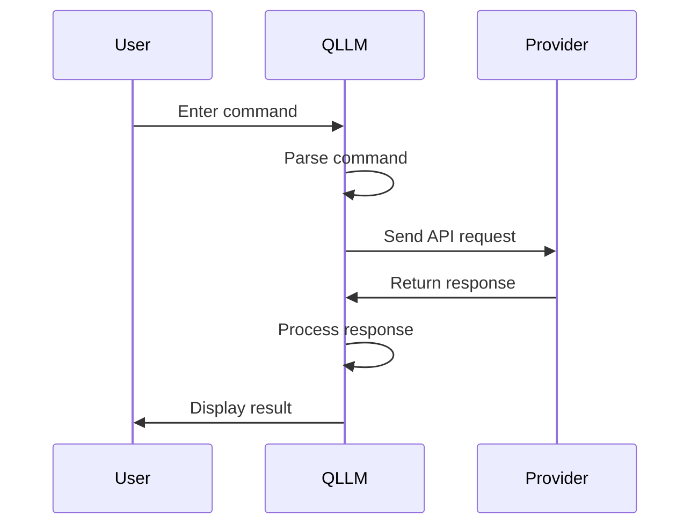

# QLLM for the Impatient: From Novice to Practitioner in Record Time

## Chapter 1: Introduction to QLLM

### Why QLLM?

Imagine you're a developer working on a complex project, juggling multiple tasks, and constantly seeking information to solve problems. You've heard about the power of Large Language Models (LLMs) like GPT-4, but the thought of switching between different interfaces, remembering various API calls, and managing multiple subscriptions makes your head spin. What if there was a single, powerful tool that could harness the capabilities of multiple LLMs right from your command line?

Enter QLLM, the Quantalogic Large Language Model CLI. It's not just another command-line interface; it's your Swiss Army knife for AI-powered productivity. But why should you care about QLLM? Let's break it down:

1. **Unified Access**: QLLM brings together multiple LLM providers under one roof. No more context-switching between different tools and APIs. Whether you're using OpenAI's GPT models, Anthropic's Claude, or any other supported provider, QLLM has got you covered.

2. **Command-Line Power**: As a developer, you live in the terminal. QLLM integrates seamlessly into your existing workflow, allowing you to leverage AI without leaving your comfort zone.

3. **Flexibility and Customization**: Every project is unique, and QLLM understands that. With its extensive configuration options and support for custom templates, you can tailor the AI interactions to your specific needs.

4. **Time-Saving Features**: From quick one-off queries to ongoing conversations, QLLM is designed to help you get answers fast. Features like conversation management and clipboard integration save you precious time in your day-to-day tasks.

5. **Cross-Platform Compatibility**: Whether you're on Windows, macOS, or Linux, QLLM works consistently across platforms, ensuring you have the same powerful toolset regardless of your operating system.

The need for a unified CLI for LLMs has never been more apparent. As AI technologies continue to evolve and proliferate, having a single, extensible tool that can adapt to these changes is invaluable. QLLM isn't just keeping up with the AI revolution; it's putting you in the driver's seat.

### What is QLLM?

Now that we've piqued your interest, let's dive into what QLLM actually is. QLLM, short for Quantalogic Large Language Model CLI, is a command-line interface designed to interact with various Large Language Models. It's more than just a wrapper around APIs; it's a comprehensive toolbox for AI-assisted development and problem-solving.

Key features of QLLM include:

1. **Multi-Provider Support**: Seamlessly switch between LLM providers like OpenAI and Anthropic.
2. **Interactive Chat Sessions**: Engage in dynamic, context-aware conversations with LLMs.
3. **One-Time Querying**: Quickly get answers to standalone questions without initiating a full chat session.
4. **Image Analysis**: Analyze images from local files, URLs, clipboard, or even capture screenshots directly.
5. **Customizable Model Parameters**: Fine-tune AI behavior with adjustable settings like temperature and max tokens.
6. **Conversation Management**: Save, list, load, and delete chat histories for easy reference and continuation.
7. **Template System**: Use and create templates for common tasks and workflows.
8. **Cross-Platform Support**: Run QLLM on Windows, macOS, or Linux with consistent behavior.

Think of QLLM as your AI-powered command-line assistant. It's there when you need to quickly look up information, brainstorm ideas, analyze code, or even process images. With its rich feature set, QLLM adapts to your needs, whether you're working on a quick script or a complex project.

### How QLLM Works

To truly appreciate QLLM, it's helpful to understand its inner workings. At a high level, QLLM acts as an intermediary between you and various LLM providers. Here's a simplified overview of how QLLM operates:

1. **Command Parsing**: When you enter a command, QLLM parses it to understand your intent. Whether you're asking a question, starting a chat, or running a template, QLLM determines the appropriate action.

2. **Provider Selection**: Based on your configuration or command-line options, QLLM selects the appropriate LLM provider to handle your request.

3. **API Interaction**: QLLM constructs the necessary API calls, handling authentication and formatting the request according to the provider's specifications.

4. **Response Processing**: Once the LLM generates a response, QLLM processes it, applying any necessary formatting or post-processing steps.

5. **Output Display**: Finally, QLLM presents the results to you in a clear, readable format in your terminal.

This process happens seamlessly, often in a matter of seconds, giving you the power of advanced AI models at your fingertips.

Let's visualize this flow with a simple sequence diagram:



QLLM's architecture is designed to be modular and extensible. This means that as new LLM providers emerge or existing ones evolve, QLLM can easily adapt to incorporate these changes. You, as a user, benefit from this flexibility without having to learn new tools or APIs for each provider.

Now that you have a solid understanding of what QLLM is and how it works, are you ready to dive in and start using it? In the next chapter, we'll get you set up with QLLM and run your first command. Get ready to supercharge your command-line productivity with the power of AI!


## Chapter 2: Getting Started

### Installation

Before we dive into the exciting world of QLLM, let's get it installed on your system. Don't worry, it's easier than teaching a cat to fetch!

#### System Requirements

First, let's make sure your system is ready for QLLM:

- Node.js (version 16 or higher)
- npm (usually comes with Node.js)
- A terminal or command prompt
- An internet connection (QLLM needs to talk to the AI, after all!)

#### Step-by-Step Installation Guide

1. Open your terminal or command prompt.

2. Run the following command:

   ```bash
   npm install -g qllm
   ```

   This command tells npm to install QLLM globally on your system, making it available from any directory.

3. Wait for the installation to complete. You might see a progress bar and some text scrolling by. Don't panic, that's normal!

4. Once it's done, verify the installation by running:

   ```bash
   qllm --version
   ```

   You should see a version number (e.g., 1.8.0) displayed. If you do, congratulations! You've successfully installed QLLM.

Pro Tip: If you encounter any permission errors during installation, you might need to use `sudo` on Unix-based systems or run your command prompt as an administrator on Windows.

### Configuration

Now that QLLM is installed, let's get it configured. Think of this as teaching QLLM your preferences and giving it the keys to the AI kingdom.

#### Setting up API Keys

QLLM needs API keys to communicate with different LLM providers. Here's how to set them up:

1. Run the configuration command:

   ```bash
   qllm configure
   ```

2. You'll be prompted to enter API keys for different providers. Start with the one you plan to use most often (e.g., OpenAI).

3. When prompted, enter your API key. Don't worry, QLLM will keep it secret!

4. Repeat for any other providers you want to set up.

#### Configuring Default Settings

While you're in the configuration mode, you can also set up some default preferences:

1. Choose your default provider and model.
2. Set default values for parameters like temperature and max tokens.
3. Configure other settings like log level and custom prompt directory.

Here's an example of what this might look like:

```bash
$ qllm configure
? Default Provider: openai
? Default Model: gpt-4o-mini
? Temperature (0.0 to 1.0): 0.7
? Max Tokens: 150
? Log Level: info
```

Pro Tip: You can always change these settings later, either through the `qllm configure` command or directly in the configuration file located at `~/.qllmrc`.

### Your First QLLM Command

Enough setup, let's see QLLM in action! We'll start with a simple query to test the waters.

#### Running a Simple Query

1. In your terminal, type:

   ```bash
   qllm ask "What is the meaning of life, the universe, and everything?"
   ```

2. Press Enter and watch the magic happen!

#### Understanding the Output

QLLM will display the response from the AI. It might look something like this:

```
Assistant: The phrase "the meaning of life, the universe, and everything" is a reference to Douglas Adams' science fiction series "The Hitchhiker's Guide to the Galaxy." In the story, a supercomputer named Deep Thought is asked to calculate the answer to the "Ultimate Question of Life, the Universe, and Everything." After 7.5 million years of computation, it provides the answer: 42.

However, this is meant to be a humorous and absurdist take on the quest for meaning. The joke is that while we have an answer, we don't understand the question itself. This highlights the difficulty and perhaps futility of trying to reduce the complexity of existence to a simple, numerical answer.

In reality, the meaning of life is a philosophical question that has been debated for centuries. Different people and cultures have various beliefs about what gives life meaning, such as:

1. Pursuing happiness and well-being
2. Fulfilling a divine or cosmic purpose
3. Creating and appreciating art and beauty
4. Advancing knowledge and understanding
5. Helping others and making the world a better place
6. Experiencing love and forming relationships

Ultimately, many philosophers argue that the meaning of life is something each individual must determine for themselves based on their own values, experiences, and beliefs.

```

> 🧠 Pause and Reflect: What do you think about this response? How does it compare to what you might have gotten from a simple web search?

Now that you've run your first QLLM command, you've taken your first step into a larger world of AI-assisted computing. In the next chapter, we'll explore more of QLLM's core commands and how they can supercharge your productivity.

Ready to dive deeper? Let's move on to Chapter 3: Core QLLM Commands. To continue, just say "Continue with Chapter 3".


[9/4/2024, 7:56:27 PM] User: continue

---

[9/4/2024, 7:56:27 PM] Assistant: Excellent! Let's dive into the core commands of QLLM that will make you a power user in no time.

## Chapter 3: Core QLLM Commands

In this chapter, we'll explore the three fundamental commands that form the backbone of QLLM: `ask`, `chat`, and `run`. By mastering these, you'll be able to handle a wide range of tasks with ease.

### The 'ask' Command

The `ask` command is your go-to for quick, one-off questions. It's like having a knowledgeable assistant always ready to help.

#### Syntax and Options

The basic syntax for the `ask` command is:

```bash
qllm ask "Your question here"
```

But QLLM wouldn't be a power tool without options. Here are some key ones:

- `-p, --provider <provider>`: Specify the LLM provider (e.g., openai, anthropic)
- `-m, --model <model>`: Choose a specific model
- `-t, --max-tokens <number>`: Set maximum tokens for the response
- `--temperature <number>`: Adjust output randomness (0.0 to 1.0)
- `-i, --image <path>`: Include image files or URLs for analysis
- `-o, --output <file>`: Save the response to a file

#### Use Cases and Examples

1. Quick fact-checking:
   ```bash
   qllm ask "What year was the first Moon landing?"
   ```

2. Code explanation:
   ```bash
   qllm ask "Explain this Python code: print([x for x in range(10) if x % 2 == 0])"
   ```

3. Image analysis:
   ```bash
   qllm ask "What's in this image?" -i path/to/image.jpg
   ```

4. Language translation:
   ```bash
   qllm ask "Translate 'Hello, world!' to French, Spanish, and Japanese"
   ```

Pro Tip: Use the `-s` or `--stream` option to see the response as it's being generated, great for longer outputs!

### The 'chat' Command

While `ask` is perfect for quick queries, `chat` is where QLLM really shines. It allows you to have multi-turn conversations, maintaining context throughout.

#### Starting and Managing Conversations

To start a chat session:

```bash
qllm chat
```

Once in a chat session, you can use various commands:

- `/help`: Display available commands
- `/new`: Start a new conversation
- `/save`: Save the current conversation
- `/load <id>`: Load a saved conversation
- `/list`: Show all messages in the current conversation

#### Advanced Chat Features

1. Switching providers mid-conversation:
   ```
   /provider anthropic
   ```

2. Adjusting model parameters:
   ```
   /set temperature 0.8
   ```

3. Adding images to the conversation:
   ```
   /image path/to/image.jpg
   ```

4. Running a template within chat:
   ```
   /run code-review
   ```

### The 'run' Command

The `run` command allows you to execute predefined templates, streamlining complex or repetitive tasks.

#### Using Predefined Templates

To run a template:

```bash
qllm run <template_name_or_url>
```

For example:
```bash
qllm run https://raw.githubusercontent.com/quantalogic/qllm/main/prompts/chain_of_thought_leader.yaml
```

#### Creating Custom Templates

You can create your own templates as YAML files. Here's a simple example:

```yaml
name: "Simple Greeting"
description: "A template that generates a greeting"
input_variables:
  name:
    type: "string"
    description: "The name of the person to greet"
prompt: "Generate a friendly greeting for {{name}}."
```

Save this as `greeting.yaml` and run it with:

```bash
qllm run greeting.yaml
```

QLLM will prompt you for the `name` variable before executing the template.

 > 🧠 Pause and Reflect: How could you use custom templates to streamline your workflow? Think about repetitive tasks in your daily work that could benefit from AI assistance.

By mastering these three commands - `ask`, `chat`, and `run` - you've already become a QLLM power user. But we're not done yet! In the next chapter, we'll explore some of QLLM's advanced features that will take your AI-assisted productivity to the next level.

Ready to unlock even more potential? Let's move on to Chapter 4: Advanced Features. Just say "Continue with Chapter 4" to proceed.

---

[9/4/2024, 7:57:02 PM] User: continue

---

[9/4/2024, 7:57:02 PM] Assistant: Excellent! You're making great progress. Let's dive into some of QLLM's more advanced features that will truly set you apart as a power user.

## Chapter 4: Advanced Features

In this chapter, we'll explore three key advanced features of QLLM: working with images, leveraging multi-provider support, and customizing QLLM to fit your specific needs.

### Working with Images

QLLM's image analysis capabilities open up a whole new dimension of AI-assisted work. Whether you're a developer debugging UI issues, a designer seeking inspiration, or a data analyst working with visual data, QLLM's image features can be a game-changer.

#### Analyzing Images with QLLM

To analyze an image, you can use the `-i` or `--image` option with the `ask` command:

```bash
qllm ask "Describe what you see in this image" -i path/to/image.jpg
```

You can even analyze multiple images at once:

```bash
qllm ask "Compare these two images" -i image1.jpg -i image2.jpg
```

Pro Tip: QLLM supports various image formats including JPG, PNG, and even GIFs!

#### Capturing and Using Screenshots

One of QLLM's most powerful features is its ability to capture and analyze screenshots on the fly. This is incredibly useful for quick visual analyses without leaving your terminal.

To capture a screenshot:

```bash
qllm ask "What's wrong with this UI?" --screenshot
```

QLLM will capture your screen and send it to the AI for analysis.

You can also specify a particular display if you have multiple monitors:

```bash
qllm ask "Describe the graph on my second monitor" --screenshot 2
```

Anecdote: A developer once used this feature to quickly identify a misaligned element in their web application. Instead of switching between their IDE and browser repeatedly, they simply asked QLLM to analyze a screenshot, saving valuable debugging time.

### Multi-provider Support

QLLM's ability to work with multiple LLM providers gives you the flexibility to choose the best tool for each task.

#### Switching Between Providers

You can switch providers on the fly using the `-p` or `--provider` option:

```bash
qllm ask -p anthropic "Explain quantum computing"
```

#### Comparing Outputs from Different Models

One powerful way to leverage multi-provider support is to compare outputs:

```bash
qllm ask "Summarize the theory of relativity" -p openai -m gpt-4
qllm ask "Summarize the theory of relativity" -p anthropic -m claude-2
```

This allows you to see how different models approach the same task, potentially giving you more comprehensive or nuanced answers.

Pro Tip: Create aliases for your most used provider-model combinations to switch between them quickly.

### Customizing QLLM

QLLM is designed to be flexible and adaptable to your needs. Let's look at some ways to customize your QLLM experience.

#### Adjusting Model Parameters

Fine-tune the AI's behavior by adjusting parameters like temperature and max tokens:

```bash
qllm ask "Write a creative short story" --temperature 0.9 --max-tokens 500
```

Higher temperature (closer to 1.0) will result in more creative, diverse outputs, while lower temperature (closer to 0.0) will give more focused, deterministic responses.

#### Creating Aliases for Frequent Commands

You can create aliases in your shell for commands you use frequently. For example, in bash:

```bash
alias qllm-creative="qllm ask --temperature 0.9 --max-tokens 500"
```

Now you can use `qllm-creative "Write a poem about AI"` for quick creative tasks.

#### Custom Prompt Templates

Create your own prompt templates for complex or repetitive tasks. For example, a code review template might look like this:

```yaml
name: "Code Review"
description: "Analyzes code and provides improvement suggestions"
input_variables:
  code:
    type: "string"
    description: "The code to review"
  language:
    type: "string"
    description: "The programming language"
prompt: |
  You are an experienced software developer. Review the following {{language}} code and provide suggestions for improvement:

  ```{{language}}
  {{code}}
  ```

  Please consider:
  1. Code efficiency
  2. Readability
  3. Best practices
  4. Potential bugs

  Provide your feedback in a structured format with clear explanations.
```

Save this as `code_review.yaml` and use it with:

```bash
qllm run code_review.yaml
```

Pause and Reflect: How could you use custom templates to streamline your workflow? Think about repetitive tasks in your daily work that could benefit from AI assistance.

By mastering these advanced features, you're now equipped to tackle a wide range of tasks with QLLM. In our next chapter, we'll put all of this knowledge into practice with real-world scenarios.

Ready to see QLLM in action? Let's move on to Chapter 5: QLLM in Practice. Just say "Continue with Chapter 5" to proceed.

---

[9/4/2024, 7:57:46 PM] User: continue

---

[9/4/2024, 7:57:46 PM] Assistant: Fantastic! Now that you've mastered the advanced features of QLLM, let's see how to apply this knowledge to real-world scenarios. This chapter will demonstrate how QLLM can revolutionize your workflow across various domains.

## Chapter 5: QLLM in Practice

In this chapter, we'll explore three practical workflows that showcase the power and versatility of QLLM: a code analysis workflow, a content creation pipeline, and a data analysis assistant.

### Code Analysis Workflow

Let's start with a scenario that many developers face daily: code review and improvement.

#### Setting up a Code Review Template

First, let's create a more comprehensive code review template. Save this as `advanced_code_review.yaml`:

```yaml
name: "Advanced Code Review"
description: "Performs a detailed code review with specific focus areas"
input_variables:
  code:
    type: "string"
    description: "The code to review"
  language:
    type: "string"
    description: "The programming language"
  focus_areas:
    type: "array"
    description: "Specific areas to focus on during the review"
prompt: |
  As an expert {{language}} developer, please review the following code:

  ```{{language}}
  {{code}}
  ```

  Focus on the following areas:
  {{#each focus_areas}}
  - {{this}}
  {{/each}}

  Provide your analysis in the following format:
  1. Overall Code Quality (1-10 scale)
  2. Strengths
  3. Areas for Improvement
  4. Specific Recommendations
  5. Code Snippets (if applicable)

  Be thorough but concise in your review.
```

#### Integrating with Version Control

Now, let's create a shell script to automate the code review process using QLLM and git. Save this as `qllm_code_review.sh`:

```bash
#!/bin/bash

# Get the latest commit hash
COMMIT_HASH=$(git rev-parse HEAD)

# Get the files changed in the last commit
CHANGED_FILES=$(git diff-tree --no-commit-id --name-only -r $COMMIT_HASH)

# Loop through each changed file
for file in $CHANGED_FILES
do
    # Get the file extension (language)
    EXTENSION="${file##*.}"
    
    # Read the file content
    CONTENT=$(cat $file)
    
    # Run QLLM code review
    echo "Reviewing $file..."
    qllm run advanced_code_review.yaml \
        --variables "{\"code\": \"$CONTENT\", \"language\": \"$EXTENSION\", \"focus_areas\": [\"Performance\", \"Security\", \"Maintainability\"]}" \
        --output "review_${file}.md"
    
    echo "Review for $file saved in review_${file}.md"
done
```

Make the script executable with `chmod +x qllm_code_review.sh`, then run it after making commits to automatically review changed files.

This workflow demonstrates how QLLM can be seamlessly integrated into your development process, providing instant, AI-powered code reviews.

### Content Creation Pipeline

Next, let's look at how QLLM can assist in content creation, from ideation to drafting and editing.

#### Ideation Phase

Create a template for brainstorming ideas. Save this as `brainstorm_ideas.yaml`:

```yaml
name: "Content Brainstorming"
description: "Generates content ideas based on a topic and target audience"
input_variables:
  topic:
    type: "string"
    description: "The main topic or theme"
  audience:
    type: "string"
    description: "The target audience"
  content_type:
    type: "string"
    description: "The type of content (e.g., blog post, video script, social media)"
prompt: |
  As a creative content strategist, generate 5 unique content ideas for {{content_type}} about {{topic}} targeted at {{audience}}.

  For each idea, provide:
  1. A catchy title
  2. A brief description (2-3 sentences)
  3. Key points to cover
  4. Potential challenges or considerations
```

#### Content Drafting

Once you have your ideas, use QLLM to help draft the content. Here's an example of how to use the `ask` command for this:

```bash
qllm ask "Write an outline for a blog post titled 'The Future of AI in Healthcare' targeting healthcare professionals. Include an introduction, 3-4 main sections, and a conclusion." --max-tokens 500
```

#### Editing and Refinement

After drafting, use QLLM to help refine and edit your content:

```bash
qllm ask "Review and improve the following text, focusing on clarity, engagement, and proper use of technical terms for a healthcare professional audience: [Paste your draft here]" --max-tokens 1000
```

This pipeline showcases how QLLM can assist throughout the content creation process, from generating ideas to polishing the final product.

### Data Analysis Assistant

Finally, let's explore how QLLM can aid in data analysis tasks.

#### Querying and Summarizing Data

Imagine you have a CSV file with sales data. You can use QLLM to help interpret this data:

```bash
cat sales_data.csv | qllm ask "Analyze this CSV data. Provide a summary of total sales, top-selling products, and any notable trends. Format your response as a bulleted list."
```

#### Visualizing Results

While QLLM can't create visualizations directly, it can help you generate code for visualizations. For example:

```bash
qllm ask "Write a Python script using matplotlib to create a bar chart of monthly sales from the following data: [Paste your monthly sales data here]"
```

You can then save this script and execute it to generate your visualization.

Pro Tip: Combine QLLM with other CLI tools for a powerful data analysis pipeline. For example:

```bash
cat large_dataset.csv | awk -F',' '{print $2, $5}' | sort | uniq -c | sort -nr | head -n 10 | qllm ask "Analyze this data and explain what it shows. The format is: count column2_value column5_value"
```

This pipeline uses `awk` to extract specific columns, `sort` and `uniq` to find unique combinations, then passes the top 10 results to QLLM for analysis.

Pause and Reflect: How could you integrate QLLM into your current workflows? What repetitive tasks could be automated or enhanced using these techniques?

By exploring these practical applications, you've seen how QLLM can be a powerful tool in various scenarios. In our next and final chapter, we'll cover troubleshooting, best practices, and your next steps in mastering QLLM.

Ready to wrap up your QLLM journey? Let's move on to Chapter 6: Troubleshooting and Tips. Just say "Continue with Chapter 6" to proceed.


## Chapter 6: Troubleshooting and Tips

### Common Issues and Solutions

Even the most powerful tools can sometimes hiccup. Here are some common issues you might encounter with QLLM and how to resolve them:

1. **API Key Errors**
   
   Problem: You get an error message about invalid API keys.
   
   Solution: Double-check your API keys in the QLLM configuration:
   ```bash
   qllm configure --list
   ```
   If the keys are missing or incorrect, set them again:
   ```bash
   qllm configure --set apiKey.openai=your_api_key_here
   ```

2. **Rate Limiting**
   
   Problem: You're getting rate limit errors from the provider.
   
   Solution: Implement a retry mechanism with exponential backoff. Here's a simple bash function you can use:
   ```bash
   qllm_with_retry() {
     local max_attempts=5
     local attempt=1
     while [ $attempt -le $max_attempts ]; do
       if qllm "$@"; then
         return 0
       else
         echo "Attempt $attempt failed. Retrying in $((2**attempt)) seconds..."
         sleep $((2**attempt))
         ((attempt++))
       fi
     done
     echo "All attempts failed."
     return 1
   }
   ```
   Use it like this: `qllm_with_retry ask "Your question here"`

3. **Unexpected Output Format**
   
   Problem: The AI's response isn't formatted as expected.
   
   Solution: Be more specific in your prompts. For example:
   ```bash
   qllm ask "List the top 5 programming languages of 2023. Format your response as a numbered list, with each item on a new line."
   ```

4. **High Token Usage**
   
   Problem: You're using up your tokens quickly.
   
   Solution: Use the `--max-tokens` option to limit response length:
   ```bash
   qllm ask "Summarize War and Peace" --max-tokens 100
   ```

5. **Slow Performance**
   
   Problem: QLLM seems to be running slowly.
   
   Solution: If you're not using it already, try the streaming option (`-s` or `--stream`) to see responses as they're generated:
   ```bash
   qllm ask "Explain quantum computing" -s
   ```

### Best Practices

To get the most out of QLLM, keep these best practices in mind:

1. **Effective Prompt Engineering**
   - Be specific and clear in your prompts
   - Provide context when necessary
   - Use system messages to set the AI's role or behavior

   Example:
   ```bash
   qllm ask "You are an expert Python developer. Review this code for best practices and potential improvements: [Your code here]" --system-message "You are a senior software engineer with 10 years of Python experience."
   ```

2. **Managing Conversation Context**
   - In chat mode, use `/new` to start fresh conversations when switching topics
   - Use `/save` and `/load` to manage long-running conversations
   - Clear context when sensitive information has been discussed:
     ```
     /clear
     ```

3. **Leveraging Templates for Consistency**
   - Create templates for tasks you perform regularly
   - Share templates with your team for standardized workflows

4. **Combining QLLM with Other Tools**
   - Use pipes to feed data into QLLM:
     ```bash
     cat data.txt | qllm ask "Summarize this text"
     ```
   - Use QLLM's output as input for other tools:
     ```bash
     qllm ask "Generate a bash script to backup all .txt files" | bash
     ```

5. **Regular Updates**
   - Keep QLLM updated to access the latest features and bug fixes:
     ```bash
     npm update -g qllm
     ```

Pro Tip: Create aliases for your most-used QLLM commands in your shell configuration file (e.g., `.bashrc` or `.zshrc`):
```bash
alias qllm-summarize="qllm ask 'Summarize the following text in 3 bullet points:'"
```

### Conclusion and Next Steps

Congratulations! You've now mastered the essentials of QLLM and are well on your way to becoming a CLI AI wizard. Here's a quick recap of what we've covered:

1. Introduction to QLLM and its capabilities
2. Installation and basic configuration
3. Core commands: ask, chat, and run
4. Advanced features like image analysis and multi-provider support
5. Practical workflows for code review, content creation, and data analysis
6. Troubleshooting common issues and best practices

To continue your QLLM journey:

1. Experiment with different providers and models to find what works best for your needs
2. Create custom templates for your most common tasks
3. Explore integrating QLLM into your existing scripts and workflows
4. Join the QLLM community (check the project's GitHub page for links) to share tips and get help

Remember, the key to mastering QLLM is practice and experimentation. Don't be afraid to try new things and push the boundaries of what you can do with AI-assisted command-line tools.

Final Challenge: Within the next 24 hours, use QLLM to solve a real problem you're facing in your work or personal projects. It could be analyzing some data, drafting a document, or even helping debug a tricky piece of code. Share your experience with a colleague or in the QLLM community.

Thank you for joining me on this whirlwind tour of QLLM. Now go forth and command your AI assistant with confidence!

---
## Chapter 7: Beyond the Basics - Expanding Your QLLM Expertise

### Diving Deeper into QLLM

1. **Explore the QLLM Source Code**: If you're technically inclined, examining the QLLM source code can give you insights into its inner workings and might inspire you to contribute or create your own extensions.

2. **Create Complex Workflows**: Try combining multiple QLLM commands with other CLI tools to create sophisticated data processing or analysis pipelines.

3. **Experiment with Different Models**: Test the same prompts across different models and providers to understand their strengths and weaknesses.

### Integrating QLLM into Your Development Environment

1. **IDE Integration**: Look into ways to integrate QLLM into your preferred Integrated Development Environment (IDE). For example, you could create custom commands or shortcuts that invoke QLLM for code review or documentation tasks.

2. **CI/CD Pipeline Integration**: Explore how to incorporate QLLM into your Continuous Integration/Continuous Deployment (CI/CD) pipelines for automated code quality checks or documentation generation.

### Contributing to the QLLM Ecosystem

1. **Develop Custom Plugins**: If you find QLLM lacking a feature you need, consider developing a plugin to add that functionality.

2. **Share Your Templates**: Create and share useful templates with the QLLM community. This could be for code review, data analysis, content creation, or any other task you find QLLM helpful for.

3. **Write Tutorials or Blog Posts**: Share your experiences and unique use cases for QLLM. This helps the community grow and might inspire others to find innovative ways to use the tool.

### Staying Updated

1. **Follow QLLM Development**: Keep an eye on the QLLM GitHub repository for new releases, features, and discussions.

2. **Engage with the Community**: Participate in forums, social media groups, or local meetups related to AI and CLI tools. Share your QLLM knowledge and learn from others' experiences.

### Final Thoughts

Remember, mastering a tool like QLLM is an ongoing process. The field of AI is rapidly evolving, and new models and capabilities are constantly emerging. Stay curious, keep experimenting, and don't hesitate to push the boundaries of what's possible with AI-assisted command-line tools.

Your journey with QLLM is just beginning. Embrace the power of AI at your fingertips, and let your imagination guide you to new and exciting applications!

Thank you for your dedication to learning QLLM. If you have any specific questions or areas you'd like to explore further, feel free to ask!