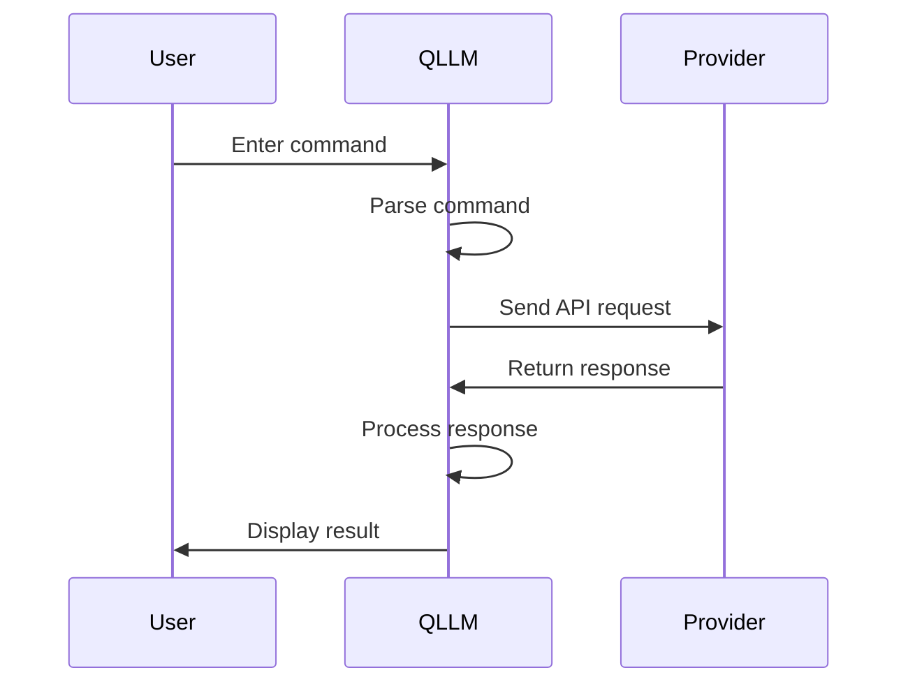

[9/4/2024, 7:55:12 PM] User: ## Who are you?

 You are the author of the QLLM CLI.

 You have a DRAFT documentation of the QLLM CLI and the source code in markdown format.


## Your task
  
Your task is to create a compelling, comprehensive, and practical article for a training course titled "QLLM for the Impatient: From Novice to Practitioner in Record Time".
The article must be 3000 words long and must be written in a way that engages and motivates impatient learners to master QLLM quickly and effectively.
Other instructions: 
### Recommendation you must follow

 - This article will be based on example first.
  - In order to make the reader engaged, you must always start with why ? then the what ? then the how ? and the when ?
    - Use annectode to help the reader to remember and increase engagements. 
    - The examples should leave the reader with a solid grasp of QLLM concepts they can immediately apply in practice.
    - Aim to make the example engaging and memorable.
    - You must provide as many examples as possible, the example must be given by increasing complexity.  
    - Throughout the article:
      - Use analogies and metaphors to explain complex ideas in relatable terms.
      - Incorporate interactive elements (e.g., "Pause and reflect" moments, quick quizzes) to enhance engagement and retention.
      - Include 'Pro Tips' that offer insider knowledge and shortcuts.
      - Address common misconceptions or pitfalls related to QLLM.
      Conclude with a powerful call-to-action, encouraging readers to apply their new knowledge immediately.
      - Provide a simple, actionable task they can complete within 24 hours of finishing the article.
    - Your goal is to leave readers feeling empowered and excited about QLLM, with a solid foundation of practical knowledge they can apply right away.  
      The article should be engaging enough to keep even the most impatient learner focused until the end.

### Format 
   
 -  Format the article using appropriate Markdown syntax, including headers (##, ###), bullet points, and code blocks where relevant.
 -  The format must be readable and easy to understand. Good readability is a must.
 -  Use Mermaid syntax diagrams in your article to illustrate complex concepts, processes, ideas, or relationships. (sequence, flowchart, gantt, state diagram, mindmap)

## Output
### Step 1: Assessment
Start by assessing if you have all the necessary information to start the article. And if you know the subject well enough to write about it.
If not, stop and explain that you cannot proceed to write the article.
Describe in a table what you know from the code and the documentation. 
| File | Description |  |------|--------------|

### Step 1.: Assessment 
Imagine some examples that you want to give in the article. The example must original and useful for the reader.
### Step 2: Detailed Outline
Write a detailed outline of the article, including chapter, the main sections, subsections, and key points to cover.
Format in as table with columns for "Chapter number", "Chapter description", "Section", "Subsection", and "Key Points".
| Chapter Number | Chapter description | Section  | Subsection | Key Points |
### Step 3: Writing a first draft
Write the article, following the structure and guidelines provided above. Chapter by chapter. Assure to include examples and interactive elements.
If you cannot finish the article in one sitting, gives instruction to the user to continue with the next chapter.
### Step 4: Write each a full chapter one by one
Write a full detailled chapter one by one, starting with the first one. 

 If you cannot finish the article in one sitting, gives instruction to the user to continue with the next chapter.

 ## DRAFT QLLM documentation in Markdown format

 # Table of Contents
- /Users/raphaelmansuy/Github/03-working/qllm/packages/qllm-cli/README.md
- /Users/raphaelmansuy/Github/03-working/qllm/packages/qllm-cli/src/qllm.ts
- /Users/raphaelmansuy/Github/03-working/qllm/packages/qllm-cli/src/index.ts
- /Users/raphaelmansuy/Github/03-working/qllm/packages/qllm-cli/src/types/configure-command-options.ts
- /Users/raphaelmansuy/Github/03-working/qllm/packages/qllm-cli/src/types/run-command-options.ts
- /Users/raphaelmansuy/Github/03-working/qllm/packages/qllm-cli/src/types/ask-command-options.ts
- /Users/raphaelmansuy/Github/03-working/qllm/packages/qllm-cli/src/types/chat-command-options.ts
- /Users/raphaelmansuy/Github/03-working/qllm/packages/qllm-cli/src/chat/utils.ts
- /Users/raphaelmansuy/Github/03-working/qllm/packages/qllm-cli/src/chat/chat.ts
- /Users/raphaelmansuy/Github/03-working/qllm/packages/qllm-cli/src/chat/command-processor.ts
- /Users/raphaelmansuy/Github/03-working/qllm/packages/qllm-cli/src/chat/image-manager.ts
- /Users/raphaelmansuy/Github/03-working/qllm/packages/qllm-cli/src/chat/chat-config.ts
- /Users/raphaelmansuy/Github/03-working/qllm/packages/qllm-cli/src/chat/config-manager.ts
- /Users/raphaelmansuy/Github/03-working/qllm/packages/qllm-cli/src/chat/message-handler.ts
- /Users/raphaelmansuy/Github/03-working/qllm/packages/qllm-cli/src/constants/config-constants.ts
- /Users/raphaelmansuy/Github/03-working/qllm/packages/qllm-cli/src/constants/index.ts
- /Users/raphaelmansuy/Github/03-working/qllm/packages/qllm-cli/src/utils/template-utils.ts
- /Users/raphaelmansuy/Github/03-working/qllm/packages/qllm-cli/src/utils/clipboard.ts
- /Users/raphaelmansuy/Github/03-working/qllm/packages/qllm-cli/src/utils/write-file.ts
- /Users/raphaelmansuy/Github/03-working/qllm/packages/qllm-cli/src/utils/validate-options.ts
- /Users/raphaelmansuy/Github/03-working/qllm/packages/qllm-cli/src/utils/common.ts
- /Users/raphaelmansuy/Github/03-working/qllm/packages/qllm-cli/src/utils/image-utils.ts
- /Users/raphaelmansuy/Github/03-working/qllm/packages/qllm-cli/src/utils/variable-utils.ts
- /Users/raphaelmansuy/Github/03-working/qllm/packages/qllm-cli/src/utils/cli-config-manager.ts
- /Users/raphaelmansuy/Github/03-working/qllm/packages/qllm-cli/src/utils/input-validator.ts
- /Users/raphaelmansuy/Github/03-working/qllm/packages/qllm-cli/src/commands/configure-command.ts
- /Users/raphaelmansuy/Github/03-working/qllm/packages/qllm-cli/src/commands/run-command.ts
- /Users/raphaelmansuy/Github/03-working/qllm/packages/qllm-cli/src/commands/chat-command.ts
- /Users/raphaelmansuy/Github/03-working/qllm/packages/qllm-cli/src/commands/ask-command.ts
- /Users/raphaelmansuy/Github/03-working/qllm/packages/qllm-cli/src/commands/list-command.ts
- /Users/raphaelmansuy/Github/03-working/qllm/packages/qllm-cli/src/chat/commands/list-models.ts
- /Users/raphaelmansuy/Github/03-working/qllm/packages/qllm-cli/src/chat/commands/list-providers.ts
- /Users/raphaelmansuy/Github/03-working/qllm/packages/qllm-cli/src/chat/commands/display-current-options.ts
- /Users/raphaelmansuy/Github/03-working/qllm/packages/qllm-cli/src/chat/commands/display-conversation.ts
- /Users/raphaelmansuy/Github/03-working/qllm/packages/qllm-cli/src/chat/commands/show-help.ts
- /Users/raphaelmansuy/Github/03-working/qllm/packages/qllm-cli/src/utils/screenshot/windows-screenshot-capture.ts
- /Users/raphaelmansuy/Github/03-working/qllm/packages/qllm-cli/src/utils/screenshot/utils.ts
- /Users/raphaelmansuy/Github/03-working/qllm/packages/qllm-cli/src/utils/screenshot/types.ts
- /Users/raphaelmansuy/Github/03-working/qllm/packages/qllm-cli/src/utils/screenshot/index.ts
- /Users/raphaelmansuy/Github/03-working/qllm/packages/qllm-cli/src/utils/screenshot/macos-screenshot-capture.ts
- /Users/raphaelmansuy/Github/03-working/qllm/packages/qllm-cli/src/utils/screenshot/linux-screenshot-capture.ts
- /Users/raphaelmansuy/Github/03-working/qllm/packages/qllm-cli/src/utils/io-manager/index.ts

## File: /Users/raphaelmansuy/Github/03-working/qllm/packages/qllm-cli/README.md

- Extension: .md
- Language: markdown
- Size: 16667 bytes
- Created: 2024-09-04 13:22:45
- Modified: 2024-09-04 13:22:45

### Code

```markdown
# QLLM: Quantalogic Large Language Model CLI & AI Toolbox üöÄ

## Table of Contents

1. [Introduction](#1-introduction)
2. [Features](#2-features)
3. [Installation](#3-installation)
4. [Configuration](#4-configuration)
5. [Usage](#5-usage)
6. [Advanced Features](#6-advanced-features)
7. [Command Reference](#7-command-reference)
8. [Examples](#8-examples)
9. [Troubleshooting](#9-troubleshooting)
10. [Contributing](#10-contributing)
11. [License](#11-license)
12. [Acknowledgements](#12-acknowledgements)

## 1. Introduction

Welcome to QLLM CLI, the ultimate command-line interface for seamless interaction with Large Language Models (LLMs). Crafted with passion by @quantalogic, QLLM CLI revolutionizes the way you engage with AI, offering a unified platform that supports multiple providers and empowers users with unparalleled flexibility.

In today's AI-driven landscape, QLLM CLI emerges as a game-changing solution for developers, researchers, and AI enthusiasts alike. Whether you're integrating AI into your workflow, exploring the frontiers of language models, or simply engaging in thought-provoking conversations with AI, QLLM CLI provides the robust toolkit you need.

Key Highlights:

-   Multi-provider support (OpenAI, Anthropic, and more)
-   Rich, interactive chat experiences with advanced conversation management
-   Efficient one-time question answering for quick insights
-   Cutting-edge image input capabilities for visual analysis tasks
-   Fine-grained control over model parameters for tailored responses
-   Comprehensive configuration options for a personalized experience

Embrace the future of AI interaction with QLLM CLI – your gateway to boundless possibilities in the world of language models.

## 2. Features

QLLM CLI boasts an impressive array of features designed to elevate your AI interaction experience:

1. **üåê Multi-provider Support**: Effortlessly switch between LLM providers like OpenAI and Anthropic, leveraging the unique strengths of various models and facilitating comparative analysis.

2. **💬 Interactive Chat Sessions**: Immerse yourself in dynamic, context-aware conversations with LLMs, complete with robust conversation history management.

3. **‚ùì One-time Question Answering**: Quickly obtain answers to standalone queries without the need for a full chat session.

4. **🖼️ Image Input Support**: Analyze images from multiple sources:

    - Local files on your system
    - URLs pointing to online images
    - Images from your clipboard
    - Screenshots captured directly through the CLI

5. **🎛️ Customizable Model Parameters**: Fine-tune AI behavior with adjustable settings:

    - Temperature
    - Max tokens
    - Top P
    - Frequency penalty
    - Presence penalty
    - Stop sequences

6. **🗂️ Conversation Management**: Efficiently save, list, load, and delete chat histories for easy reference and continuation of previous interactions.

7. **üìã Provider and Model Listing**: Easily view available providers and their associated models to make informed choices.

8. **🔄 Streaming Responses**: Experience real-time output for long-form content, enhancing interactivity.

9. **üíæ Output to File**: Save AI responses directly to your filesystem for future reference or processing.

10. **⚙️ Configurable Settings**: Tailor your QLLM CLI experience with a robust configuration system for managing defaults and API keys.

11. **🖥️ Cross-platform Compatibility**: Enjoy a consistent experience across Windows, macOS, and Linux.

12. **üì∏ Screenshot Capture**: Take screenshots directly from the CLI for immediate AI analysis.

13. **üé® Syntax Highlighting**: Benefit from colorized output for improved readability and a more pleasant user experience.

14. **🛡️ Error Handling and Validation**: Robust error checking and input validation ensure smooth operation and helpful error messages.

15. **üß© Extensible Architecture**: Modular design facilitates easy addition of new features and providers in the future.

## 3. Installation

To embark on your QLLM CLI journey, ensure you have Node.js (version 14 or higher) installed on your system. Then, execute the following command:

```bash
npm install -g qllm
```

This global installation makes the `qllm` command readily available in your terminal.

Verify the installation with:

```bash
qllm --version
```

You should see the version number (e.g., 1.8.0) displayed, confirming a successful installation.

## 4. Configuration

Before diving into the world of AI interactions, configure QLLM CLI with your API keys for the desired LLM providers. QLLM CLI offers flexible configuration management:

### Interactive Configuration

Initiate the interactive configuration mode:

```bash
qllm configure
```

This guided process helps you set up API keys and default preferences across several sections:

1. Provider Settings
    - Default Provider
    - Default Model
2. Model Parameters
    - Temperature
    - Max Tokens
    - Top P
    - Frequency Penalty
    - Presence Penalty
3. Other Settings
    - Log Level
    - Custom Prompt Directory
    - Stop Sequence

### Command-line Configuration

Usage: `qllm configure [options]`

Configure QLLM CLI settings.

Options:
-l, --list List all configuration settings
-s, --set <key=value> Set a configuration value
-g, --get <key> Get a configuration value
-h, --help Display help for command

This command allows you to manage configuration settings for the QLLM CLI.

Examples:

```bash
qllm configure --set provider=openai
qllm configure --set model=gpt-4
```

### Viewing Current Configuration

Display your current settings at any time:

```bash
qllm configure --list
```

This command shows all current settings, with API keys masked for security.

### Configuration File

QLLM CLI stores its configuration in a JSON file located at `~/.qllmrc`. While manual editing is possible, using the `configure` command is recommended for proper formatting and validation.

## 5. Usage

QLLM CLI offers a variety of commands for interacting with LLMs. Here's an overview of the primary usage patterns:

### Running Templates

QLLM CLI allows you to run templates directly. This is now the default behavior when no specific command is provided:

```bash
qllm <template_url>
```

For example:

```bash
qllm https://raw.githubusercontent.com/quantalogic/qllm/main/prompts/chain_of_tought_leader.yaml
```

The `run` command supports various options:

-   `-p, --provider <provider>`: Specify the LLM provider (default: openai)
-   `-m, --model <model>`: Choose a specific model
-   `-t, --max-tokens <number>`: Set maximum tokens for the response
-   `--temperature <number>`: Adjust output randomness (0.0 to 1.0)
-   `-s, --stream`: Stream the response in real-time
-   `-o, --output <file>`: Save the response to a file
-   `-i, --image <path>`: Include image files or URLs (can be used multiple times)
-   `--use-clipboard`: Use an image from your clipboard
-   `--screenshot <number>`: Capture and include a screenshot
-   `--system-message <message>`: Prepend a system message to the conversation

#### Using with Piped Input

```bash
echo "Explain quantum computing" | qllm ask
```

or

```bash
cat article.txt | qllm ask "Summarize this text"
```

#### Image Analysis

```bash
qllm ask "Describe this image" -i path/to/image.jpg
```

#### Streaming Responses

```bash
qllm ask "Write a short story about AI" -s
```

#### Saving Output to File

```bash
qllm ask "Explain the theory of relativity" -o relativity_explanation.txt
```

### Interactive Chat

Start an interactive chat session:

```bash
qllm chat
```

In chat mode, utilize various commands to manage your conversation:

-   `/help`: Display available commands
-   `/stop`: End the chat session
-   `/new`: Start a new conversation
-   `/save`: Save the current conversation
-   `/load`: Load a saved conversation
-   `/list`: Show all messages in the current conversation
-   `/clear`: Clear the current conversation
-   `/models`: List available models for the current provider
-   `/providers`: List available providers
-   `/options`: Display current chat options
-   `/set <option> <value>`: Set a chat option
-   `/image <path>`: Add an image to the conversation
-   `/clearimages`: Clear all images from the buffer
-   `/listimages`: List all images in the buffer
-   `/removeimage <path>`: Remove a specific image from the buffer

The `chat` command also supports options similar to the `ask` command for setting the provider, model, and other parameters.

### Listing Providers and Models

View available providers:

```bash
qllm list providers
```

List models for a specific provider:

```bash
qllm list models openai
```

The `list models` command offers several options:

-   `-f, --full`: Show full model details
-   `-s, --sort <field>`: Sort models by field (id, created)
-   `-r, --reverse`: Reverse sort order
-   `-c, --columns <columns>`: Select specific columns to display (comma-separated: id,description,created)

### Configuration Management

Manage your settings at any time:

```bash
qllm configure --set model gpt-4
qllm configure --get logLevel
qllm configure --list
```

## 6. Advanced Features

QLLM CLI offers sophisticated features for power users:

### Image Input

Include images in your queries for visual analysis:

```bash
qllm ask "Describe this image" -i path/to/image.jpg
```

QLLM CLI supports multiple image input methods:

1. Local file paths
2. URLs to online images
3. Images from the clipboard
4. Screenshots captured directly by the CLI

Use an image from your clipboard:

```bash
qllm ask "What's in this image?" --use-clipboard
```

Capture and use a screenshot:

```bash
qllm ask "Analyze this screenshot" --screenshot 0
```

Combine multiple image inputs:

```bash
qllm ask "Compare these images" -i image1.jpg -i image2.jpg --use-clipboard
```

### Streaming Responses

For long-form content, stream the output in real-time:

```bash
qllm ask "Write a short story about AI" -s
```

This feature allows you to see the AI's response as it's generated, providing a more interactive experience.

### Saving Output to File

Save the LLM's response directly to a file:

```bash
qllm ask "Explain the theory of relativity" -o relativity_explanation.txt
```

This is particularly useful for long responses or when you want to process the output further.

### Conversation Management

QLLM CLI provides robust conversation management features in chat mode:

-   Save conversations: `/save`
-   List saved conversations: `/conversations`
-   Load a saved conversation: `/load <conversation_id>`
-   Delete a conversation: `/delete <conversation_id>`
-   Clear the current conversation: `/clear`

These features allow you to maintain context across multiple chat sessions and organize your interactions with the AI.

## 7. Command Reference

Quick reference of main QLLM CLI commands:

-   `qllm ask <question>`: Ask a one-time question
-   `qllm chat`: Start an interactive chat session
-   `qllm configure`: Configure QLLM CLI settings
-   `qllm list providers`: List all available providers
-   `qllm list models <provider>`: List models for a specific provider

Each command supports various options. Use `qllm <command> --help` for detailed information on each command's options.

## 8. Examples

Explore these example use cases for QLLM CLI:

1. Creative Writing Assistance:

    ```bash
    qllm ask "Write a haiku about artificial intelligence"
    ```

2. Code Explanation:

    ```bash
    qllm ask "Explain this Python code: [paste your code here]"
    ```

3. Image Analysis:

    ```bash
    qllm ask "Describe the contents of this image" -i vacation_photo.jpg
    ```

4. Interactive Problem-Solving:

    ```bash
    qllm chat -p anthropic -m claude-2
    ```

5. Data Analysis:

    ```bash
    qllm ask "Analyze this CSV data: [paste CSV here]" --max-tokens 500
    ```

6. Language Translation:

    ```bash
    qllm ask "Translate 'Hello, world!' to French, Spanish, and Japanese"
    ```

7. Document Summarization:

    ```bash
    qllm ask "Summarize this article: [paste article text]" -o summary.txt
    ```

8. Character Creation:

    ```bash
    qllm ask "Create a detailed character profile for a sci-fi novel"
    ```

9. Recipe Generation:

    ```bash
    qllm ask "Create a recipe using chicken, spinach, and feta cheese"
    ```

10. Workout Planning:
    ```bash
    qllm ask "Design a 30-minute HIIT workout routine"
    ```

## 9. Troubleshooting

If you encounter issues while using QLLM CLI, try these troubleshooting steps:

1. Verify your API keys are correctly configured:

    ```bash
    qllm configure --list
    ```

    Ensure that your API keys are set for the providers you're trying to use.

2. Check your internet connection. QLLM CLI requires an active internet connection to communicate with LLM providers.

3. Update to the latest version of QLLM CLI:

    ```bash
    npm update -g qllm
    ```

4. Ensure you're using a supported Node.js version (14 or higher).

5. For image input issues, verify that the image files exist and are in a supported format (jpg, jpeg, png, gif, bmp, webp).

6. For clipboard-related issues, ensure your system's clipboard is functioning correctly.

7. If you're experiencing problems with a specific provider or model, try using a different one to isolate the issue.

If problems persist, please open an issue on our GitHub repository with a detailed description of the problem, steps to reproduce it, and any relevant error messages or logs.

## 10. Contributing

We warmly welcome contributions to QLLM CLI! To contribute, please follow these steps:

1. Fork the repository on GitHub.
2. Clone your forked repository to your local machine.
3. Create a new branch for your feature or bug fix.
4. Make your changes, adhering to the existing code style and conventions.
5. Write tests for your changes if applicable.
6. Run the existing test suite to ensure your changes don't introduce regressions:
    ```bash
    npm test
    ```
7. Commit your changes with a clear and descriptive commit message.
8. Push your changes to your fork on GitHub.
9. Create a pull request from your fork to the main QLLM CLI repository.

Please ensure your code adheres to our coding standards:

-   Use TypeScript for type safety.
-   Follow the existing code style (we use Prettier for formatting).
-   Write unit tests for new features.
-   Update documentation as necessary, including this README if you're adding or changing features.

We use GitHub Actions for CI/CD, so make sure your changes pass all automated checks.

## 11. License

This project is licensed under the Apache License, Version 2.0. You may obtain a copy of the License at

http://www.apache.org/licenses/LICENSE-2.0

Unless required by applicable law or agreed to in writing, software distributed under the License is distributed on an "AS IS" BASIS, WITHOUT WARRANTIES OR CONDITIONS OF ANY KIND, either express or implied. See the License for the specific language governing permissions and limitations under the License.

## 12. Acknowledgements

We extend our heartfelt gratitude to the developers and maintainers of:

-   [Commander.js](https://github.com/tj/commander.js/): For robust command-line interfaces
-   [Prompts](https://github.com/terkelg/prompts): For interactive command-line user interfaces
-   [Kleur](https://github.com/lukeed/kleur): For adding vibrant colors to our CLI output
-   [Nanospinner](https://github.com/usmanyunusov/nanospinner): For elegant loading spinners

## Why We Created QuantaLogic

The potential of generative AI is immense, yet its practical application remains a challenge for many organizations. At QuantaLogic, we believe that the true value of AI lies not in its theoretical capabilities, but in its ability to solve real-world business problems efficiently and effectively.

We created QuantaLogic because we identified a significant gap between the advanced AI models developed by industry leaders like OpenAI, Anthropic, and Mistral, and their practical implementation in everyday business processes. Our mission is to bridge this gap, making the power of generative AI accessible and actionable for businesses of all sizes.

QLLM CLI is a testament to this mission, providing a versatile and user-friendly tool that empowers users to harness the full potential of various LLMs through a single, unified interface. By simplifying the interaction with these powerful AI models, we aim to accelerate innovation and drive efficiency across industries.

Join us in our journey to democratize AI and unlock its transformative potential for businesses worldwide.

```

## File: /Users/raphaelmansuy/Github/03-working/qllm/packages/qllm-cli/src/qllm.ts

- Extension: .ts
- Language: typescript
- Size: 6090 bytes
- Created: 2024-09-04 12:54:05
- Modified: 2024-09-04 12:54:05

### Code

```typescript
#!/usr/bin/env node

import { Command } from "commander";
import { listCommand } from "./commands/list-command";
import { CliConfigManager } from "./utils/cli-config-manager";
import { configureCommand } from "./commands/configure-command";
import { runActionCommand } from "./commands/run-command";
import { readFileSync } from "fs";
import { IOManager } from "./utils/io-manager";
import { askCommandAction } from "./commands/ask-command";
import { chatAction } from "./commands/chat-command";

import path from "path";

declare var __dirname: string; //eslint-disable-line
declare var process: NodeJS.Process; //eslint-disable-line

// Read version from package.json
const packageJson = JSON.parse(
    readFileSync(path.resolve(__dirname, "..", "package.json"), "utf-8"),
);

const VERSION = packageJson.version;

const ioManager = new IOManager();

export async function main() {
    try {

        const configManager = CliConfigManager.getInstance();

        await configManager.ensureConfigFileExists();
        await configManager.load();

        const program = new Command();

        program
            .version(VERSION)
            .description(
                "Multi-Provider LLM Command CLI - qllm. Created with ❤️ by @quantalogic.",
            )
            .option(
                "--log-level <level>",
                "Set log level (error, warn, info, debug)",
            )
            .option("-p, --provider <provider>", "LLM provider to use")
            .option("-m, --model <model>", "Specific model to use")
            .option(
                "--max-tokens <maxTokens>",
                "Maximum number of tokens to generate",
                parseInt,
            )
            .option(
                "--temperature <temperature>",
                "Temperature for response generation",
                parseFloat,
            );


        // Set the run command as the default command
        program
            .argument("[template]", "Template name, file path, or URL")
            .option(
                "-t, --type <type>",
                "Template source type (file, url, inline)",
                "file",
            )
            .option(
                "-v, --variables <variables>",
                "Template variables in JSON format",
            )
            .option("-s, --stream", "Stream the response")
            .option("-o, --output <output>", "Output file for the response")
            .option(
                "-e, --extract <variables>",
                "Variables to extract from the response, comma-separated",
            )
            .action(async (template, options, command) => {
                if (!template) {
                    command.help();
                } else {
                    const globalOptions = program.opts();
                    const mergedOptions = { ...globalOptions, ...options };
                    await runActionCommand(template, mergedOptions);
                }
            });

        // Modify the chat command definition
        program
            .command("chat")
            .description("Start an interactive chat session with an LLM")
            .option(
                "--top-p <number>",
                "Top P value for response generation",
                parseFloat,
            )
            .option(
                "--frequency-penalty <number>",
                "Frequency penalty for response generation",
                parseFloat,
            )
            .option(
                "--presence-penalty <number>",
                "Presence penalty for response generation",
                parseFloat,
            )
            .option(
                "--stop-sequence <sequence>",
                "Stop sequence for response generation",
                (value, previous) => previous.concat([value]),
                [] as string[],
            )
            .action((options) => {
                const globalOptions = program.opts();
                const mergedOptions = { ...globalOptions, ...options };
                chatAction(mergedOptions);
            });

        // Modify the ask command definition
        program
            .command("ask")
            .description("Ask a question to an LLM")
            .argument("<question>", "The question to ask")
            .option("-c, --context <context>", "Additional context for the question")
            .option("-i, --image <path>", "Path to image file, or URL (can be used multiple times)", (value, previous) => previous.concat([value]), [] as string[])
            .option("--use-clipboard", "Use image from clipboard", false)
            .option("--screenshot <display>", "Capture screenshot from specified display number", (value) => parseInt(value, 10))
            .option("-s, --stream", "Stream the response", false)
            .option("-o, --output <file>", "Output file for the response")
            .option("--system-message <message>", "System message to prepend to the conversation")
            .action((question, options) => {
                const globalOptions = program.opts();
                const mergedOptions = { ...globalOptions, ...options, question };
                askCommandAction(question, mergedOptions);
            });

        // Add other commands
        program.addCommand(listCommand);
        program.addCommand(configureCommand);

        // Set up the exit handler
        process.on("exit", (code) => {
            process.exit(code);
        });

        await program.parseAsync(process.argv);
    } catch (error) {
        ioManager.displayError(
            `An error occurred: ${(error as Error).message}`,
        );
        process.exit(1);
    } finally {
        try {
            // Any cleanup code if needed
        } catch (error) {
            ioManager.displayError(
                `An error occurred while saving the configuration: ${(error as Error).message}`,
            );
        }
    }
}

main().catch((error) => {
    ioManager.displayError(`Unhandled error: ${error}`);
    process.exit(1);
});

export default main;

```

## File: /Users/raphaelmansuy/Github/03-working/qllm/packages/qllm-cli/src/index.ts

- Extension: .ts
- Language: typescript
- Size: 185 bytes
- Created: 2024-09-03 12:42:53
- Modified: 2024-09-03 12:42:53

### Code

```typescript
#!/usr/bin/env node

import main from "./qllm";

main()
    .then(() => {})
    .catch((error) => {
        console.error("An error occurred:", error);
        process.exit(1);
    });

```

## File: /Users/raphaelmansuy/Github/03-working/qllm/packages/qllm-cli/src/types/configure-command-options.ts

- Extension: .ts
- Language: typescript
- Size: 2591 bytes
- Created: 2024-09-04 10:36:30
- Modified: 2024-09-04 10:36:30

### Code

```typescript
// packages/qllm-cli/src/types/config-types.ts

import { z } from "zod";

export const ConfigSchema = z.object({
    provider: z.string().optional(),
    model: z.string().optional(),
    logLevel: z.enum(["error", "warn", "info", "debug"]).default("info"),
    apiKeys: z.record(z.string()).optional(),
    customPromptDirectory: z.string().optional(),
    temperature: z.number().min(0).max(1).optional(),
    maxTokens: z.number().positive().optional(),
    topP: z.number().min(0).max(1).optional(),
    frequencyPenalty: z.number().min(-2).max(2).optional(),
    presencePenalty: z.number().min(-2).max(2).optional(),
    stopSequence: z.array(z.string()).optional(),
});

export type Config = z.infer<typeof ConfigSchema>;

export interface ConfigOption {
    name: string;
    type: "string" | "number" | "boolean" | "array";
    description: string;
    validator?: (value: any) => boolean;
}

export const CONFIG_OPTIONS: ConfigOption[] = [
    {
        name: "provider",
        type: "string",
        description: "Default LLM provider",
    },
    {
        name: "model",
        type: "string",
        description: "Default model for the selected provider",
    },
    {
        name: "logLevel",
        type: "string",
        description: "Log level (error, warn, info, debug)",
        validator: (value: string) =>
            ["error", "warn", "info", "debug"].includes(value),
    },
    {
        name: "customPromptDirectory",
        type: "string",
        description: "Custom directory for prompt templates",
    },
    {
        name: "temperature",
        type: "number",
        description: "Sampling temperature (0.0 to 1.0)",
        validator: (value: number) => value >= 0 && value <= 1,
    },
    {
        name: "maxTokens",
        type: "number",
        description: "Maximum number of tokens to generate",
        validator: (value: number) => value > 0,
    },
    {
        name: "topP",
        type: "number",
        description: "Top P sampling (0.0 to 1.0)",
        validator: (value: number) => value >= 0 && value <= 1,
    },
    {
        name: "frequencyPenalty",
        type: "number",
        description: "Frequency penalty (-2.0 to 2.0)",
        validator: (value: number) => value >= -2 && value <= 2,
    },
    {
        name: "presencePenalty",
        type: "number",
        description: "Presence penalty (-2.0 to 2.0)",
        validator: (value: number) => value >= -2 && value <= 2,
    },
    {
        name: "stopSequence",
        type: "array",
        description: "Stop sequences (comma-separated)",
    },
];

```

## File: /Users/raphaelmansuy/Github/03-working/qllm/packages/qllm-cli/src/types/run-command-options.ts

- Extension: .ts
- Language: typescript
- Size: 551 bytes
- Created: 2024-09-03 12:42:53
- Modified: 2024-09-03 12:42:53

### Code

```typescript
import { z } from "zod";

export const RunCommandOptionsSchema = z.object({
    type: z.enum(["file", "url", "inline"]).default("file").optional(),
    variables: z.string().optional(),
    provider: z.string().optional(),
    model: z.string().optional(),
    maxTokens: z.number().int().positive().optional(),
    temperature: z.number().min(0).max(1).optional(),
    stream: z.boolean().optional(),
    output: z.string().optional(),
    extract: z.string().optional(),
});

export type RunCommandOptions = z.infer<typeof RunCommandOptionsSchema>;

```

## File: /Users/raphaelmansuy/Github/03-working/qllm/packages/qllm-cli/src/types/ask-command-options.ts

- Extension: .ts
- Language: typescript
- Size: 3420 bytes
- Created: 2024-09-04 10:36:30
- Modified: 2024-09-04 10:36:30

### Code

```typescript
import { LLMProvider } from "qllm-lib";
import { z } from "zod";

/** Base Zod schema for the ask command options */
const BaseAskCommandOptionsSchema = z.object({
    /** Maximum number of tokens to generate */
    maxTokens: z.number().int().positive().optional(),

    /** Temperature for response generation */
    temperature: z.number().min(0).max(1).optional(),

    /** Whether to stream the response */
    stream: z.boolean().optional(),

    /** Output file for the response */
    output: z.string().optional(),

    /** System message to prepend to the conversation */
    systemMessage: z.string().optional(),

    /** Array of image paths, URLs, or 'screenshot' */
    image: z.array(z.string()).optional(),

    /** Whether to use clipboard for image input */
    useClipboard: z.boolean().optional(),

    /** Display number for screenshot capture */
    screenshot: z.number().int().optional(),
});

export const AskCommandOptionsPartialSchema =
    BaseAskCommandOptionsSchema.extend({
        provider: z.string().optional(), // LLM provider to use
        model: z.string().optional(), // Specific model to use
    });

export const AskCommandOptionsSchema = BaseAskCommandOptionsSchema.extend({
    provider: z.string(), // LLM provider to use
    model: z.string(), // Specific model to use
});

export type AskCommandOptions = z.infer<typeof AskCommandOptionsSchema>;

export type PartialAskCommandOptions = z.infer<
    typeof AskCommandOptionsPartialSchema
>;

/** Configuration for the ask command */
export interface AskConfig {
    /** Default provider to use */
    provider: string;

    /** Default model to use */
    model: string;

    /** Default maximum tokens */
    defaultMaxTokens: number;

    /** Default temperature */
    defaultTemperature: number;

    /** Default setting for using clipboard */
    defaultUseClipboard: boolean;

    /** Default display number for screenshot capture */
    defaultScreenshotDisplay?: number;
}

/** Context for executing the ask command */
export interface AskContext {
    /** The question to ask */
    question: string;

    /** Options for the ask command */
    options: AskCommandOptions;

    /** The LLM provider instance */
    provider: LLMProvider;

    /** Configuration for the ask command */
    config: AskConfig;
}

/** Result of the ask command execution */
export interface AskResult {
    /** The generated response */
    response: string;

    /** The model used for generation */
    model: string;

    /** Usage statistics */
    usage?: {
        promptTokens: number;
        completionTokens: number;
        totalTokens: number;
    };
}

/** Function type for executing the ask command */
export type AskExecutor = (context: AskContext) => Promise<AskResult>;

/** Function type for saving the response to a file */
export type ResponseSaver = (
    response: string,
    outputPath: string,
) => Promise<void>;

/** Function type for preparing image inputs */
export type ImageInputPreparer = (
    options: AskCommandOptions,
) => Promise<string[]>;

/** Function type for creating message content */
export type MessageContentCreator = (question: string, images: string[]) => any;

/** Function type for capturing a screenshot */
export type ScreenshotCapturer = (display?: number) => Promise<string>;

/** Function type for formatting file sizes */
export type BytesFormatter = (bytes: number) => string;

```

## File: /Users/raphaelmansuy/Github/03-working/qllm/packages/qllm-cli/src/types/chat-command-options.ts

- Extension: .ts
- Language: typescript
- Size: 523 bytes
- Created: 2024-09-03 12:42:53
- Modified: 2024-09-03 12:42:53

### Code

```typescript
import { z } from "zod";

export const ChatCommandOptionsSchema = z.object({
    provider: z.string().optional(),
    model: z.string().optional(),
    maxTokens: z.number().int().positive().optional(),
    temperature: z.number().min(0).max(1).optional(),
    topP: z.number().min(0).max(1).optional(),
    frequencyPenalty: z.number().optional(),
    presencePenalty: z.number().optional(),
    stopSequence: z.array(z.string()).optional(),
});

export type ChatCommandOptions = z.infer<typeof ChatCommandOptionsSchema>;

```

## File: /Users/raphaelmansuy/Github/03-working/qllm/packages/qllm-cli/src/chat/utils.ts

- Extension: .ts
- Language: typescript
- Size: 5089 bytes
- Created: 2024-09-04 07:28:37
- Modified: 2024-09-04 07:28:37

### Code

```typescript
// packages/qllm-cli/src/chat/utils.ts
import fs from "fs/promises";
import path from "path";
import { createSpinner } from "nanospinner";
import { ioManager } from "../utils/io-manager";

export const utils = {
    async readLocalFile(filePath: string): Promise<string> {
        try {
            const fullPath = path.resolve(filePath);
            const content = await fs.readFile(fullPath, "utf-8");
            return content;
        } catch (error) {
            throw new Error(`Failed to read file: ${(error as Error).message}`);
        }
    },

    async writeLocalFile(filePath: string, content: string): Promise<void> {
        try {
            const fullPath = path.resolve(filePath);
            await fs.writeFile(fullPath, content, "utf-8");
        } catch (error) {
            throw new Error(
                `Failed to write file: ${(error as Error).message}`,
            );
        }
    },

    isValidUrl(string: string): boolean {
        try {
            new URL(string);
            return true;
        } catch (_) {
            return false;
        }
    },

    async withSpinner<T>(
        message: string,
        action: () => Promise<T>,
    ): Promise<T> {
        const spinner = createSpinner(message).start();
        try {
            const result = await action();
            spinner.success({ text: "Operation completed successfully" });
            return result;
        } catch (error) {
            spinner.error({
                text: `Operation failed: ${(error as Error).message}`,
            });
            throw error;
        }
    },

    truncateString(str: string, maxLength: number): string {
        if (str.length <= maxLength) return str;
        return str.slice(0, maxLength - 3) + "...";
    },

    formatBytes(bytes: number): string {
        if (bytes === 0) return "0 Bytes";
        const k = 1024;
        const sizes = ["Bytes", "KB", "MB", "GB", "TB"];
        const i = Math.floor(Math.log(bytes) / Math.log(k));
        return parseFloat((bytes / Math.pow(k, i)).toFixed(2)) + " " + sizes[i];
    },

    delay(ms: number): Promise<void> {
        return new Promise((resolve) => setTimeout(resolve, ms));
    },

    async retryOperation<T>(
        operation: () => Promise<T>,
        maxRetries: number = 3,
        delayMs: number = 1000,
    ): Promise<T> {
        for (let i = 0; i < maxRetries; i++) {
            try {
                return await operation();
            } catch (error) {
                if (i === maxRetries - 1) throw error;
                ioManager.displayWarning(
                    `Operation failed, retrying in ${delayMs}ms...`,
                );
                await this.delay(delayMs);
            }
        }
        throw new Error("Max retries reached");
    },

    sanitizeFilename(filename: string): string {
        return filename.replace(/[^a-z0-9]/gi, "_").toLowerCase();
    },

    getFileExtension(filename: string): string {
        return path.extname(filename).slice(1).toLowerCase();
    },

    isImageFile(filename: string): boolean {
        const imageExtensions = ["jpg", "jpeg", "png", "gif", "bmp", "webp"];
        return imageExtensions.includes(this.getFileExtension(filename));
    },

    // New utility functions for conversation management

    formatConversationSummary(conversation: {
        id: string;
        createdAt: Date;
        messages: any[];
    }): string {
        const { id, createdAt, messages } = conversation;
        const messageCount = messages.length;
        const firstMessage = messages[0]?.content?.text || "No messages";
        return `ID: ${id} | Created: ${createdAt.toLocaleString()} | Messages: ${messageCount} | First message: ${this.truncateString(
            firstMessage,
            50,
        )}`;
    },

    formatMessageContent(content: any): string {
        if (typeof content === "string") {
            return content;
        } else if (content.type === "text") {
            return content.text;
        } else if (content.type === "image_url") {
            return `[Image: ${content.url}]`;
        } else {
            return JSON.stringify(content);
        }
    },

    formatConversationMessage(message: {
        role: string;
        content: any;
        timestamp?: Date;
    }): string {
        const { role, content, timestamp } = message;
        const formattedContent = this.formatMessageContent(content);
        const timeString = timestamp
            ? `[${timestamp.toLocaleTimeString()}] `
            : "";
        return `${timeString}${
            role.charAt(0).toUpperCase() + role.slice(1)
        }: ${formattedContent}`;
    },

    async ensureDirectoryExists(dirPath: string): Promise<void> {
        try {
            await fs.mkdir(dirPath, { recursive: true });
        } catch (error) {
            if ((error as NodeJS.ErrnoException).code !== "EEXIST") {
                throw error;
            }
        }
    },

    generateUniqueId(): string {
        return Date.now().toString(36) + Math.random().toString(36).substr(2);
    },
};

```

## File: /Users/raphaelmansuy/Github/03-working/qllm/packages/qllm-cli/src/chat/chat.ts

- Extension: .ts
- Language: typescript
- Size: 5435 bytes
- Created: 2024-09-04 16:57:23
- Modified: 2024-09-04 16:57:23

### Code

```typescript
// packages/qllm-cli/src/chat/chat.ts
import { ConversationManager, LLMProvider, ChatMessage } from "qllm-lib";
import { createConversationManager, getLLMProvider } from "qllm-lib";
import { ChatConfig } from "./chat-config";
import { MessageHandler } from "./message-handler";
import { CommandProcessor } from "./command-processor";
import { IOManager } from "../utils/io-manager";
import { ConfigManager } from "./config-manager";
import { ioManager } from "../utils/io-manager";
import ImageManager from "./image-manager";

declare var process: NodeJS.Process; //eslint-disable-line

export class Chat {
    private conversationManager: ConversationManager;
    private conversationId: string | null = null;
    private config: ChatConfig;
    private messageHandler: MessageHandler;
    private commandProcessor: CommandProcessor;
    private ioManager: IOManager;
    private configManager: ConfigManager;
    private imageManager: ImageManager;

    constructor(
        private readonly providerName: string,
        private readonly modelName: string,
    ) {
        this.conversationManager = createConversationManager();
        this.config = ChatConfig.getInstance();
        this.imageManager = new ImageManager();
        this.configManager = new ConfigManager(this.config);
        this.messageHandler = new MessageHandler(
            this.conversationManager,
            this.configManager,
        );
        this.commandProcessor = new CommandProcessor();
        this.ioManager = new IOManager();
    }

    async initialize(): Promise<void> {
        try {
            await this.config.initialize();
            this.configManager.setProvider(this.providerName);
            this.configManager.setModel(this.modelName);
            ioManager.displaySuccess(
                `Chat initialized with ${this.providerName} provider and ${this.modelName} model.`,
            );
        } catch (error) {
            ioManager.displayError(
                `Failed to initialize chat: ${(error as Error).message}`,
            );
            process.exit(1);
        }
    }

    async start(): Promise<void> {
        await this.initialize();
        const conversation =
            await this.conversationManager.createConversation();
        this.conversationId = conversation.id;
        ioManager.displayInfo(
            "Chat session started. Type your messages or use special commands.",
        );
        ioManager.displayInfo("Type /help for available commands.");
        this.promptUser();
    }

    private async promptUser(): Promise<void> {
        try {
            const input = await this.ioManager.getUserInput("You: ");

            // Check if input is undefined (e.g., due to Ctrl+C)
            if (input === undefined) {
                process.exit(0);
            }

            if (input.trim() === "") {
                return;
            }

            if (input.startsWith("/")) {
                await this.handleSpecialCommand(input);
            } else {
                await this.sendUserMessage(
                    input,
                    this.imageManager.getImages(),
                );
            }
        } catch (error) {
            if (error instanceof Error) {
                ioManager.displayError(
                    `Error getting user input:  $error.message`,
                );
            } else {
                ioManager.displayError(
                    `Error getting user input:  ${String(error)}`,
                );
            }
        } finally {
            // Continue prompting the user
            this.promptUser();
        }
    }

    private async handleSpecialCommand(input: string): Promise<void> {
        try {
            const [command, ...args] = input.trim().split(/\s+/);
            if (!command) {
                ioManager.displayError("No command provided");
                return;
            }
            const cleanCommand = command.substring(1).toLowerCase();
            const context = {
                config: this.config,
                configManager: this.configManager,
                conversationId: this.conversationId,
                conversationManager: this.conversationManager,
                ioManager: this.ioManager,
                imageManager: this.imageManager,
            };
            await this.commandProcessor.processCommand(
                cleanCommand,
                args,
                context,
            );
        } catch (error) {
            ioManager.displayError(
                "Error processing special command: " +
                    (error instanceof Error ? error.message : String(error)),
            );
        }
    }

    private async sendUserMessage(
        message: string,
        images: string[],
    ): Promise<void> {
        if (!this.conversationId) {
            ioManager.displayError(
                "No active conversation. Please start a chat first.",
            );
            return;
        }
        const currentProviderName = this.configManager.getProvider();
        const provider = await getLLMProvider(currentProviderName);
        const messages = await this.conversationManager.getHistory(
            this.conversationId,
        );
        await this.messageHandler.generateAndSaveResponse(
            provider,
            message,
            images,
            messages,
            this.conversationId,
        );
    }
}

```

## File: /Users/raphaelmansuy/Github/03-working/qllm/packages/qllm-cli/src/chat/command-processor.ts

- Extension: .ts
- Language: typescript
- Size: 13241 bytes
- Created: 2024-09-04 16:57:23
- Modified: 2024-09-04 16:57:23

### Code

```typescript
// packages/qllm-cli/src/chat/command-processor.ts
import { ConversationManager, TextContent } from "qllm-lib";
import { ChatConfig } from "./chat-config";
import { ConfigManager } from "./config-manager";
import { IOManager } from "../utils/io-manager";

import ImageManager from "./image-manager";
import { showHelp } from "./commands/show-help";
import { displayCurrentOptions } from "./commands/display-current-options";
import { displayConversation } from "./commands/display-conversation";
import { listModels } from "./commands/list-models";
import { listProviders } from "./commands/list-providers";
import { runActionCommand } from "../commands/run-command";
import { fileExists, writeToFile } from "../utils/write-file";

declare var process: NodeJS.Process; // eslint-disable-line no-var

export interface CommandContext {
    config: ChatConfig;
    configManager: ConfigManager;
    conversationId: string | null;
    conversationManager: ConversationManager;
    ioManager: IOManager;
    imageManager: ImageManager;
}

export class CommandProcessor {
    private commands: Record<
        string,
        (args: string[], context: CommandContext) => Promise<void>
    > = {
        models: listModels,
        providers: listProviders,
        stop: this.stopChat,
        model: this.setModel,
        provider: this.setProvider,
        image: this.addImage,
        options: displayCurrentOptions,
        set: this.setOption,
        help: showHelp,
        clearimages: this.clearImages,
        listimages: this.listImages,
        removeimage: this.removeImage,
        clear: this.clearConversation,
        new: this.newConversation,
        list: this.listMessages,
        conversations: this.listConversations,
        display: displayConversation,
        select: this.selectConversation,
        delete: this.deleteConversation,
        deleteall: this.deleteAllConversations,
        run: this.runTemplate,
        save: this.saveResponse,
    };

    async processCommand(
        command: string,
        args: string[],
        context: CommandContext,
    ): Promise<void> {
        const handler = this.commands[command] || showHelp;
        await handler.call(this, args, context);
    }

    private stopChat(
        args: string[],
        { ioManager }: CommandContext,
    ): Promise<void> {
        ioManager.displaySystemMessage("Stopping chat session...");
        process.exit(0);
    }

    private async runTemplate(
        args: string[],
        {
            conversationManager,
            ioManager,
            conversationId,
            config,
        }: CommandContext,
    ): Promise<void> {
        if (!conversationId) {
            ioManager.displayError(
                "No active conversation. Please start a chat first.",
            );
            return;
        }

        const templateUrl = args[0];
        if (!templateUrl) {
            ioManager.displayError(
                "Please provide a template URL or local file path.",
            );
            return;
        }
        const result = await runActionCommand(templateUrl, {
            model: config.get("model"),
            provider: config.get("provider"),
            maxTokens: config.get("maxTokens"),
            temperature: config.get("temperature"),
            stream: true,
        });

        if (result && conversationId) {
            conversationManager.addMessage(conversationId, {
                role: "user",
                content: {
                    type: "text",
                    text: result.question,
                },
                providerId: "template",
            });

            conversationManager.addMessage(conversationId, {
                role: "assistant",
                content: {
                    type: "text",
                    text: result.response,
                },
                providerId: "template",
            });
        }
    }

    private async setModel(
        args: string[],
        { configManager, ioManager }: CommandContext,
    ): Promise<void> {
        const modelName = args.join(" ");
        if (!modelName) {
            ioManager.displayError("Please provide a model name.");
            return;
        }
        if (modelName.includes("@")) {
            const [providerName, model] = modelName.split("@");
            await configManager.setProvider(providerName);
            configManager.setModel(model);
        } else {
            configManager.setModel(modelName);
        }
    }

    private async setProvider(
        args: string[],
        { configManager, ioManager }: CommandContext,
    ): Promise<void> {
        const providerName = args[0];
        if (!providerName) {
            ioManager.displayError("Please provide a provider name.");
            return;
        }
        await configManager.setProvider(providerName);
    }

    private async addImage(
        args: string[],
        { conversationId, ioManager, imageManager }: CommandContext,
    ): Promise<void> {
        const imageUrl = args[0];
        if (!imageUrl) {
            ioManager.displayError(
                "Please provide an image URL or local file path.",
            );
            return;
        }
        if (!conversationId) {
            ioManager.displayError(
                "No active conversation. Please start a chat first.",
            );
            return;
        }
        try {
            imageManager.addImage(imageUrl);
        } catch (error) {
            // Error handling is done in ImageManager
        }
    }

    private async setOption(
        args: string[],
        { configManager, ioManager }: CommandContext,
    ): Promise<void> {
        const [option, ...valueArgs] = args;
        const value = valueArgs.join(" ");
        if (!option || !value) {
            ioManager.displayError("Please provide both option and value.");
            return;
        }
        await configManager.setOption(option, value);
    }

    private clearImages(
        args: string[],
        { imageManager, ioManager }: CommandContext,
    ): Promise<void> {
        imageManager.clearImages();
        ioManager.displaySuccess("All images cleared from the buffer.");
        return Promise.resolve();
    }

    private listImages(
        args: string[],
        { imageManager, ioManager }: CommandContext,
    ): Promise<void> {
        const images = imageManager.getImages();
        if (images.length === 0) {
            ioManager.displayInfo("No images in the buffer.");
        } else {
            ioManager.displayInfo(`Images in the buffer (${images.length}):`);
            images.forEach((image, index) => {
                ioManager.displayInfo(`${index + 1}. ${image}`);
            });
        }
        return Promise.resolve();
    }

    private removeImage(
        args: string[],
        { imageManager, ioManager }: CommandContext,
    ): Promise<void> {
        const imageUrl = args[0];
        if (!imageUrl) {
            ioManager.displayError(
                "Please provide an image URL or local file path to remove.",
            );
            return Promise.resolve();
        }
        const removed = imageManager.removeImage(imageUrl);
        if (removed) {
            ioManager.displaySuccess(`Image removed: ${imageUrl}`);
        } else {
            ioManager.displayWarning(`Image not found: ${imageUrl}`);
        }
        return Promise.resolve();
    }

    private async clearConversation(
        args: string[],
        { conversationId, conversationManager, ioManager }: CommandContext,
    ): Promise<void> {
        if (!conversationId) {
            ioManager.displayError("No active conversation.");
            return;
        }
        await conversationManager.clearConversation(conversationId);
        ioManager.displaySuccess("Current conversation cleared.");
    }

    private async newConversation(
        args: string[],
        { conversationManager, ioManager }: CommandContext,
    ): Promise<void> {
        const newConversation = await conversationManager.createConversation();
        ioManager.displaySuccess(
            `New conversation started. ID: ${newConversation.id}`,
        );
    }

    private async listMessages(
        args: string[],
        cmdContext: CommandContext,
    ): Promise<void> {
        const { conversationId, ioManager } = cmdContext;
        if (!conversationId) {
            ioManager.displayError("No active conversation.");
            return;
        }
        await displayConversation([conversationId], cmdContext);
    }

    private async listConversations(
        args: string[],
        { conversationManager, ioManager }: CommandContext,
    ): Promise<void> {
        const conversations = await conversationManager.listConversations();
        ioManager.displayInfo("All conversations:");
        conversations.forEach((conversation, index) => {
            ioManager.displayInfo(
                `${index + 1}. ID: ${
                    conversation.id
                }, Created: ${conversation.metadata.createdAt.toLocaleString()}`,
            );
        });
    }

    private async selectConversation(
        args: string[],
        { conversationManager, ioManager }: CommandContext,
    ): Promise<void> {
        const conversationId = args[0];
        if (!conversationId) {
            ioManager.displayError("Please provide a conversation ID.");
            return;
        }
        try {
            await conversationManager.getConversation(conversationId);
            ioManager.displaySuccess(
                `Conversation ${conversationId} selected as current conversation.`,
            );
        } catch (error) {
            ioManager.displayError(
                `Failed to select conversation: ${(error as Error).message}`,
            );
        }
    }

    private async deleteConversation(
        args: string[],
        { conversationManager, ioManager }: CommandContext,
    ): Promise<void> {
        const conversationId = args[0];
        if (!conversationId) {
            ioManager.displayError("Please provide a conversation ID.");
            return;
        }
        await conversationManager.deleteConversation(conversationId);
        ioManager.displaySuccess(`Conversation ${conversationId} deleted.`);
    }

    private async deleteAllConversations(
        args: string[],
        { conversationManager, ioManager }: CommandContext,
    ): Promise<void> {
        await conversationManager.deleteAllConversations();
        ioManager.displaySuccess("All conversations deleted.");
    }

    private async saveResponse(
        args: string[],
        { conversationManager, ioManager, conversationId }: CommandContext,
    ): Promise<void> {
        if (!conversationId) {
            ioManager.displayError("No active conversation.");
            return;
        }

        const filePath = args[0];
        if (!filePath) {
            ioManager.displayError("Please provide a file path.");
            return;
        }

        const conversation =
            await conversationManager.getConversation(conversationId);
        if (
            !conversation ||
            !conversation.messages ||
            conversation.messages.length === 0
        ) {
            ioManager.displayError("No messages found in the conversation.");
            return;
        }

        // Prepare the full conversation content
        const conversationContent = conversation.messages
            .map((msg) => {
                const role = msg.role === "assistant" ? "Assistant" : "User";
                const text = Array.isArray(msg.content)
                    ? msg.content
                          .filter(
                              (c): c is TextContent =>
                                  "type" in c && c.type === "text",
                          )
                          .map((c) => c.text)
                          .join("\n")
                    : "type" in msg.content && msg.content.type === "text"
                      ? msg.content.text
                      : "";

                // Format each message with a timestamp and role
                const timestamp = new Date(msg.timestamp).toLocaleString(); // Assuming msg has a timestamp property
                return `[${timestamp}] ${role}: ${text}`;
            })
            .join("\n\n---\n\n"); // Delimiter between messages

        const isFileExists = await fileExists(filePath);

        if (isFileExists) {
            const confirm = await ioManager.confirmAction(
                `File ${filePath} already exists. Do you to continue and overwrite it?`,
            );

            if (!confirm) {
                ioManager.displayWarning(`Operation cancelled by user.`);
                return;
            }
        }

        await writeToFile(filePath, conversationContent, {
            flag: "w",
        });

        const startOfContent =
            conversationContent.length > 20
                ? conversationContent.substring(0, 20) + "..."
                : conversationContent;

        ioManager.displaySuccess(
            `Full conversation ${startOfContent} saved to ${filePath}`,
        );
    }
}

```

## File: /Users/raphaelmansuy/Github/03-working/qllm/packages/qllm-cli/src/chat/image-manager.ts

- Extension: .ts
- Language: typescript
- Size: 2055 bytes
- Created: 2024-09-03 12:42:53
- Modified: 2024-09-03 12:42:53

### Code

```typescript
// packages/qllm-cli/src/chat/image-manager.ts

import { utils } from "./utils";
import { ioManager } from "../utils/io-manager";

export class ImageManager {
    private images: Set<string>;

    constructor() {
        this.images = new Set<string>();
    }

    hasImages(): boolean {
        return this.images.size > 0;
    }

    addImage(image: string): void {
        if (utils.isValidUrl(image) || utils.isImageFile(image)) {
            this.images.add(image);
            ioManager.displaySuccess(
                `Image added: ${utils.truncateString(image, 50)}`,
            );
        } else {
            ioManager.displayError("Invalid image URL or file path");
        }
    }

    removeImage(image: string): boolean {
        const removed = this.images.delete(image);
        if (removed) {
            ioManager.displaySuccess(
                `Image removed: ${utils.truncateString(image, 50)}`,
            );
        } else {
            ioManager.displayWarning(
                `Image not found: ${utils.truncateString(image, 50)}`,
            );
        }
        return removed;
    }

    hasImage(image: string): boolean {
        return this.images.has(image);
    }

    getImages(): string[] {
        return Array.from(this.images);
    }

    getImageCount(): number {
        return this.images.size;
    }

    clearImages(showOutput: boolean = true): void {
        const count = this.images.size;
        this.images.clear();
        ioManager.displaySuccess(
            `Cleared ${count} image${count !== 1 ? "s" : ""} from the buffer`,
        );
    }

    displayImages(): void {
        if (this.images.size === 0) {
            ioManager.displayInfo("No images in the buffer");
            return;
        }

        ioManager.displayInfo(`Images in the buffer (${this.images.size}):`);
        this.getImages().forEach((image, index) => {
            ioManager.displayInfo(
                `${index + 1}. ${utils.truncateString(image, 70)}`,
            );
        });
    }
}

export default ImageManager;

```

## File: /Users/raphaelmansuy/Github/03-working/qllm/packages/qllm-cli/src/chat/chat-config.ts

- Extension: .ts
- Language: typescript
- Size: 4408 bytes
- Created: 2024-09-03 12:42:53
- Modified: 2024-09-03 12:42:53

### Code

```typescript
import fs from "fs/promises";
import path from "path";
import os from "os";
import { z } from "zod";

const ChatConfigSchema = z.object({
    provider: z.string().optional(),
    model: z.string().optional(),
    temperature: z.number().min(0).max(1).optional(),
    maxTokens: z.number().positive().optional(),
    topP: z.number().min(0).max(1).optional(),
    frequencyPenalty: z.number().min(-2).max(2).optional(),
    presencePenalty: z.number().min(-2).max(2).optional(),
    stopSequence: z.array(z.string()).optional(),
    currentConversationId: z.string().optional(),
});

type ChatConfigType = z.infer<typeof ChatConfigSchema>;

export class ChatConfig {
    private static instance: ChatConfig;
    private config: ChatConfigType = {};
    private configPath: string;

    private constructor() {
        this.configPath = path.join(os.homedir(), ".qllm-chat-config.json");
    }

    public static getInstance(): ChatConfig {
        if (!ChatConfig.instance) {
            ChatConfig.instance = new ChatConfig();
        }
        return ChatConfig.instance;
    }

    public async load(): Promise<void> {
        try {
            const configData = await fs.readFile(this.configPath, "utf-8");
            const parsedConfig = JSON.parse(configData);
            this.config = ChatConfigSchema.parse(parsedConfig);
        } catch (error) {
            if ((error as NodeJS.ErrnoException).code !== "ENOENT") {
                console.warn(`Error loading config: ${error}`);
            }
            // If file doesn't exist or is invalid, we'll use default config
        }
    }

    public async save(): Promise<void> {
        try {
            await fs.writeFile(
                this.configPath,
                JSON.stringify(this.config, null, 2),
            );
        } catch (error) {
            console.error(`Error saving config: ${error}`);
        }
    }

    public get<K extends keyof ChatConfigType>(key: K): ChatConfigType[K] {
        return this.config[key];
    }

    public set<K extends keyof ChatConfigType>(
        key: K,
        value: ChatConfigType[K],
    ): void {
        const partialConfig = { [key]: value };
        const validatedConfig = ChatConfigSchema.partial().parse(partialConfig);
        this.config[key] = validatedConfig[key] as ChatConfigType[K];
    }

    public getProvider(): string | undefined {
        return this.config.provider;
    }

    public setProvider(provider: string): void {
        this.set("provider", provider);
    }

    public getModel(): string | undefined {
        return this.config.model;
    }

    public setModel(model: string): void {
        this.set("model", model);
    }

    public getTemperature(): number | undefined {
        return this.config.temperature;
    }

    public setTemperature(temperature: number): void {
        this.set("temperature", temperature);
    }

    public getMaxTokens(): number | undefined {
        return this.config.maxTokens;
    }

    public setMaxTokens(maxTokens: number): void {
        this.set("maxTokens", maxTokens);
    }

    public getTopP(): number | undefined {
        return this.config.topP;
    }

    public setTopP(topP: number): void {
        this.set("topP", topP);
    }

    public getFrequencyPenalty(): number | undefined {
        return this.config.frequencyPenalty;
    }

    public setFrequencyPenalty(frequencyPenalty: number): void {
        this.set("frequencyPenalty", frequencyPenalty);
    }

    public getPresencePenalty(): number | undefined {
        return this.config.presencePenalty;
    }

    public setPresencePenalty(presencePenalty: number): void {
        this.set("presencePenalty", presencePenalty);
    }

    public getStopSequence(): string[] | undefined {
        return this.config.stopSequence;
    }

    public setStopSequence(stopSequence: string[]): void {
        this.set("stopSequence", stopSequence);
    }

    public getCurrentConversationId(): string | undefined {
        return this.config.currentConversationId;
    }

    public setCurrentConversationId(conversationId: string | undefined): void {
        this.set("currentConversationId", conversationId);
    }

    public async initialize(): Promise<void> {
        await this.load();
    }

    public getAllSettings(): ChatConfigType {
        return { ...this.config };
    }
}

export const chatConfig = ChatConfig.getInstance();

```

## File: /Users/raphaelmansuy/Github/03-working/qllm/packages/qllm-cli/src/chat/config-manager.ts

- Extension: .ts
- Language: typescript
- Size: 3252 bytes
- Created: 2024-09-04 15:26:58
- Modified: 2024-09-04 15:26:58

### Code

```typescript
// packages/qllm-cli/src/chat/config-manager.ts
import { ChatConfig } from "./chat-config";
import { getLLMProvider } from "qllm-lib";
import { ioManager } from "../utils/io-manager";
import { DEFAULT_PROVIDER, DEFAULT_MODEL } from "../constants";

export class ConfigManager {
    constructor(private config: ChatConfig) {}

    async setProvider(providerName: string): Promise<void> {
        try {
            await getLLMProvider(providerName);
            this.config.setProvider(providerName);
            ioManager.displaySuccess(`Provider set to: ${providerName}`);
        } catch (error) {
            ioManager.displayError(
                `Failed to set provider: ${(error as Error).message}`,
            );
        }
    }

    getConfig(): ChatConfig {
        return this.config;
    }

    getProvider(): string {
        return this.config.getProvider() || DEFAULT_PROVIDER;
    }

    setModel(modelName: string): void {
        this.config.setModel(modelName);
        ioManager.displaySuccess(`Model set to: ${modelName}`);
    }

    getModel(): string {
        return this.config.getModel() || DEFAULT_MODEL;
    }

    async setOption(option: string, value: string): Promise<void> {
        const evalOption = option?.trim().toLowerCase();
        switch (evalOption) {
            case "temperature":
                this.config.setTemperature(parseFloat(value));
                break;
            case "max_tokens":
                this.config.setMaxTokens(parseInt(value, 10));
                break;
            case "top_p":
                this.config.setTopP(parseFloat(value));
                break;
            case "frequency_penalty":
                this.config.setFrequencyPenalty(parseFloat(value));
                break;
            case "presence_penalty":
                this.config.setPresencePenalty(parseFloat(value));
                break;
            case "stop_sequence":
                this.config.setStopSequence(value.split(","));
                break;
            default:
                ioManager.displayError(`Unknown option: ${option}`);
                this.showValidOptions();
                return;
        }

        ioManager.displaySuccess(`Option ${evalOption} set to: ${value}`);
    }

    getAllSettings(): Record<string, any> {
        return {
            provider: this.getProvider(),
            model: this.getModel(),
            temperature: this.config.getTemperature(),
            maxTokens: this.config.getMaxTokens(),
            topP: this.config.getTopP(),
            frequencyPenalty: this.config.getFrequencyPenalty(),
            presencePenalty: this.config.getPresencePenalty(),
            stopSequence: this.config.getStopSequence(),
        };
    }

    private showValidOptions(): void {
        ioManager.displayInfo("Valid options are:");
        [
            "temperature",
            "max_tokens",
            "top_p",
            "frequency_penalty",
            "presence_penalty",
            "stop_sequence",
        ].forEach((opt) => ioManager.displayInfo(`- ${opt}`));
    }

    async initialize(): Promise<void> {
        await this.config.initialize();
    }

    async save(): Promise<void> {
        await this.config.save();
    }
}

```

## File: /Users/raphaelmansuy/Github/03-working/qllm/packages/qllm-cli/src/chat/message-handler.ts

- Extension: .ts
- Language: typescript
- Size: 5447 bytes
- Created: 2024-09-03 12:42:53
- Modified: 2024-09-03 12:42:53

### Code

```typescript
// packages/qllm-cli/src/chat/message-handler.ts
import {
    ConversationManager,
    LLMProvider,
    ConversationMessage,
    ChatMessage,
    ChatMessageContent,
    MessageContent,
    ImageUrlContent,
    TextContent,
} from "qllm-lib";
import { createSpinner } from "nanospinner";
import { ioManager } from "../utils/io-manager";
import { DEFAULT_PROVIDER, DEFAULT_MODEL } from "../constants";
import { ConfigManager } from "./config-manager";

type ConversationMessageWithoutIdAndTimestamp = Omit<
    ConversationMessage,
    "id" | "timestamp"
>;

export class MessageHandler {
    constructor(
        private conversationManager: ConversationManager,
        private configManager: ConfigManager,
    ) {}

    private toUserConversationMessage(
        message: string,
        images: string[],
    ): ConversationMessageWithoutIdAndTimestamp {
        const config = this.configManager.getConfig();

        const content: ChatMessageContent =
            images.length === 0
                ? {
                      type: "text",
                      text: message,
                  }
                : [
                      {
                          type: "text",
                          text: message,
                      } as TextContent,
                      ...images.map((image) => {
                          return {
                              type: "image_url",
                              url: image,
                          } as ImageUrlContent;
                      }),
                  ];

        const conversationMessage: ConversationMessageWithoutIdAndTimestamp = {
            role: "user",
            content,
            providerId: config.getProvider() || DEFAULT_PROVIDER,
            options: {
                model: config.getModel() || DEFAULT_MODEL,
                temperature: config.getTemperature(),
                maxTokens: config.getMaxTokens(),
                topProbability: config.getTopP(),
                frequencyPenalty: config.getFrequencyPenalty(),
                presencePenalty: config.getPresencePenalty(),
                stop: config.getStopSequence(),
            },
        };

        return conversationMessage;
    }

    async generateAndSaveResponse(
        provider: LLMProvider,
        query: string,
        images: string[],
        history: ConversationMessage[],
        conversationId: string,
    ): Promise<void> {
        const spinner = createSpinner("Generating response...").start();

        const queryMessage = this.toUserConversationMessage(query, images);
        const options = queryMessage.options;

        const messages = [...history, queryMessage];

        let chunkNumber = 0;
        try {
            let fullResponse = "";
            for await (const chunk of provider.streamChatCompletion({
                messages,
                options: {
                    model: options?.model || DEFAULT_MODEL,
                    temperature: options?.temperature || 0.7,
                    maxTokens: options?.maxTokens || 150,
                    topProbability: options?.topProbability || 1,
                    frequencyPenalty: options?.frequencyPenalty || 0,
                    presencePenalty: options?.presencePenalty || 0,
                    stop: options?.stop || undefined,
                },
            })) {
                if (chunkNumber === 0) {
                    spinner.stop();
                    process.stdout.write("\r\x1b[K"); // Clear the entire line
                    spinner.clear();
                    ioManager.displayInfo("\nAssistant: ");
                }
                if (chunk.text) {
                    process.stdout.write(chunk.text);
                    fullResponse += chunk.text;
                }
                chunkNumber++;
            }
            console.log("\n");
            await this.conversationManager.addMessage(
                conversationId,
                queryMessage,
            );
            await this.saveResponse(
                conversationId,
                fullResponse,
                provider.name,
            );
        } catch (error) {
            spinner.error({
                text: `Error generating response: ${(error as Error).message}`,
            });
        }
    }

    private async saveResponse(
        conversationId: string,
        response: string,
        providerId: string,
    ): Promise<void> {
        await this.conversationManager.addMessage(conversationId, {
            role: "assistant",
            content: {
                type: "text",
                text: response,
            },
            providerId,
        });
    }

    async addImage(
        conversationId: string,
        imageUrl: string,
        providerId: string,
    ): Promise<void> {
        const spinner = createSpinner("Processing image...").start();
        try {
            await this.conversationManager.addMessage(conversationId, {
                role: "user",
                content: [
                    {
                        type: "image_url",
                        url: imageUrl,
                    },
                ],
                providerId,
            });
            spinner.success({ text: "Image added to the conversation." });
        } catch (error) {
            spinner.error({
                text: `Failed to add image: ${(error as Error).message}`,
            });
        }
    }
}

```

## File: /Users/raphaelmansuy/Github/03-working/qllm/packages/qllm-cli/src/constants/config-constants.ts

- Extension: .ts
- Language: typescript
- Size: 109 bytes
- Created: 2024-09-04 10:36:30
- Modified: 2024-09-04 10:36:30

### Code

```typescript
export const CONFIG_OPTIONS = [
    "provider",
    "model",
    "logLevel",
    "customPromptDirectory",
];

```

## File: /Users/raphaelmansuy/Github/03-working/qllm/packages/qllm-cli/src/constants/index.ts

- Extension: .ts
- Language: typescript
- Size: 331 bytes
- Created: 2024-09-03 12:42:53
- Modified: 2024-09-03 12:42:53

### Code

```typescript
export const DEFAULT_PROVIDER = "openai";
export const DEFAULT_MODEL = "gpt-4o-mini";
export const DEFAULT_MAX_TOKENS = 16 * 1024;
export const DEFAULT_TEMPERATURE = 0.7;
export const DEFAULT_TOP_P = 1;
export const DEFAULT_FREQUENCY_PENALTY = 0;
export const DEFAULT_PRESENCE_PENALTY = 0;
export const DEFAULT_STOP_SEQUENCE = [];

```

## File: /Users/raphaelmansuy/Github/03-working/qllm/packages/qllm-cli/src/utils/template-utils.ts

- Extension: .ts
- Language: typescript
- Size: 263 bytes
- Created: 2024-09-03 12:42:53
- Modified: 2024-09-03 12:42:53

### Code

```typescript
export function parseVariables(variablesString?: string): Record<string, any> {
    if (!variablesString) return {};
    try {
        return JSON.parse(variablesString);
    } catch (error) {
        throw new Error("Invalid JSON format for variables");
    }
}

```

## File: /Users/raphaelmansuy/Github/03-working/qllm/packages/qllm-cli/src/utils/clipboard.ts

- Extension: .ts
- Language: typescript
- Size: 7647 bytes
- Created: 2024-09-03 12:42:53
- Modified: 2024-09-03 12:42:53

### Code

```typescript
// src/utils/clipboard.ts

import { execSync, exec } from "child_process";
import * as fs from "fs/promises";
import * as os from "os";
import * as path from "path";

export class Clipboard {
    private static readonly base64Regex =
        /^data:image\/(png|jpeg|jpg|gif|webp);base64,/;

    private static isBase64Image(str: string): boolean {
        return Clipboard.base64Regex.test(str);
    }

    private static async commandExists(command: string): Promise<boolean> {
        return new Promise((resolve) => {
            exec(`command -v ${command}`, (error) => {
                resolve(!error);
            });
        });
    }

    private static async safeExecSync(
        command: string,
        options: any = {},
    ): Promise<string | null> {
        try {
            return execSync(command, {
                ...options,
                encoding: "utf8",
                stdio: "pipe",
            });
        } catch (error) {
            if (error instanceof Error && "stderr" in error) {
                const stderr = (error as any).stderr.toString();
                if (stderr.includes("No image data found on the clipboard")) {
                    return null;
                }
            }
            throw error;
        }
    }

    private static async readClipboardImage(): Promise<string | null> {
        const tempDir = os.tmpdir();
        const tempFilePath = path.join(
            tempDir,
            `clipboard_image_${Date.now()}.png`,
        );

        try {
            if (process.platform === "darwin") {
                // macOS
                if (await Clipboard.commandExists("pngpaste")) {
                    const result = await Clipboard.safeExecSync(
                        `pngpaste "${tempFilePath}"`,
                    );
                    if (result === null) {
                        return null; // No image in clipboard
                    }
                } else {
                    console.error(
                        'pngpaste is not installed. Please install it using "brew install pngpaste"',
                    );
                    return null;
                }
            } else if (process.platform === "win32") {
                // Windows
                await Clipboard.safeExecSync(
                    `powershell -command "Add-Type -AssemblyName System.Windows.Forms;$clip=[Windows.Forms.Clipboard]::GetImage();if($clip -ne $null){$clip.Save('${tempFilePath}')}"`,
                    { stdio: "ignore" },
                );
            } else {
                // Linux
                if (await Clipboard.commandExists("xclip")) {
                    await Clipboard.safeExecSync(
                        `xclip -selection clipboard -t image/png -o > "${tempFilePath}"`,
                    );
                } else {
                    console.error(
                        "xclip is not installed. Please install it using your package manager.",
                    );
                    return null;
                }
            }

            try {
                const stats = await fs.stat(tempFilePath);
                if (stats.size > 0) {
                    const imageData = await fs.readFile(tempFilePath);
                    return `data:image/png;base64,${imageData.toString("base64")}`;
                } else {
                    return null;
                }
            } catch (error) {
                if ((error as NodeJS.ErrnoException).code === "ENOENT") {
                    return null; // File doesn't exist, no image in clipboard
                } else {
                    throw error;
                }
            }
        } catch (error) {
            console.error("Error reading image from clipboard:", error);
            return null;
        } finally {
            try {
                await fs.unlink(tempFilePath);
            } catch (error) {
                // Ignore error if file doesn't exist
                if ((error as NodeJS.ErrnoException).code !== "ENOENT") {
                    console.error("Error deleting temporary file:", error);
                }
            }
        }
    }

    static async isImageInClipboard(): Promise<boolean> {
        const imageData = await Clipboard.readClipboardImage();
        return imageData !== null;
    }

    static async getImageFromClipboard(): Promise<string | null> {
        return await Clipboard.readClipboardImage();
    }

    static async isTextInClipboard(): Promise<boolean> {
        const clipboardContent = await Clipboard.getTextFromClipboard();
        return (
            clipboardContent !== null &&
            clipboardContent.length > 0 &&
            !Clipboard.isBase64Image(clipboardContent)
        );
    }

    static async getTextFromClipboard(): Promise<string | null> {
        try {
            let clipboardContent: string | null = null;
            if (process.platform === "darwin") {
                // macOS
                if (await Clipboard.commandExists("pbpaste")) {
                    clipboardContent = await Clipboard.safeExecSync("pbpaste");
                } else {
                    console.error("pbpaste is not available on this system.");
                    return null;
                }
            } else if (process.platform === "win32") {
                // Windows
                clipboardContent = await Clipboard.safeExecSync(
                    'powershell -command "Get-Clipboard"',
                );
            } else {
                // Linux
                if (await Clipboard.commandExists("xclip")) {
                    clipboardContent = await Clipboard.safeExecSync(
                        "xclip -selection clipboard -o",
                    );
                } else {
                    console.error(
                        "xclip is not installed. Please install it using your package manager.",
                    );
                    return null;
                }
            }
            return clipboardContent &&
                !Clipboard.isBase64Image(clipboardContent)
                ? clipboardContent.trim()
                : null;
        } catch (error) {
            console.error("Error getting text from clipboard:", error);
            return null;
        }
    }

    static async writeToClipboard(content: string): Promise<boolean> {
        try {
            if (process.platform === "darwin") {
                // macOS
                if (await Clipboard.commandExists("pbcopy")) {
                    await Clipboard.safeExecSync("pbcopy", { input: content });
                } else {
                    console.error("pbcopy is not available on this system.");
                    return false;
                }
            } else if (process.platform === "win32") {
                // Windows
                await Clipboard.safeExecSync(
                    `powershell -command "Set-Clipboard '${content.replace(/'/g, "''")}'"`,
                );
            } else {
                // Linux
                if (await Clipboard.commandExists("xclip")) {
                    await Clipboard.safeExecSync("xclip -selection clipboard", {
                        input: content,
                    });
                } else {
                    console.error(
                        "xclip is not installed. Please install it using your package manager.",
                    );
                    return false;
                }
            }
            return true;
        } catch (error) {
            console.error("Error writing to clipboard:", error);
            return false;
        }
    }
}

```

## File: /Users/raphaelmansuy/Github/03-working/qllm/packages/qllm-cli/src/utils/write-file.ts

- Extension: .ts
- Language: typescript
- Size: 1356 bytes
- Created: 2024-09-04 16:57:23
- Modified: 2024-09-04 16:57:23

### Code

```typescript
import { promises as fs } from "fs";
import * as path from "path";

export async function writeToFile(
    filePath: string,
    content: string,
    options: {
        encoding?: BufferEncoding;
        mode?: number;
        flag?: string;
        append?: boolean;
    } = {},
): Promise<void> {
    if (typeof filePath !== "string" || filePath.trim().length === 0) {
        throw new Error("Invalid file path");
    }

    if (typeof content !== "string") {
        throw new Error("Content must be a string");
    }

    const { encoding = "utf8", mode = 0o666, append = false } = options;
    const flag = append ? "a" : "w";

    let fileHandle: fs.FileHandle | null = null;
    try {
        // Ensure the directory exists
        await fs.mkdir(path.dirname(filePath), { recursive: true });

        fileHandle = await fs.open(filePath, flag, mode);
        await fileHandle.writeFile(content, { encoding });
    } finally {
        if (fileHandle) {
            try {
                await fileHandle.close();
            } catch (closeError) {
                // Handle close error if needed
            }
        }
    }
}


export async function fileExists(filePath: string): Promise<boolean> {
    try {
        await fs.access(filePath);
        return true; // File exists
    } catch {
        return false; // File does not exist
    }
}
```

## File: /Users/raphaelmansuy/Github/03-working/qllm/packages/qllm-cli/src/utils/validate-options.ts

- Extension: .ts
- Language: typescript
- Size: 2570 bytes
- Created: 2024-09-03 12:42:53
- Modified: 2024-09-03 12:42:53

### Code

```typescript
import { z } from "zod";
import { IOManager } from "./io-manager";

export async function validateOptions<T extends z.ZodType>(
    schema: T,
    options: unknown,
    ioManager: IOManager,
): Promise<Partial<z.infer<T>>> {
    try {
        // Attempt to parse and validate the options
        const validatedOptions = schema.parse(options);
        return validatedOptions;
    } catch (error) {
        if (error instanceof z.ZodError) {
            // If it's a Zod validation error, we can provide more detailed information
            ioManager.displayError("Validation failed. Errors:");
            error.errors.forEach((err) => {
                ioManager.displayError(
                    `- ${err.path.join(".")}: ${err.message}`,
                );
            });

            // Ask the user if they want to continue with default values
            const continueWithDefaults = await ioManager.confirmAction(
                "Do you want to continue with default values for invalid options?",
            );

            if (continueWithDefaults) {
                // If user wants to continue, manually create a partial object with only the valid options
                const partialOptions: Partial<z.infer<T>> = {};
                if (schema instanceof z.ZodObject) {
                    Object.entries(options as Record<string, unknown>).forEach(
                        ([key, value]) => {
                            if (key in schema.shape) {
                                try {
                                    const fieldSchema =
                                        schema.shape[key as keyof z.infer<T>];
                                    const validatedValue =
                                        fieldSchema.parse(value);
                                    (partialOptions as any)[key] =
                                        validatedValue;
                                } catch {
                                    // If individual field validation fails, skip this field
                                }
                            }
                        },
                    );
                }
                ioManager.displayWarning(
                    "Continuing with partial options. Some values may be undefined or removed.",
                );
                return partialOptions;
            } else {
                throw new Error("Options validation failed");
            }
        } else {
            // If it's some other kind of error, re-throw it
            throw error;
        }
    }
}

```

## File: /Users/raphaelmansuy/Github/03-working/qllm/packages/qllm-cli/src/utils/common.ts

- Extension: .ts
- Language: typescript
- Size: 368 bytes
- Created: 2024-09-04 11:48:01
- Modified: 2024-09-04 11:48:01

### Code

```typescript
export const processAndExit = (
    f: (...args: any[]) => void | Promise<void>,
): ((...args: any[]) => Promise<void>) => {
    return async (...args: any[]) => {
        try {
            await f(...args);
            process.exit(0);
        } catch (error) {
            console.error("An error occurred:", error);
            process.exit(1);
        }
    };
};

```

## File: /Users/raphaelmansuy/Github/03-working/qllm/packages/qllm-cli/src/utils/image-utils.ts

- Extension: .ts
- Language: typescript
- Size: 865 bytes
- Created: 2024-09-03 12:42:53
- Modified: 2024-09-03 12:42:53

### Code

```typescript
import fs from "fs/promises";
import mime from "mime-types";

export async function isImageFile(filePath: string): Promise<boolean> {
    try {
        const stats = await fs.stat(filePath);
        if (!stats.isFile()) return false;

        const mimeType = mime.lookup(filePath);
        return mimeType ? mimeType.startsWith("image/") : false;
    } catch {
        return false;
    }
}

export async function readImageFileAndConvertToBase64(
    imagePath: string,
): Promise<string> {
    if (await isImageFile(imagePath)) {
        // Convert file to base64
        const fileContent = await fs.readFile(imagePath);
        const mimeType = mime.lookup(imagePath) || "application/octet-stream";
        return `data:${mimeType};base64,${fileContent.toString("base64")}`;
    }
    // Assume it's already a valid URL or base64 string
    return imagePath;
}

```

## File: /Users/raphaelmansuy/Github/03-working/qllm/packages/qllm-cli/src/utils/variable-utils.ts

- Extension: .ts
- Language: typescript
- Size: 3474 bytes
- Created: 2024-09-03 12:42:53
- Modified: 2024-09-03 12:42:53

### Code

```typescript
import { TemplateDefinition } from "qllm-lib";
import prompts from "prompts";
import kleur from "kleur";

export async function promptForVariables(
    template: TemplateDefinition,
    providedVariables: Record<string, any>,
): Promise<Record<string, any>> {
    const missingVariables: Record<string, any> = {};

    console.log(kleur.cyan().bold("\nüîç Collecting input variables\n"));

    try {
        for (const [key, variable] of Object.entries(
            template.input_variables || {},
        )) {
            if (!(key in providedVariables)) {
                console.log(
                    kleur.cyan(`üìù Input required for: ${kleur.bold(key)}`),
                );

                const response = await prompts({
                    type: getPromptType(variable) as any,
                    name: "value",
                    message: formatPromptMessage(variable),
                    initial: variable.place_holder,
                    validate: (value) => validateInput(value, variable),
                    choices: getChoices(variable),
                });

                if (response.value === undefined) {
                    throw new Error("User cancelled the input");
                }

                missingVariables[key] = castValue(
                    response.value,
                    variable.type,
                );
                console.log(
                    kleur.green(`‚úÖ Value for ${key} collected successfully\n`),
                );
            }
        }

        console.log(
            kleur.green().bold("‚úÖ All variables collected successfully"),
        );
        return missingVariables;
    } catch (error: unknown) {
        if (error instanceof Error) {
            console.error(kleur.red(`‚ùå Error: ${error.message}`));
        } else {
            console.error(kleur.red("‚ùå An unknown error occurred"));
        }
        throw error;
    }
}

function getPromptType(variable: any): string {
    if (variable.choices) return "select";
    switch (variable.type) {
        case "number":
            return "number";
        case "boolean":
            return "confirm";
        case "array":
            return "list";
        default:
            return "text";
    }
}

function formatPromptMessage(variable: any): string {
    let message = variable.description;
    if (variable.default !== undefined) {
        message += kleur.gray(` (Default: ${variable.default})`);
    }
    return message;
}

function validateInput(value: any, variable: any): boolean | string {
    if (value === "" && !("default" in variable)) {
        return kleur.red("This field is required");
    }
    return true;
}

function castValue(value: any, type: string): any {
    switch (type) {
        case "number":
            return Number(value);
        case "boolean":
            return Boolean(value);
        case "array":
            return Array.isArray(value)
                ? value
                : value.split(",").map((item: string) => item.trim());
        default:
            return value;
    }
}

function getChoices(
    variable: any,
): { title: string; value: any }[] | undefined {
    if (!variable.choices) return undefined;
    return variable.choices.map(
        (choice: string | { title: string; value: any }) => {
            if (typeof choice === "string") {
                return { title: choice, value: choice };
            }
            return choice;
        },
    );
}

```

## File: /Users/raphaelmansuy/Github/03-working/qllm/packages/qllm-cli/src/utils/cli-config-manager.ts

- Extension: .ts
- Language: typescript
- Size: 4309 bytes
- Created: 2024-09-04 10:36:30
- Modified: 2024-09-04 10:36:30

### Code

```typescript
// packages/qllm-cli/src/utils/cli-config-manager.ts

import fs from "fs/promises";
import path from "path";
import os from "os";
import { z } from "zod";

// Define the schema for the configuration
const CliConfigSchema = z.object({
    provider: z.string().optional(),
    model: z.string().optional(),
    logLevel: z.enum(["error", "warn", "info", "debug"]).default("info"),
    apiKeys: z.record(z.string()).optional(),
    customPromptDirectory: z.string().optional(),
    temperature: z.number().min(0).max(1).optional(),
    maxTokens: z.number().positive().optional(),
    topP: z.number().min(0).max(1).optional(),
    frequencyPenalty: z.number().min(-2).max(2).optional(),
    presencePenalty: z.number().min(-2).max(2).optional(),
    stopSequence: z.array(z.string()).optional(),
});

type Config = z.infer<typeof CliConfigSchema>;

const CONFIG_FILE_NAME = ".qllmrc";

export class CliConfigManager {
    private static instance: CliConfigManager;
    private config: Config = { logLevel: "info" };
    private configPath: string;

    private constructor() {
        this.configPath = path.join(os.homedir(), CONFIG_FILE_NAME);
    }

    public static getInstance(): CliConfigManager {
        if (!CliConfigManager.instance) {
            CliConfigManager.instance = new CliConfigManager();
        }
        return CliConfigManager.instance;
    }

    public async ensureConfigFileExists(): Promise<void> {
        try {
            await fs.access(this.configPath);
        } catch (error) {
            if ((error as NodeJS.ErrnoException).code === "ENOENT") {
                await this.save();
            }
        }
    }

    public async load(): Promise<void> {
        try {
            const configData = await fs.readFile(this.configPath, "utf-8");
            const parsedConfig = JSON.parse(configData);
            this.config = CliConfigSchema.parse(parsedConfig);
        } catch (error) {
            if ((error as NodeJS.ErrnoException).code !== "ENOENT") {
                console.warn(`Error loading config: ${error}`);
            }
            // If file doesn't exist or is invalid, we'll use default config
        }
    }

    public async save(): Promise<void> {
        try {
            await fs.writeFile(
                this.configPath,
                JSON.stringify(this.config, null, 2),
            );
        } catch (error) {
            console.error(`Error saving config: ${error}`);
        }
    }

    public get<K extends keyof Config>(key: K): Config[K] {
        return this.config[key];
    }

    public set<K extends keyof Config>(key: K, value: Config[K]): void {
        this.config[key] = value;
    }

    public getApiKey(provider: string): string | undefined {
        return this.config.apiKeys?.[provider];
    }

    public setApiKey(provider: string, apiKey: string): void {
        if (!this.config.apiKeys) {
            this.config.apiKeys = {};
        }
        this.config.apiKeys[provider] = apiKey;
    }

    public async initialize(): Promise<void> {
        await this.load();
        // You can add any initialization logic here
    }

    public configCopy(): Config {
        return {
            provider: this.config.provider,
            model: this.config.model,
            logLevel: this.config.logLevel,
            apiKeys: this.config.apiKeys
                ? { ...this.config.apiKeys }
                : undefined,
            customPromptDirectory: this.config.customPromptDirectory,
            temperature: this.config.temperature,
            maxTokens: this.config.maxTokens,
            topP: this.config.topP,
            frequencyPenalty: this.config.frequencyPenalty,
            presencePenalty: this.config.presencePenalty,
            stopSequence: this.config.stopSequence,
        };
    }

    public getAllSettings(): Config {
        return this.configCopy();
    }

    public async setMultiple(settings: Partial<Config>): Promise<void> {
        Object.entries(settings).forEach(([key, value]) => {
            if (key in this.config) {
                (this.config as any)[key] = value;
            }
        });
        await this.save();
    }

    public getConfigPath(): string {
        return this.configPath;
    }
}

export const configManager = CliConfigManager.getInstance();

```

## File: /Users/raphaelmansuy/Github/03-working/qllm/packages/qllm-cli/src/utils/input-validator.ts

- Extension: .ts
- Language: typescript
- Size: 3613 bytes
- Created: 2024-09-04 10:36:30
- Modified: 2024-09-04 10:36:30

### Code

```typescript
// packages/qllm-cli/src/utils/input-validator.ts

import { z } from "zod";
import { Config } from "../types/configure-command-options";
import { CONFIG_OPTIONS } from "../constants/config-constants";

const ConfigSchema = z.object({
    provider: z.string().optional(),
    model: z.string().optional(),
    logLevel: z.enum(["error", "warn", "info", "debug"]).optional(),
    apiKeys: z.record(z.string()).optional(),
    customPromptDirectory: z.string().optional(),
    temperature: z.number().min(0).max(1).optional(),
    maxTokens: z.number().positive().optional(),
    topP: z.number().min(0).max(1).optional(),
    frequencyPenalty: z.number().min(-2).max(2).optional(),
    presencePenalty: z.number().min(-2).max(2).optional(),
    stopSequence: z.array(z.string()).optional(),
});

export function validateConfig(config: Partial<Config>): Partial<Config> {
    const validConfig: Partial<Config> = {};

    for (const [key, value] of Object.entries(config)) {
        if (CONFIG_OPTIONS.includes(key as keyof Config)) {
            try {
                const schema = ConfigSchema.shape[key as keyof Config];
                validConfig[key as keyof Config] = schema.parse(value) as any;
            } catch (error) {
                if (error instanceof z.ZodError) {
                    throw new Error(
                        `Invalid value for ${key}: ${error.errors[0].message}`,
                    );
                }
                throw error;
            }
        } else {
            throw new Error(`Invalid option: ${key}`);
        }
    }

    return validConfig;
}

export function validateSingleOption(key: string, value: any): any {
    if (!CONFIG_OPTIONS.includes(key as keyof Config)) {
        throw new Error(`Invalid option: ${key}`);
    }

    try {
        const schema = ConfigSchema.shape[key as keyof Config];
        return schema.parse(value);
    } catch (error) {
        if (error instanceof z.ZodError) {
            throw new Error(
                `Invalid value for ${key}: ${error.errors[0].message}`,
            );
        }
        throw error;
    }
}

export function isValidUrl(string: string): boolean {
    try {
        new URL(string);
        return true;
    } catch (_) {
        return false;
    }
}

export function isImageFile(filename: string): boolean {
    const imageExtensions = ["jpg", "jpeg", "png", "gif", "bmp", "webp"];
    const extension = filename.split(".").pop()?.toLowerCase();
    return extension ? imageExtensions.includes(extension) : false;
}

export function sanitizeFilename(filename: string): string {
    return filename.replace(/[^a-z0-9]/gi, "_").toLowerCase();
}

export function validatePositiveInteger(value: string): number {
    const num = parseInt(value, 10);
    if (isNaN(num) || num <= 0) {
        throw new Error("Value must be a positive integer");
    }
    return num;
}

export function validateFloat(value: string, min: number, max: number): number {
    const num = parseFloat(value);
    if (isNaN(num) || num < min || num > max) {
        throw new Error(`Value must be a number between ${min} and ${max}`);
    }
    return num;
}

export function validateEnum<T extends string>(
    value: string,
    validValues: T[],
): T {
    if (!validValues.includes(value as T)) {
        throw new Error(
            `Invalid value. Must be one of: ${validValues.join(", ")}`,
        );
    }
    return value as T;
}

export function validateStringArray(value: string): string[] {
    return value
        .split(",")
        .map((item) => item.trim())
        .filter((item) => item !== "");
}

```

## File: /Users/raphaelmansuy/Github/03-working/qllm/packages/qllm-cli/src/commands/configure-command.ts

- Extension: .ts
- Language: typescript
- Size: 10449 bytes
- Created: 2024-09-04 12:54:05
- Modified: 2024-09-04 12:54:05

### Code

```typescript
// packages/qllm-cli/src/commands/configure-command.ts
import { Command } from "commander";
import { CliConfigManager } from "../utils/cli-config-manager";
import { IOManager } from "../utils/io-manager";
import { Config } from "../types/configure-command-options";
import { ConfigSchema } from "../types/configure-command-options"; // {{ edit_1 }}
import { z } from "zod";
import { CONFIG_OPTIONS } from "../types/configure-command-options";
import { utils } from "../chat/utils";
import { getListProviderNames, getLLMProvider } from "qllm-lib";

const configManager = CliConfigManager.getInstance();
const ioManager = new IOManager();
export const configureCommand = new Command("configure")
    .description("Configure QLLM CLI settings")
    .option("-l, --list", "List all configuration settings")
    .option("-s, --set <key=value>", "Set a configuration value")
    .option("-g, --get <key>", "Get a configuration value")
    .action(async (options) => {
        try {
            if (options.list) {
                listConfig();
            } else if (options.set) {
                if (options.set) {
                    const [key, value] = options.set.split("="); // Split the input on '='
                    await setConfig(key, value);
                }
            } else if (options.get) {
                getConfig(options.get);
            } else {
                await interactiveConfig();
            }
        } catch (error) {
            ioManager.displayError(
                `An error occurred: ${(error as Error).message}`,
            );
        } finally {
            // Ensure the program exits after completing the operation
            process.exit(0);
        }
    });

function listConfig(): void {
    const config = configManager.getAllSettings();
    ioManager.displaySectionHeader("Current Configuration");
    Object.entries(config).forEach(([key, value]) => {
        if (key === "apiKeys") {
            ioManager.displayInfo(`${key}:`);
            if (value) {
                Object.entries(value).forEach(([provider, apiKey]) => {
                    ioManager.displayInfo(
                        `  ${provider}: ${maskApiKey(apiKey)}`,
                    );
                });
            } else {
                ioManager.displayInfo("  No API keys set");
            }
        } else {
            ioManager.displayInfo(`${key}: ${JSON.stringify(value)}`);
        }
    });
}

function maskApiKey(apiKey: string): string {
    if (apiKey.length <= 8) {
        return "*".repeat(apiKey.length);
    }
    return (
        apiKey.substring(0, 4) +
        "*".repeat(apiKey.length - 8) +
        apiKey.substring(apiKey.length - 4)
    );
}

async function setConfig(key: string, value: string): Promise<void> {
    const config = configManager.configCopy(); // Ensure this is a fresh copy

    // Declare variables outside the switch statement
    let models: Array<{ id: string }>;
    let modelIds: string[];

    if (key === "model") {
        // Ensure the provider is set before setting the model
        if (!config.provider) {
            throw new Error("Provider must be set before setting the model.");
        }
        const provider = await getLLMProvider(config.provider); // {{ edit_1 }}
        models = await provider.listModels(); // {{ edit_2 }}
        modelIds = models.map((model) => model.id);

        if (!modelIds.includes(value)) {
            throw new Error(
                `Invalid model: ${value}. Available models for provider ${config.provider}: ${modelIds.join(", ")}`,
            );
        }
        config.model = value;
    }

    // Update the configManager with the new values
    configManager.set(key as keyof Config, config[key as keyof Config]);

    // Save the updated configuration
    try {
        console.log(`Setting ${key} to ${value}`);
        configManager.set(key as keyof Config, value); // Ensure the key-value pair is set correctly
        await configManager.save();
        ioManager.displaySuccess(
            `Configuration updated and saved successfully`,
        );
        getConfig(key); // Display the updated config
    } catch (error) {
        throw new Error(
            `Failed to save configuration: ${(error as Error).message}`,
        );
    }
}

function getConfig(key: string): void {
    const configValue = configManager.get(key as keyof Config); // Ensure this retrieves the correct value
    if (configValue) {
        ioManager.displayInfo(`Configuration for ${key}: ${configValue}`);
    } else {
        ioManager.displayError(`Configuration key not found: ${key}`); // Handle missing keys
    }
}

async function interactiveConfig(): Promise<void> {
    const config = configManager.configCopy(); // Ensure this is a fresh copy
    const validProviders = getListProviderNames(); // Fetch valid providers

    const configGroups = [
        {
            name: "Provider Settings",
            options: ["provider", "model"],
        },
        {
            name: "Model Parameters",
            options: [
                "temperature",
                "maxTokens",
                "topP",
                "frequencyPenalty",
                "presencePenalty",
            ],
        },
        {
            name: "Other Settings",
            options: ["logLevel", "customPromptDirectory", "stopSequence"],
        },
    ];

    ioManager.clear();
    ioManager.displayTitle("QLLM Interactive Configuration");
    ioManager.newLine();

    for (const group of configGroups) {
        ioManager.displayGroupHeader(group.name);

        for (const key of group.options) {
            const configOption = CONFIG_OPTIONS.find(
                (option) => option.name === key,
            );
            if (!configOption) continue;

            const value = config[key as keyof Config];
            const currentValue =
                value !== undefined
                    ? ioManager.colorize(JSON.stringify(value), "yellow")
                    : ioManager.colorize("Not set", "dim");

            let newValue: string | undefined;

            if (key === "provider") {
                newValue = await ioManager.getUserInput(
                    `${ioManager.colorize(key, "cyan")} (${configOption.description}) (current: ${currentValue}).\nAvailable providers:\n${validProviders.map((provider) => `  - ${provider}`).join("\n")}\nPlease select a provider: `,
                );

                // Validate the input against the list of valid providers
                if (!validProviders.includes(newValue.trim())) {
                    ioManager.displayError(
                        `Invalid provider. Please choose from: ${validProviders.join(", ")}`,
                    );
                    continue; // Skip to the next option
                }

                // Fetch models for the selected provider
                const provider = await getLLMProvider(newValue.trim());
                const models = await provider.listModels();
                const modelIds = models.map(
                    (model: { id: string }) => model.id,
                ); // Explicitly type the model parameter

                // Update the current value to reflect the new provider
                config.provider = newValue.trim();

                // Prompt for the default model with improved display
                const modelInput = await ioManager.getUserInput(
                    `${ioManager.colorize("model", "cyan")} (Available models):\n${modelIds.map((modelId) => `  - ${modelId}`).join("\n")}\nPlease select a model: `,
                );

                // Validate the input against the list of models
                if (!modelIds.includes(modelInput.trim())) {
                    ioManager.displayError(
                        `Invalid model. Please choose from: ${modelIds.join(", ")}`,
                    );
                    continue; // Skip to the next option
                }

                // Set the validated model
                config.model = modelInput.trim(); // Ensure this line is executed after setting the provider
            } else {
                newValue = await ioManager.getUserInput(
                    `${ioManager.colorize(key, "cyan")} (${configOption.description}) (current: ${currentValue}): `,
                );
            }

            if (newValue && newValue.trim() !== "") {
                await utils.retryOperation(
                    async () => {
                        try {
                            const schema =
                                ConfigSchema.shape[key as keyof Config];
                            const validatedValue = schema.parse(
                                configOption.type === "number"
                                    ? parseFloat(newValue)
                                    : newValue,
                            );
                            configManager.set(
                                key as keyof Config,
                                validatedValue,
                            );
                            ioManager.displaySuccess(
                                `${key} updated successfully`,
                            );
                        } catch (error) {
                            if (error instanceof z.ZodError) {
                                throw new Error(
                                    `Invalid input: ${error.errors[0].message}`,
                                );
                            }
                            throw error;
                        }
                    },
                    3,
                    0,
                );
            }

            // Update the configManager with the new values
            configManager.set(key as keyof Config, config[key as keyof Config]); // Ensure the manager is updated
        }
        ioManager.newLine(); // Add a newline after each group
    }

    try {
        await configManager.save(); // Ensure the save method is called
        ioManager.displaySuccess(
            "Configuration updated and saved successfully",
        );
    } catch (error) {
        ioManager.displayError(
            `Failed to save configuration: ${(error as Error).message}`,
        );
    }

    ioManager.newLine();
    ioManager.displayInfo(
        ioManager.colorize("Press Enter to return to the main menu...", "dim"),
    );
    await ioManager.getUserInput("");
}

```

## File: /Users/raphaelmansuy/Github/03-working/qllm/packages/qllm-cli/src/commands/run-command.ts

- Extension: .ts
- Language: typescript
- Size: 7948 bytes
- Created: 2024-09-04 16:57:23
- Modified: 2024-09-04 16:57:23

### Code

```typescript
// packages/qllm-cli/src/commands/run-command.ts

import {
    RunCommandOptions,
    RunCommandOptionsSchema,
} from "../types/run-command-options";
import { TemplateExecutor, getLLMProvider, TemplateLoader } from "qllm-lib";
import { promptForVariables } from "../utils/variable-utils";
import { validateOptions } from "../utils/validate-options";
import { IOManager, Spinner } from "../utils/io-manager";
import { CliConfigManager } from "../utils/cli-config-manager";
import { DEFAULT_PROVIDER, DEFAULT_MODEL } from "../constants";
import { parseVariables } from "../utils/template-utils";
import { writeToFile } from "../utils/write-file";

declare var process: NodeJS.Process; //eslint-disable-line

export const runActionCommand = async (
    templateSource: string,
    options: Partial<RunCommandOptions>,
): Promise<{ question: string; response: string } | undefined> => {
    const ioManager = new IOManager();
    const cliConfig = CliConfigManager.getInstance();

    try {
        const optionsWithType: RunCommandOptions = {
            type: options.type || "file",
            ...options,
        };

        const validOptions = await validateOptions(
            RunCommandOptionsSchema,
            optionsWithType,
            ioManager,
        );

        const spinner = ioManager.createSpinner("Processing template...");
        spinner.start();

        try {
            spinner.update({ text: "Loading template..." });
            const template = await TemplateLoader.load(templateSource);
            spinner.stop();

            const providerName =
                validOptions.provider ||
                template.provider ||
                cliConfig.get("provider") ||
                DEFAULT_PROVIDER;

            const modelName =
                validOptions.model ||
                template.model ||
                cliConfig.get("model") ||
                DEFAULT_MODEL;

            const variables = parseVariables(validOptions.variables);
            const executor = setupExecutor(ioManager, spinner);
            const provider = await getLLMProvider(providerName);

            let question = "";

            executor.on("contentPrepared", (content: string) => {
                question = content;
            });

            const result = await executor.execute({
                template,
                variables: { ...variables },
                providerOptions: {
                    model: modelName,
                    maxTokens:
                        template.parameters?.max_tokens ||
                        validOptions.maxTokens,
                    temperature:
                        template.parameters?.temperature ||
                        validOptions.temperature,
                    topKTokens: template.parameters?.top_k,
                    topProbability: template.parameters?.top_p,
                    seed: template.parameters?.seed,
                    systemMessage: template.parameters?.system_message,
                    frequencyPenalty: template.parameters?.frequency_penalty,
                    presencePenalty: template.parameters?.presence_penalty,
                    logitBias: template.parameters?.logit_bias,
                    logprobs: template.parameters?.logprobs,
                    stop: template.parameters?.stop_sequences,
                },
                provider,
                stream: validOptions.stream,
                onPromptForMissingVariables: async (
                    template,
                    initialVariables,
                ) => {
                    return promptForVariables(template, initialVariables);
                },
            });

            await handleOutput(result, validOptions, ioManager);

            return {
                question: question,
                response: result.response,
            };
        } catch (error) {
            spinner.error({
                text: `Error executing template: ${(error as Error).message}`,
            });
        }
    } catch (error) {
        ioManager.displayError(
            `An error occurred: ${(error as Error).message}`,
        );
    }
};

const setupExecutor = (ioManager: IOManager, spinner: Spinner) => {
    const executor = new TemplateExecutor();

    executor.on("streamChunk", (chunk: string) => process.stdout.write(chunk));
    executor.on("streamComplete", (_response: string) => {});
    executor.on("streamError", (error: unknown) => {
        spinner.stop();
        ioManager.displayError(`Error during completion: ${error}`);
    });
    executor.on("requestSent", (request: unknown) => {
        const length = JSON.stringify(request).length;
        spinner.start();
        spinner.update({
            text: `Request sent, waiting for reply... ${length} bytes sent.`,
        });
    });
    executor.on("streamStart", () => {
        spinner.update({ text: "" });
        spinner.stop();
    });
    executor.on("executionError", (error: unknown) => {
        spinner.stop();
        ioManager.displayError(`Error executing template: ${error}`);
    });
    executor.on("executionComplete", () => {
        spinner.start();
        spinner.success({ text: "Template executed successfully" });
        spinner.stop();
    });

    return executor;
};

const handleOutput = async (
    result: unknown,
    validOptions: RunCommandOptions,
    ioManager: IOManager,
) => {
    if (validOptions.extract) {
        await handleExtractedOutput(result, validOptions, ioManager);
    } else {
        await handleFullOutput(result, validOptions, ioManager);
    }
};

const handleExtractedOutput = async (
    result: unknown,
    validOptions: RunCommandOptions,
    ioManager: IOManager,
) => {
    const extractedVariables = validOptions
        .extract!.split(",")
        .map((v) => v.trim());
    const extractedData: Record<string, any> = {}; //eslint-disable-line

    // Cast result to a known type
    const outputResult = result as { outputVariables: Record<string, any> }; //eslint-disable-line

    for (const variable of extractedVariables) {
        if (outputResult.outputVariables.hasOwnProperty(variable)) {
            //eslint-disable-line
            extractedData[variable] = outputResult.outputVariables[variable];
        } else {
            ioManager.displayWarning(
                `Variable "${variable}" not found in the output.`,
            );
        }
    }

    if (validOptions.output) {
        const contentToWrite =
            Object.keys(extractedData).length === 1
                ? Object.values(extractedData)[0]
                : JSON.stringify(extractedData, null, 2);
        await writeToFile(validOptions.output, contentToWrite);
        ioManager.displaySuccess(
            `Extracted data saved to ${validOptions.output}`,
        );
    } else {
        displayExtractedVariables(extractedData, ioManager);
    }
};

const handleFullOutput = async (
    result: any, //eslint-disable-line
    validOptions: RunCommandOptions,
    ioManager: IOManager,
) => {
    if (validOptions.output) {
        await writeToFile(validOptions.output, result.response);
        ioManager.displaySuccess(`Response saved to ${validOptions.output}`);
    } else {
        ioManager.displayInfo("Template Execution Result:");
        ioManager.stdout.write(result.response);
    }

    if (Object.keys(result.outputVariables).length > 0) {
        displayExtractedVariables(result.outputVariables, ioManager);
    }
};

const displayExtractedVariables = (
    variables: Record<string, unknown>,
    ioManager: IOManager,
) => {
    ioManager.displayInfo("Output Variables:");
    for (const [key, value] of Object.entries(variables)) {
        ioManager.displayInfo(`${ioManager.colorize(key, "green")}:`);
        ioManager.displayInfo(
            `${ioManager.colorize(value as string, "yellow")}`,
        );
        ioManager.displayInfo("-------------------------");
    }
};

```

## File: /Users/raphaelmansuy/Github/03-working/qllm/packages/qllm-cli/src/commands/chat-command.ts

- Extension: .ts
- Language: typescript
- Size: 3737 bytes
- Created: 2024-09-04 16:57:23
- Modified: 2024-09-04 16:57:23

### Code

```typescript
// packages/qllm-cli/src/commands/chat-command.ts

import { Command } from "commander";
import { getListProviderNames, getLLMProvider } from "qllm-lib";
import { Chat } from "../chat/chat";
import { chatConfig } from "../chat/chat-config";
import { ioManager } from "../utils/io-manager";
import { CliConfigManager } from "../utils/cli-config-manager";
import {
    ChatCommandOptions,
    ChatCommandOptionsSchema,
} from "../types/chat-command-options";
import { IOManager } from "../utils/io-manager";
import { validateOptions } from "../utils/validate-options";
import { DEFAULT_MODEL, DEFAULT_PROVIDER } from "../constants";

declare var process: NodeJS.Process; //eslint-disable-line

export const chatAction = async (options: ChatCommandOptions) => {
    try {
        await chatConfig.initialize();

        let validOptions = options;

        try {
            // validate use zod schema
            validOptions = await validateOptions(
                ChatCommandOptionsSchema,
                options,
                new IOManager(),
            );
        } catch (error) {
            if (error instanceof Error) {
                ioManager.displayError(
                    `An error occurred while validating the options: ${error.message}`,
                );
                process.exit(1);
            }
        }

        const providerName =
            validOptions.provider ||
            CliConfigManager.getInstance().get("provider") ||
            DEFAULT_MODEL;
        const modelName =
            validOptions.model ||
            CliConfigManager.getInstance().get("model") ||
            DEFAULT_PROVIDER;

        const availableProviders = getListProviderNames();
        if (!availableProviders.includes(providerName)) {
            ioManager.displayWarning(
                `Invalid provider "${providerName}". Available providers: ${availableProviders.join(
                    ", ",
                )}`,
            );
            ioManager.displayInfo(
                "Use the 'configure' command to set a valid provider.",
            );
            ioManager.displayInfo(
                "Use the '/providers' command to see available providers.",
            );
        }

        chatConfig.set("maxTokens", validOptions.maxTokens);
        chatConfig.set("temperature", validOptions.temperature);
        chatConfig.set("topP", validOptions.topP);
        chatConfig.set("frequencyPenalty", validOptions.frequencyPenalty);
        chatConfig.set("presencePenalty", validOptions.presencePenalty);
        chatConfig.set("stopSequence", validOptions.stopSequence);

        const provider = await getLLMProvider(providerName);
        const models = await provider.listModels();

        if (!models.some((m) => m.id === modelName)) {
            ioManager.displayWarning(
                `Invalid model "${modelName}" for provider "${providerName}".`,
            );
            ioManager.displayInfo("Available models:");
            models.forEach((m) => ioManager.displayInfo(`- ${m.id}`));
            ioManager.displayInfo(
                "Use the 'configure' command to set a valid model.",
            );
            ioManager.displayInfo(
                "Use the '/models' command to see available models.",
            );
        }

        const chat = new Chat(providerName, modelName);

        await chat.start();
    } catch (error) {
        ioManager.displayError("An error occurred while starting the chat:");
        if (error instanceof Error) {
            ioManager.displayError(error.message);
        } else {
            ioManager.displayError("An unknown error occurred");
        }
    }
};

// Remove the chatCommand export, as it's now defined in the main file

```

## File: /Users/raphaelmansuy/Github/03-working/qllm/packages/qllm-cli/src/commands/ask-command.ts

- Extension: .ts
- Language: typescript
- Size: 9611 bytes
- Created: 2024-09-04 12:54:05
- Modified: 2024-09-04 12:54:05

### Code

```typescript
import fs from "fs/promises";
import path from "path";
import { getLLMProvider, ChatMessage, LLMProvider } from "qllm-lib";
import { createSpinner, Spinner } from "nanospinner";
import {
    AskCommandOptions,
    AskCommandOptionsPartialSchema,
    PartialAskCommandOptions,
} from "../types/ask-command-options";
import { Clipboard } from "../utils/clipboard";
import { ScreenshotCapture } from "../utils/screenshot";
import {
    readImageFileAndConvertToBase64,
    isImageFile,
} from "../utils/image-utils";
import { ioManager } from "../utils/io-manager";
import { validateOptions } from "../utils/validate-options";
import { IOManager } from "../utils/io-manager";
import { CliConfigManager } from "../utils/cli-config-manager";
import { DEFAULT_PROVIDER, DEFAULT_MODEL } from "../constants";

declare var process: NodeJS.Process; //eslint-disable-line

// Updated function to read from stdin
async function readStdin(): Promise<string> {
    return new Promise((resolve) => {
        let data = "";
        process.stdin.on("readable", () => {
            let chunk;
            while (null !== (chunk = process.stdin.read())) {
                data += chunk;
            }
        });
        process.stdin.on("end", () => {
            resolve(data.trim());
        });
        // Add this line to handle cases where stdin is not being piped
        if (process.stdin.isTTY) {
            process.stdin.emit("end");
        }
    });
}

export const askCommandAction = async (
    question: string,
    options: AskCommandOptions,
) => {
    // Read from stdin if available
    const stdinInput = await readStdin();
    if (stdinInput) {
        question = stdinInput + (question ? `\n${question}` : "");
    }

    if (!question) {
        ioManager.displayError("No question provided.");
        process.exit(1);
    }

    let validOptions: PartialAskCommandOptions = options;
    try {
        validOptions = await validateOptions(
            AskCommandOptionsPartialSchema,
            options,
            new IOManager(),
        );
    } catch (error) {
        if (error instanceof Error) {
            ioManager.displayError(
                `An error occurred while validating the options: ${error.message}`,
            );
        }
        process.exit(1);
    }

    const cliConfig = CliConfigManager.getInstance();
    const providerName =
        validOptions.provider || cliConfig.get("provider") || DEFAULT_PROVIDER;
    const modelName =
        validOptions.model || cliConfig.get("model") || DEFAULT_MODEL;

    const spinner = createSpinner("Processing...").start();

    try {
        spinner.update({ text: "Connecting to provider..." });
        const provider = await getLLMProvider(providerName);

        spinner.update({ text: "Preparing input..." });
        const imageInputs = await prepareImageInputs({
            image: options.image || [],
            useClipboard: options.useClipboard || false,
            screenshot: options.screenshot,
        });

        spinner.update({ text: "Sending request..." });
        const usedOptions: AskCommandOptions = {
            ...validOptions,
            image: imageInputs,
            provider: providerName,
            model: modelName,
        };

        const response = await askQuestion(
            spinner,
            question,
            provider,
            usedOptions,
        );

        if (!usedOptions.stream) {
            spinner.success({
                text: ioManager.colorize(
                    "response received successfully!",
                    "green",
                ),
            });
        }

        if (options.output) {
            await saveResponseToFile(response, options.output);
            ioManager.displaySuccess(`Response saved to ${options.output}`);
        }

        if (!usedOptions.stream) {
            ioManager.stdout.log(response);
        }
        process.exit(0);
    } catch (error) {
        spinner.error({
            text: ioManager.colorize(
                "An error occurred while processing your request.",
                "red",
            ),
        });
        ioManager.displayError(
            error instanceof Error ? error.message : String(error),
        );
        process.exit(1);
    }
};

// Remove the askCommand definition as it's now in the main file

interface ImageInputOptions {
    image: string[];
    useClipboard: boolean;
    screenshot?: number;
}

async function prepareImageInputs({
    image,
    useClipboard,
    screenshot,
}: ImageInputOptions): Promise<string[]> {
    const images: string[] = [];

    if (screenshot !== undefined) {
        try {
            const screenshotCapture = new ScreenshotCapture();
            await screenshotCapture.initialize();
            const screenshotBase64 =
                await screenshotCapture.captureAndGetBase64({
                    interactive: false,
                    fullScreen: true,
                    windowName: undefined,
                    displayNumber: screenshot,
                });
            if (!screenshotBase64) {
                ioManager.displayError(
                    `No screenshot captured from display ${screenshot}`,
                );
            } else {
                images.push(screenshotBase64);
                ioManager.displaySuccess(
                    `Screenshot captured successfully from display ${screenshot}`,
                );
            }
        } catch (error) {
            ioManager.displayError(
                `Failed to capture screenshot from display ${screenshot}: ${error}`,
            );
        }
    }

    for (const item of image) {
        try {
            if (await isImageFile(item)) {
                const base64Image = await readImageFileAndConvertToBase64(item);
                images.push(base64Image);
                ioManager.displaySuccess(`Image loaded successfully: ${item}`);
            } else {
                // Assume it's a URL
                images.push(item);
                ioManager.displaySuccess(`Image URL added: ${item}`);
            }
        } catch (error) {
            ioManager.displayError(
                `Failed to process image input ${item}: ${error}`,
            );
        }
    }

    if (useClipboard) {
        try {
            ioManager.displayInfo("Checking clipboard for images...");
            const clipboardImage = await Clipboard.getImageFromClipboard();
            if (clipboardImage) {
                images.push(clipboardImage);
                ioManager.displaySuccess(
                    `Image found in clipboard, size ${formatBytes(
                        clipboardImage.length,
                    )} bytes`,
                );
            } else {
                ioManager.displayWarning("No image found in clipboard.");
            }
        } catch (error) {
            ioManager.displayError(
                `Failed to get image from clipboard: ${error}`,
            );
        }
    }

    return images;
}

function formatBytes(bytes: number): string {
    const sizes = ["Bytes", "KB", "MB", "GB", "TB"];
    if (bytes === 0) return "0 Byte";
    const i = Math.floor(Math.log(bytes) / Math.log(1024));
    return `${(bytes / Math.pow(1024, i)).toFixed(2)} ${sizes[i]}`;
}

async function askQuestion(
    spinner: Spinner,
    question: string,
    provider: LLMProvider,
    options: AskCommandOptions,
): Promise<string> {
    const messages: ChatMessage[] = [
        {
            role: "user",
            content: createMessageContent(question, options.image || []),
        },
    ];

    const params = {
        messages,
        options: {
            systemMessage: options.systemMessage,
            model: options.model,
            maxTokens: options.maxTokens,
            temperature: options.temperature,
        },
    };

    if (options.stream) {
        return streamResponse(spinner, provider, params);
    } else {
        const response = await provider.generateChatCompletion(params);
        return response.text || "No response generated.";
    }
}

function createMessageContent(
    question: string,
    images: string[],
): ChatMessage["content"] {
    const content: ChatMessage["content"] = [{ type: "text", text: question }];
    for (const image of images) {
        content.push({
            type: "image_url",
            url: image, // Url can be a local file path, URL, or base64 string
        });
    }
    return content;
}

async function streamResponse(
    spinner: Spinner,
    provider: LLMProvider,
    params: any,
): Promise<string> {
    const chunks: string[] = [];
    let chunkNumber = 0;
    spinner.update({ text: "Waiting response..." });

    const stream = await provider.streamChatCompletion(params);
    for await (const chunk of stream) {
        if (chunkNumber === 0) {
            spinner.update({ text: "" });
            spinner.stop();
            spinner.clear();
        }
        if (chunk.text) {
            ioManager.stdout.write(chunk.text);
            chunks.push(chunk.text);
        }
        chunkNumber++;
    }
    spinner.start();
    spinner.update({ text: "Response completed ..." });
    spinner.stop();
    return chunks.join("");
}

async function saveResponseToFile(
    response: string,
    outputPath: string,
): Promise<void> {
    try {
        const directory = path.dirname(outputPath);
        await fs.mkdir(directory, { recursive: true });
        await fs.writeFile(outputPath, response, "utf-8");
    } catch (error) {
        throw new Error(`Failed to save response to file: ${error}`);
    }
}

```

## File: /Users/raphaelmansuy/Github/03-working/qllm/packages/qllm-cli/src/commands/list-command.ts

- Extension: .ts
- Language: typescript
- Size: 5408 bytes
- Created: 2024-09-04 07:41:00
- Modified: 2024-09-04 07:41:00

### Code

```typescript
import { Command } from "commander";
import Table from "cli-table3";
import kleur from "kleur";
import { createSpinner } from "nanospinner";
import {
    getListProviderNames,
    getLLMProvider,
    LLMProvider,
    Model,
} from "qllm-lib";
import { processAndExit } from "../utils/common";

declare var process: NodeJS.Process; //eslint-disable-line

export const listCommand = new Command("list")
    .description("List providers and models")
    .addCommand(
        new Command("providers")
            .description("List all available providers")
            .action(processAndExit(listProviders)),
    )
    .addCommand(
        new Command("models")
            .description("List models for a specific provider")
            .argument("<provider>", "Provider name")
            .option("-f, --full", "Show full model details")
            .option(
                "-s, --sort <field>",
                "Sort models by field (id, created)",
                "id",
            )
            .option("-r, --reverse", "Reverse sort order")
            .option(
                "-c, --columns <columns>",
                "Select columns to display (comma-separated: id,description,created)",
                "id,description,created",
            )
            .action(processAndExit(listModels)),
    );

async function listProviders() {
    const spinner = createSpinner("Fetching providers...").start();
    try {
        const providers = await getListProviderNames();
        spinner.success({ text: "Providers fetched successfully" });

        const table = new Table({
            head: [kleur.cyan("Provider Name")],
            style: { head: [], border: [] },
        });

        providers.forEach((provider) => table.push([provider]));

        console.log(kleur.bold("\nAvailable Providers:"));
        console.log(table.toString());
    } catch (error) {
        spinner.error({ text: "Error listing providers" });
        console.error(
            kleur.red("Error:"),
            error instanceof Error ? error.message : String(error),
        );
    }
}

async function listModels(
    providerName: string,
    options: {
        full?: boolean;
        sort?: string;
        reverse?: boolean;
        columns?: string;
    },
) {
    const spinner = createSpinner(
        `Fetching models for ${providerName}...`,
    ).start();
    try {
        const provider: LLMProvider = await getLLMProvider(providerName);
        const models = await provider.listModels();
        spinner.success({ text: "Models fetched successfully" });

        displayModels(models, providerName, options);
    } catch (error) {
        spinner.error({ text: `Error listing models for ${providerName}` });
        console.error(
            kleur.red("Error:"),
            error instanceof Error ? error.message : String(error),
        );
    }
}

function displayModels(
    models: Model[],
    providerName: string,
    options: {
        full?: boolean;
        sort?: string;
        reverse?: boolean;
        columns?: string;
    },
) {
    const columns = options.columns?.split(",") || [
        "id",
        "description",
        "created",
    ];
    const sortedModels = sortModels(
        models,
        options.sort || "id",
        options.reverse,
    );

    const tableHead = columns.map((col) =>
        kleur.cyan(col.charAt(0).toUpperCase() + col.slice(1)),
    );
    const table = new Table({
        head: tableHead,
        style: { head: [], border: [] },
    });

    sortedModels.forEach((model: Model) => {
        const row = columns.map((col) => {
            switch (col) {
                case "id":
                    return kleur.yellow(model.id);
                case "description":
                    return options.full
                        ? model.description || "N/A"
                        : truncate(model.description || "N/A", 50);
                case "created":
                    return model.created
                        ? new Date(model.created).toLocaleString()
                        : "N/A";
                default:
                    return "N/A";
            }
        });
        table.push(row);
    });

    console.log(kleur.bold(`\nModels for ${kleur.green(providerName)}:`));
    console.log(table.toString());

    if (!options.full) {
        console.log(
            kleur.dim(
                "\nTip: Use the -f or --full flag to see full model descriptions.",
            ),
        );
    }
    console.log(
        kleur.dim(
            "Tip: Use -s or --sort to sort by id or created date, and -r or --reverse to reverse the order.",
        ),
    );
    console.log(
        kleur.dim(
            "Tip: Use -c or --columns to select specific columns (e.g., -c id,created)",
        ),
    );
}

function sortModels(
    models: Model[],
    sortField: string,
    reverse: boolean = false,
): Model[] {
    return models.sort((a, b) => {
        let comparison = 0;
        if (sortField === "created" && a.created && b.created) {
            comparison =
                new Date(a.created).getTime() - new Date(b.created).getTime();
        } else {
            comparison = a.id.localeCompare(b.id);
        }
        return reverse ? -comparison : comparison;
    });
}

function truncate(str: string, length: number): string {
    return str.length > length ? str.substring(0, length - 3) + "..." : str;
}

```

## File: /Users/raphaelmansuy/Github/03-working/qllm/packages/qllm-cli/src/chat/commands/list-models.ts

- Extension: .ts
- Language: typescript
- Size: 1426 bytes
- Created: 2024-09-03 12:42:53
- Modified: 2024-09-03 12:42:53

### Code

```typescript
// Modify list-models.ts

import { getLLMProvider } from "qllm-lib";
import { DEFAULT_PROVIDER } from "../../constants";
import { CommandContext } from "../command-processor";

export async function listModels(
    args: string[],
    { ioManager, configManager }: CommandContext,
): Promise<void> {
    const argProviderName = args.length > 0 ? args[0] : null;
    const spinner = ioManager.createSpinner("Fetching models...");
    spinner.start();

    try {
        const config = configManager.getConfig();
        const providerName =
            argProviderName || config.getProvider() || DEFAULT_PROVIDER;
        const provider = await getLLMProvider(providerName);
        const models = await provider.listModels();

        spinner.success({ text: "Models fetched successfully" });
        ioManager.newLine();

        ioManager.displayTitle(`Available Models for ${providerName}`);
        ioManager.newLine();

        ioManager.displayModelTable(
            models.map((model) => ({
                id: model.id,
                description: (model.description || "N/A").substring(0, 50),
            })),
        );

        ioManager.newLine();
        ioManager.displayInfo(`Total models: ${models.length}`);
        ioManager.displayInfo(`Provider: ${providerName}`);
    } catch (error) {
        spinner.error({
            text: `Failed to list models: ${(error as Error).message}`,
        });
    }
}

```

## File: /Users/raphaelmansuy/Github/03-working/qllm/packages/qllm-cli/src/chat/commands/list-providers.ts

- Extension: .ts
- Language: typescript
- Size: 336 bytes
- Created: 2024-09-03 12:42:53
- Modified: 2024-09-03 12:42:53

### Code

```typescript
import { getListProviderNames } from "qllm-lib";
import { CommandContext } from "../command-processor";

export function listProviders(
    args: string[],
    { ioManager }: CommandContext,
): Promise<void> {
    const providers = getListProviderNames();

    ioManager.displayProviderList(providers);

    return Promise.resolve();
}

```

## File: /Users/raphaelmansuy/Github/03-working/qllm/packages/qllm-cli/src/chat/commands/display-current-options.ts

- Extension: .ts
- Language: typescript
- Size: 1077 bytes
- Created: 2024-09-04 10:36:30
- Modified: 2024-09-04 10:36:30

### Code

```typescript
import { CommandContext } from "../command-processor";
import { getListProviderNames } from "qllm-lib";

export function displayCurrentOptions(
    args: string[],
    { configManager, ioManager }: CommandContext,
): Promise<void> {
    const config = configManager.getConfig();

    const options = [
        { name: "Provider", value: configManager.getProvider() },
        { name: "Model", value: config.getModel() }, // Use the stored model directly
        { name: "Temperature", value: config.getTemperature() },
        { name: "Max Tokens", value: config.getMaxTokens() },
        { name: "Top P", value: config.getTopP() },
        { name: "Frequency Penalty", value: config.getFrequencyPenalty() },
        { name: "Presence Penalty", value: config.getPresencePenalty() },
        { name: "Stop Sequence", value: config.getStopSequence()?.join(", ") },
    ];

    const validProviders = getListProviderNames();
    ioManager.displayInfo(`Valid providers: ${validProviders.join(", ")}`);

    ioManager.displayConfigOptions(options);

    return Promise.resolve();
}

```

## File: /Users/raphaelmansuy/Github/03-working/qllm/packages/qllm-cli/src/chat/commands/display-conversation.ts

- Extension: .ts
- Language: typescript
- Size: 8638 bytes
- Created: 2024-09-03 12:42:53
- Modified: 2024-09-03 12:42:53

### Code

```typescript
import { CommandContext } from "../command-processor";
import { IOManager } from "../../utils/io-manager";
import { ConversationMessage, ChatMessageContent, LLMOptions } from "qllm-lib";

const MESSAGES_PER_PAGE = 5;
const MAX_CONTENT_LENGTH = 100;

export async function displayConversation(
    args: string[],
    { conversationManager, ioManager }: CommandContext,
): Promise<void> {
    const conversationId = args[0];
    if (!conversationId) {
        ioManager.displayError("Please provide a conversation ID.");
        return;
    }

    try {
        const conversation =
            await conversationManager.getConversation(conversationId);
        const messages = conversation.messages;

        displayConversationSummary(conversation, ioManager);

        let currentPage = 1;
        let filter: string | null = null;
        let expandedMessageIndex: number | null = null;

        while (true) {
            displayMessages(
                messages,
                currentPage,
                filter,
                expandedMessageIndex,
                ioManager,
            );
            const action = await promptForAction(ioManager);

            switch (action) {
                case "next":
                    if (currentPage * MESSAGES_PER_PAGE < messages.length)
                        currentPage++;
                    expandedMessageIndex = null;
                    break;
                case "prev":
                    if (currentPage > 1) currentPage--;
                    expandedMessageIndex = null;
                    break;
                case "filter":
                    filter = await promptForFilter(ioManager);
                    currentPage = 1;
                    expandedMessageIndex = null;
                    break;
                case "expand":
                    expandedMessageIndex = await promptForExpand(
                        ioManager,
                        messages.length,
                    );
                    break;
                case "exit":
                    return;
            }
        }
    } catch (error) {
        ioManager.displayError(
            `Failed to display conversation: ${(error as Error).message}`,
        );
    }
}

function displayConversationSummary(
    conversation: any,
    ioManager: IOManager,
): void {
    ioManager.displaySectionHeader(`Conversation: ${conversation.id}`);
    ioManager.displayInfo(
        `Title: ${ioManager.colorize(
            conversation.metadata.title || "Untitled",
            "cyan",
        )}`,
    );
    ioManager.displayInfo(
        `Created: ${ioManager.colorize(
            conversation.metadata.createdAt.toLocaleString(),
            "yellow",
        )}`,
    );
    ioManager.displayInfo(
        `Updated: ${ioManager.colorize(
            conversation.metadata.updatedAt.toLocaleString(),
            "yellow",
        )}`,
    );
    ioManager.displayInfo(
        `Messages: ${ioManager.colorize(
            conversation.messages.length.toString(),
            "green",
        )}`,
    );
    ioManager.newLine();
}

function displayMessages(
    messages: ConversationMessage[],
    page: number,
    filter: string | null,
    expandedIndex: number | null,
    ioManager: IOManager,
): void {
    const startIndex = (page - 1) * MESSAGES_PER_PAGE;
    const endIndex = startIndex + MESSAGES_PER_PAGE;
    const filteredMessages = filter
        ? messages.filter((m) => m.role === filter || m.providerId === filter)
        : messages;
    const displayedMessages = filteredMessages.slice(startIndex, endIndex);

    displayedMessages.forEach((message, index) => {
        const globalIndex = startIndex + index;
        displayMessage(
            message,
            globalIndex + 1,
            globalIndex === expandedIndex,
            ioManager,
        );
        ioManager.displayInfo(ioManager.colorize("─".repeat(50), "dim"));
    });

    ioManager.displayInfo(
        `Page ${page} of ${Math.ceil(filteredMessages.length / MESSAGES_PER_PAGE)}`,
    );
}

function displayMessage(
    message: ConversationMessage,
    index: number,
    isExpanded: boolean,
    ioManager: IOManager,
): void {
    const roleColor = message.role === "user" ? "green" : "blue";
    const timestamp = message.timestamp
        ? ioManager.colorize(
              `[${message.timestamp.toLocaleTimeString()}]`,
              "dim",
          )
        : "";

    ioManager.displayInfo(
        `${ioManager.colorize(`${index}.`, "cyan")} ${ioManager.colorize(
            message.role.toUpperCase(),
            roleColor,
        )} ${timestamp}`,
    );

    displayMessageContent(message.content, ioManager, isExpanded);

    if (message.providerId) {
        ioManager.displayInfo(
            `   Provider: ${ioManager.colorize(message.providerId, "magenta")}`,
        );
    }

    if (message.options) {
        displayLLMOptions(message.options, ioManager);
    }
}

function displayMessageContent(
    content: ChatMessageContent,
    ioManager: IOManager,
    isExpanded: boolean,
    indent: string = "   ",
): void {
    if (typeof content === "string") {
        displayTruncatedContent(content, ioManager, isExpanded, indent);
    } else if (Array.isArray(content)) {
        content.forEach((item) =>
            displayMessageContent(item, ioManager, isExpanded, indent + "   "),
        );
    } else if (content.type === "text") {
        displayTruncatedContent(content.text, ioManager, isExpanded, indent);
    } else if (content.type === "image_url") {
        ioManager.displayInfo(
            `${indent}${ioManager.colorize("[Image]", "yellow")} ${content.url}`,
        );
    } else {
        ioManager.displayInfo(`${indent}${JSON.stringify(content, null, 2)}`);
    }
}

function displayTruncatedContent(
    content: string,
    ioManager: IOManager,
    isExpanded: boolean,
    indent: string,
): void {
    if (isExpanded || content.length <= MAX_CONTENT_LENGTH) {
        ioManager.displayInfo(`${indent}${content}`);
    } else {
        const truncated = content.slice(0, MAX_CONTENT_LENGTH) + "...";
        ioManager.displayInfo(`${indent}${truncated}`);
        ioManager.displayInfo(
            `${indent}${ioManager.colorize(
                "[Content truncated. Use 'e' to expand]",
                "dim",
            )}`,
        );
    }
}

function displayLLMOptions(
    options: Partial<LLMOptions>,
    ioManager: IOManager,
): void {
    ioManager.displayInfo("   LLM Options:");
    Object.entries(options).forEach(([key, value]) => {
        if (value !== undefined) {
            let displayValue = value;
            if (typeof value === "object") {
                displayValue = JSON.stringify(value);
            }
            ioManager.displayInfo(
                `      ${ioManager.colorize(key, "cyan")}: ${ioManager.colorize(
                    String(displayValue),
                    "yellow",
                )}`,
            );
        }
    });
}

async function promptForAction(ioManager: IOManager): Promise<string> {
    while (true) {
        const input = await ioManager.getUserInput(
            "Enter action (n: next, p: prev, f: filter, e: expand, x: exit): ",
        );

        switch (input.toLowerCase()) {
            case "n":
                return "next";
            case "p":
                return "prev";
            case "f":
                return "filter";
            case "e":
                return "expand";
            case "x":
                return "exit";
            default:
                ioManager.displayWarning("Invalid input. Please try again.");
            // The loop will continue, prompting the user again
        }
    }
}

async function promptForFilter(ioManager: IOManager): Promise<string | null> {
    const input = await ioManager.getUserInput(
        "Enter filter (user, assistant, provider name, or empty to clear): ",
    );

    return input || null;
}

async function promptForExpand(
    ioManager: IOManager,
    messageCount: number,
): Promise<number | null> {
    while (true) {
        const input = await ioManager.getUserInput(
            `Enter message number to expand (1-${messageCount}) or 'c' to cancel: `,
        );

        if (input.toLowerCase() === "c") {
            return null;
        }

        const index = parseInt(input, 10) - 1;
        if (isNaN(index) || index < 0 || index >= messageCount) {
            ioManager.displayError("Invalid message number. Please try again.");
            // The loop will continue, prompting the user again
        } else {
            return index;
        }
    }
}

```

## File: /Users/raphaelmansuy/Github/03-working/qllm/packages/qllm-cli/src/chat/commands/show-help.ts

- Extension: .ts
- Language: typescript
- Size: 5445 bytes
- Created: 2024-09-04 16:57:23
- Modified: 2024-09-04 16:57:23

### Code

```typescript
import { CommandContext } from "../command-processor";

const helpGroups = [
    {
        title: "Chat Management",
        commands: [
            { command: "/stop", description: "Stop the chat session" },
            {
                command: "/clear",
                description: "Clear the current conversation",
            },
            { command: "/new", description: "Start a new conversation" },
            {
                command: "/list",
                description: "Display all messages in the current conversation",
            },
            {
                command: "/conversations",
                description: "List all past conversations",
            },
            {
                command: "/display <id>",
                description: "Display a past conversation",
            },
            {
                command: "/select <id>",
                description: "Select a past conversation as current",
            },
            {
                command: "/delete <id>",
                description: "Delete a past conversation",
            },
            {
                command: "/deleteall",
                description: "Delete all past conversations",
            },
            {
                command: "/run <template>",
                description: "Run a predefined prompt template <template> can be an URL or a local file",
            },
            {
                command: "/save <file>",
                description: "Write the current conversation to a file <file> can be a local file"
            }
        ],
    },
    {
        title: "Model and Provider Settings",
        commands: [
            {
                command: "/models [provider]",
                description:
                    "List available models (optionally for a specific provider)",
            },
            { command: "/providers", description: "List available providers" },
            { command: "/model <name>", description: "Set the model" },
            { command: "/provider <name>", description: "Set the provider" },
            { command: "/options", description: "Display current options" },
            { command: "/set <option> <value>", description: "Set an option" },
        ],
    },
    {
        title: "Image Handling",
        commands: [
            {
                command: "/image <url>",
                description: "Add an image to the current query",
            },
            {
                command: "/clearimages",
                description: "Clear all images from the buffer",
            },
            {
                command: "/listimages",
                description: "Display the list of images in the buffer",
            },
            {
                command: "/removeimage <url>",
                description: "Remove a specific image from the buffer",
            },
        ],
    },
    {
        title: "Help",
        commands: [{ command: "/help", description: "Show this help message" }],
    },
];

export function showHelp(
    args: string[],
    { ioManager }: CommandContext,
): Promise<void> {
    if (args.length > 0) {
        return showCommandHelp(args[0], { ioManager });
    }

    ioManager.displaySectionHeader("QLLM CLI Help");
    ioManager.newLine();

    helpGroups.forEach((group) => {
        ioManager.displayGroupHeader(group.title);
        group.commands.forEach((cmd) => {
            ioManager.displayInfo(
                `  ${ioManager.colorize(cmd.command, "cyan")} - ${cmd.description}`,
            );
        });
        ioManager.newLine();
    });

    ioManager.displayInfo(
        ioManager.colorize(
            "Tip: Use '/help <command>' for more detailed information about a specific command.",
            "yellow",
        ),
    );

    return Promise.resolve();
}

function showCommandHelp(
    command: string,
    { ioManager }: Pick<CommandContext, "ioManager">,
): Promise<void> {
    const allCommands = helpGroups.flatMap((group) => group.commands);
    const commandHelp = allCommands.find(
        (cmd) => cmd.command.split(" ")[0] === command,
    );

    if (commandHelp) {
        ioManager.displaySectionHeader(`Help: ${commandHelp.command}`);
        ioManager.displayInfo(`Description: ${commandHelp.description}`);
        ioManager.newLine();
        ioManager.displayInfo("Usage:");
        ioManager.displayInfo(
            `  ${ioManager.colorize(commandHelp.command, "cyan")}`,
        );
        
        // Add more detailed usage information for specific commands
        if (command === "run") {
            ioManager.newLine();
            ioManager.displayInfo("The run command allows you to execute predefined chat templates.");
            ioManager.displayInfo("Templates are predefined conversation starters or workflows.");
            ioManager.displayInfo("Example:");
            ioManager.displayInfo("  /run code-review");
            ioManager.newLine();
            ioManager.displayInfo("Available templates:");
            ioManager.displayInfo("  - code-review: Start a code review session");
            ioManager.displayInfo("  - brainstorm: Begin a brainstorming session");
            ioManager.displayInfo("  - debug: Initiate a debugging session");
            // Add more templates as they become available
        }
    } else {
        ioManager.displayError(`No help available for command: ${command}`);
    }

    return Promise.resolve();
}

```

## File: /Users/raphaelmansuy/Github/03-working/qllm/packages/qllm-cli/src/utils/screenshot/windows-screenshot-capture.ts

- Extension: .ts
- Language: typescript
- Size: 5561 bytes
- Created: 2024-09-03 12:42:53
- Modified: 2024-09-03 12:42:53

### Code

```typescript
// windows-screenshot-capture.ts

import * as fs from "fs/promises";
import * as path from "path";
import { exec } from "child_process";
import { promisify } from "util";
import {
    CaptureOptions,
    Screen,
    Window,
    ScreenshotCapture,
    ScreenshotCaptureOptions,
} from "./types";
import { createTempDir, cleanup, delay } from "./utils";

const execAsync = promisify(exec);

export class WindowsScreenshotCapture implements ScreenshotCapture {
    private tempDir: string;
    private maxRetries: number;
    private retryDelay: number;

    constructor(options: ScreenshotCaptureOptions = {}) {
        this.maxRetries = options.maxRetries ?? 3;
        this.retryDelay = options.retryDelay ?? 1000;
        this.tempDir = createTempDir();
    }

    async initialize(): Promise<void> {
        try {
            await fs.mkdir(this.tempDir, { recursive: true });
        } catch (error) {
            console.error("Failed to create temporary directory:", error);
            throw new Error("Failed to initialize WindowsScreenshotCapture");
        }
    }

    async captureAndGetBase64(options: CaptureOptions): Promise<string | null> {
        for (let attempt = 1; attempt <= this.maxRetries; attempt++) {
            try {
                return await this.capture(options);
            } catch (error) {
                console.warn(
                    `Screenshot capture attempt ${attempt} failed:`,
                    error,
                );
                if (attempt === this.maxRetries) {
                    throw new Error(
                        `Failed to capture screenshot after ${this.maxRetries} attempts`,
                    );
                }
                await delay(this.retryDelay);
            }
        }
        throw new Error("Unexpected error in captureAndGetBase64");
    }

    private async capture(options: CaptureOptions): Promise<string | null> {
        const filename = `screenshot-${Date.now()}.png`;
        const filePath = path.join(this.tempDir, filename);

        try {
            let command = `powershell -command "Add-Type -AssemblyName System.Windows.Forms,System.Drawing; `;

            if (options.windowName) {
                command += `$window = (Get-Process | Where-Object {$_.MainWindowTitle -like '*${options.windowName}*'} | Select-Object -First 1).MainWindowHandle; `;
                command += `$rect = New-Object System.Drawing.Rectangle; [System.Windows.Forms.Screen]::FromHandle($window).Bounds.CopyTo($rect); `;
            } else if (options.displayNumber) {
                command += `$rect = [System.Windows.Forms.Screen]::AllScreens[${options.displayNumber - 1}].Bounds; `;
            } else {
                command += `$rect = [System.Windows.Forms.Screen]::PrimaryScreen.Bounds; `;
            }

            command += `$bmp = New-Object System.Drawing.Bitmap $rect.Width, $rect.Height; `;
            command += `$graphics = [System.Drawing.Graphics]::FromImage($bmp); `;
            command += `$graphics.CopyFromScreen($rect.Location, [System.Drawing.Point]::Empty, $rect.Size); `;
            command += `$bmp.Save('${filePath}'); `;
            command += `$graphics.Dispose(); $bmp.Dispose();"`;

            await execAsync(command);

            if (options.clipboard) {
                await execAsync(
                    `powershell -command "Set-Clipboard -Path '${filePath}'"`,
                );
                console.log("Screenshot captured to clipboard");
                return null;
            } else {
                const imageBuffer = await fs.readFile(filePath);
                return `data:image/png;base64,${imageBuffer.toString("base64")}`;
            }
        } finally {
            if (!options.clipboard) {
                await cleanup(filePath);
            }
        }
    }

    async listWindows(): Promise<Window[]> {
        const command = `powershell -command "Get-Process | Where-Object {$_.MainWindowTitle} | Select-Object Id, Name, MainWindowTitle | ConvertTo-Json"`;
        try {
            const { stdout } = await execAsync(command);
            const windowsData = JSON.parse(stdout);
            return windowsData.map((window: any) => ({
                name: window.MainWindowTitle,
                id: window.Id.toString(),
                app: window.Name,
            }));
        } catch (error) {
            console.error("Failed to list windows:", error);
            return [];
        }
    }

    async listScreens(): Promise<Screen[]> {
        const command = `powershell -command "[System.Windows.Forms.Screen]::AllScreens | Select-Object DeviceName, Bounds | ConvertTo-Json"`;
        try {
            const { stdout } = await execAsync(command);
            const screensData = JSON.parse(stdout);
            return screensData.map((screen: any, index: number) => ({
                id: (index + 1).toString(),
                type: screen.DeviceName,
                resolution: `${screen.Bounds.Width}x${screen.Bounds.Height}`,
            }));
        } catch (error) {
            console.error("Failed to list screens:", error);
            return [];
        }
    }

    async cleanupTempDir(): Promise<void> {
        try {
            const files = await fs.readdir(this.tempDir);
            await Promise.all(
                files.map((file) => fs.unlink(path.join(this.tempDir, file))),
            );
            await fs.rmdir(this.tempDir);
        } catch (error) {
            console.error("Error cleaning up temporary directory:", error);
        }
    }
}

```

## File: /Users/raphaelmansuy/Github/03-working/qllm/packages/qllm-cli/src/utils/screenshot/utils.ts

- Extension: .ts
- Language: typescript
- Size: 639 bytes
- Created: 2024-09-03 12:42:53
- Modified: 2024-09-03 12:42:53

### Code

```typescript
// utils.ts

import * as fs from "fs/promises";
import * as path from "path";
import * as os from "os";
import { v4 as uuidv4 } from "uuid";

export function createTempDir(): string {
    const baseDir = os.tmpdir();
    const uniqueDir = `screenshot-capture-${uuidv4()}`;
    return path.join(baseDir, uniqueDir);
}

export async function cleanup(filePath: string): Promise<void> {
    try {
        await fs.unlink(filePath);
    } catch (error) {
        console.warn("Failed to delete temporary file:", error);
    }
}

export function delay(ms: number): Promise<void> {
    return new Promise((resolve) => setTimeout(resolve, ms));
}

```

## File: /Users/raphaelmansuy/Github/03-working/qllm/packages/qllm-cli/src/utils/screenshot/types.ts

- Extension: .ts
- Language: typescript
- Size: 774 bytes
- Created: 2024-09-03 12:42:53
- Modified: 2024-09-03 12:42:53

### Code

```typescript
// interfaces.ts

export interface CaptureOptions {
    windowName?: string;
    interactive?: boolean;
    fullScreen?: boolean;
    clipboard?: boolean;
    mainMonitorOnly?: boolean;
    displayNumber?: number;
    captureMouseCursor?: boolean;
}

export interface Window {
    name: string;
    id: string;
    app: string;
}

export interface Screen {
    id: string;
    type: string;
    resolution: string;
}

export interface ScreenshotCapture {
    initialize(): Promise<void>;
    captureAndGetBase64(options: CaptureOptions): Promise<string | null>;
    listWindows(): Promise<Window[]>;
    listScreens(): Promise<Screen[]>;
    cleanupTempDir(): Promise<void>;
}

export interface ScreenshotCaptureOptions {
    maxRetries?: number;
    retryDelay?: number;
}

```

## File: /Users/raphaelmansuy/Github/03-working/qllm/packages/qllm-cli/src/utils/screenshot/index.ts

- Extension: .ts
- Language: typescript
- Size: 3131 bytes
- Created: 2024-09-03 12:42:53
- Modified: 2024-09-03 12:42:53

### Code

```typescript
// File: /Users/raphaelmansuy/Github/03-working/qllm/packages/qllm-cli/src/utils/screenshot/index.ts

import * as os from "os";
import path from "path";
import fs from "fs/promises";
import { v4 as uuidv4 } from "uuid";
import { MacOSScreenshotCapture } from "./macos-screenshot-capture";
import { WindowsScreenshotCapture } from "./windows-screenshot-capture";
import { LinuxScreenshotCapture } from "./linux-screenshot-capture";

// Interfaces
export interface ScreenshotCaptureOptions {
    maxRetries?: number;
    retryDelay?: number;
}

export interface CaptureOptions {
    windowName?: string;
    interactive?: boolean;
    fullScreen?: boolean;
    clipboard?: boolean;
    mainMonitorOnly?: boolean;
    displayNumber?: number;
    captureMouseCursor?: boolean;
}

export interface Window {
    name: string;
    id: string;
    app: string;
}

export interface Screen {
    id: string;
    type: string;
    resolution: string;
}

// Interface for ScreenshotCapture implementations
export interface ScreenshotCaptureImpl {
    initialize(): Promise<void>;
    captureAndGetBase64(options: CaptureOptions): Promise<string | null>;
    listWindows(): Promise<Window[]>;
    listScreens(): Promise<Screen[]>;
    cleanupTempDir(): Promise<void>;
}

// Factory function to create ScreenshotCapture instances
function createScreenshotCapture(
    options: ScreenshotCaptureOptions = {},
): ScreenshotCaptureImpl {
    const platform = os.platform();
    switch (platform) {
        case "darwin":
            return new MacOSScreenshotCapture(options);
        case "win32":
            return new WindowsScreenshotCapture(options);
        case "linux":
            return new LinuxScreenshotCapture(options);
        default:
            throw new Error(`Unsupported platform: ${platform}`);
    }
}

// Facade
export class ScreenshotCapture {
    private implementation: ScreenshotCaptureImpl;

    constructor(options: ScreenshotCaptureOptions = {}) {
        this.implementation = createScreenshotCapture(options);
    }

    async initialize(): Promise<void> {
        return this.implementation.initialize();
    }

    async captureAndGetBase64(
        options: CaptureOptions = {},
    ): Promise<string | null> {
        return this.implementation.captureAndGetBase64(options);
    }

    async listWindows(): Promise<Window[]> {
        return this.implementation.listWindows();
    }

    async listScreens(): Promise<Screen[]> {
        return this.implementation.listScreens();
    }

    async cleanupTempDir(): Promise<void> {
        return this.implementation.cleanupTempDir();
    }
}

// Utility functions
export function createTempDir(): string {
    const baseDir = os.tmpdir();
    const uniqueDir = `screenshot-capture-${uuidv4()}`;
    return path.join(baseDir, uniqueDir);
}

export async function cleanup(filePath: string): Promise<void> {
    try {
        await fs.unlink(filePath);
    } catch (error) {
        console.warn("Failed to delete temporary file:", error);
    }
}

export function delay(ms: number): Promise<void> {
    return new Promise((resolve) => setTimeout(resolve, ms));
}

```

## File: /Users/raphaelmansuy/Github/03-working/qllm/packages/qllm-cli/src/utils/screenshot/macos-screenshot-capture.ts

- Extension: .ts
- Language: typescript
- Size: 6544 bytes
- Created: 2024-09-03 12:42:53
- Modified: 2024-09-03 12:42:53

### Code

```typescript
// macos-screenshot-capture.ts

import * as fs from "fs/promises";
import * as path from "path";
import { exec } from "child_process";
import { promisify } from "util";
import {
    CaptureOptions,
    Screen,
    Window,
    ScreenshotCapture,
    ScreenshotCaptureOptions,
} from "./types";
import { createTempDir, cleanup, delay } from "./utils";

const execAsync = promisify(exec);

export class MacOSScreenshotCapture implements ScreenshotCapture {
    private tempDir: string;
    private maxRetries: number;
    private retryDelay: number;

    constructor(options: ScreenshotCaptureOptions = {}) {
        this.maxRetries = options.maxRetries ?? 3;
        this.retryDelay = options.retryDelay ?? 1000;
        this.tempDir = createTempDir();
    }

    async initialize(): Promise<void> {
        try {
            await fs.mkdir(this.tempDir, { recursive: true });
        } catch (error) {
            console.error("Failed to create temporary directory:", error);
            throw new Error("Failed to initialize MacOSScreenshotCapture");
        }
    }

    async captureAndGetBase64(options: CaptureOptions): Promise<string | null> {
        for (let attempt = 1; attempt <= this.maxRetries; attempt++) {
            try {
                return await this.capture(options);
            } catch (error) {
                console.warn(
                    `Screenshot capture attempt ${attempt} failed:`,
                    error,
                );
                if (attempt === this.maxRetries) {
                    throw new Error(
                        `Failed to capture screenshot after ${this.maxRetries} attempts`,
                    );
                }
                await delay(this.retryDelay);
            }
        }
        throw new Error("Unexpected error in captureAndGetBase64");
    }

    private async capture(options: CaptureOptions): Promise<string | null> {
        const filename = `screenshot-${Date.now()}.png`;
        const filePath = path.join(this.tempDir, filename);

        try {
            let command = `screencapture`;
            if (options.clipboard) {
                command += " -c";
            }
            if (options.interactive) {
                command += " -i";
            } else {
                if (
                    options.mainMonitorOnly ||
                    (!options.displayNumber && !options.windowName)
                ) {
                    command += " -m";
                }
                if (options.displayNumber) {
                    command += ` -D${options.displayNumber}`;
                }
                if (options.captureMouseCursor) {
                    command += " -C";
                }
                if (options.windowName) {
                    const windowId = await this.getWindowId(options.windowName);
                    if (windowId) {
                        command += ` -l ${windowId}`;
                    } else {
                        throw new Error(
                            `Window "${options.windowName}" not found`,
                        );
                    }
                }
            }
            if (!options.clipboard) {
                command += ` "${filePath}"`;
            }

            await execAsync(command);

            if (options.clipboard) {
                console.log("Screenshot captured to clipboard");
                return null;
            } else {
                const imageBuffer = await fs.readFile(filePath);
                return `data:image/png;base64,${imageBuffer.toString("base64")}`;
            }
        } finally {
            if (!options.clipboard) {
                await cleanup(filePath);
            }
        }
    }

    private async getWindowId(windowName: string): Promise<string | null> {
        const appleScript = `
      tell application "System Events"
        set frontApp to first application process whose frontmost is true
        tell process (name of frontApp)
          set windowId to id of first window whose name contains "${windowName}"
          return windowId
        end tell
      end tell
    `;

        try {
            const { stdout } = await execAsync(`osascript -e '${appleScript}'`);
            return stdout.trim();
        } catch (error) {
            console.error("Failed to get window ID:", error);
            return null;
        }
    }

    async listWindows(): Promise<Window[]> {
        const appleScript = `
      tell application "System Events"
        set windowList to {}
        repeat with proc in (every process whose visible is true)
          set procName to name of proc
          repeat with w in (every window of proc)
            set end of windowList to {name:name of w, id:id of w, app:procName}
          end repeat
        end repeat
        return windowList
      end tell
    `;

        try {
            const { stdout } = await execAsync(`osascript -e '${appleScript}'`);
            const windowsData = stdout
                .trim()
                .split(", {")
                .map((w) => w.replace(/[{}]/g, ""));

            return windowsData.map((windowData) => {
                const [name, id, app] = windowData
                    .split(", ")
                    .map((item) => item.split(":")[1]);
                return { name, id, app };
            });
        } catch (error) {
            console.error("Failed to list windows:", error);
            return [];
        }
    }

    async listScreens(): Promise<Screen[]> {
        try {
            const { stdout } = await execAsync(
                "system_profiler SPDisplaysDataType -json",
            );
            const data = JSON.parse(stdout);
            const displays = data.SPDisplaysDataType[0].spdisplays_ndrvs;

            return displays.map((display: any, index: number) => ({
                id: (index + 1).toString(),
                type: display._name,
                resolution: `${display._spdisplays_pixels || "Unknown"}`,
            }));
        } catch (error) {
            console.error("Failed to list screens:", error);
            return [];
        }
    }

    async cleanupTempDir(): Promise<void> {
        try {
            const files = await fs.readdir(this.tempDir);
            await Promise.all(
                files.map((file) => fs.unlink(path.join(this.tempDir, file))),
            );
            await fs.rmdir(this.tempDir);
        } catch (error) {
            console.error("Error cleaning up temporary directory:", error);
        }
    }
}

```

## File: /Users/raphaelmansuy/Github/03-working/qllm/packages/qllm-cli/src/utils/screenshot/linux-screenshot-capture.ts

- Extension: .ts
- Language: typescript
- Size: 5352 bytes
- Created: 2024-09-03 12:42:53
- Modified: 2024-09-03 12:42:53

### Code

```typescript
// linux-screenshot-capture.ts

import * as fs from "fs/promises";
import * as path from "path";
import { exec } from "child_process";
import { promisify } from "util";
import {
    CaptureOptions,
    Screen,
    Window,
    ScreenshotCapture,
    ScreenshotCaptureOptions,
} from "./types";
import { createTempDir, cleanup, delay } from "./utils";

const execAsync = promisify(exec);

export class LinuxScreenshotCapture implements ScreenshotCapture {
    private tempDir: string;
    private maxRetries: number;
    private retryDelay: number;

    constructor(options: ScreenshotCaptureOptions = {}) {
        this.maxRetries = options.maxRetries ?? 3;
        this.retryDelay = options.retryDelay ?? 1000;
        this.tempDir = createTempDir();
    }

    async initialize(): Promise<void> {
        try {
            await fs.mkdir(this.tempDir, { recursive: true });
        } catch (error) {
            console.error("Failed to create temporary directory:", error);
            throw new Error("Failed to initialize LinuxScreenshotCapture");
        }
    }

    async captureAndGetBase64(options: CaptureOptions): Promise<string | null> {
        for (let attempt = 1; attempt <= this.maxRetries; attempt++) {
            try {
                return await this.capture(options);
            } catch (error) {
                console.warn(
                    `Screenshot capture attempt ${attempt} failed:`,
                    error,
                );
                if (attempt === this.maxRetries) {
                    throw new Error(
                        `Failed to capture screenshot after ${this.maxRetries} attempts`,
                    );
                }
                await delay(this.retryDelay);
            }
        }
        throw new Error("Unexpected error in captureAndGetBase64");
    }

    private async capture(options: CaptureOptions): Promise<string | null> {
        const filename = `screenshot-${Date.now()}.png`;
        const filePath = path.join(this.tempDir, filename);

        try {
            let command = "import";

            if (options.windowName) {
                const windowId = await this.getWindowId(options.windowName);
                if (windowId) {
                    command += ` -window ${windowId}`;
                } else {
                    throw new Error(`Window "${options.windowName}" not found`);
                }
            } else if (options.displayNumber) {
                command += ` -display :0.${options.displayNumber - 1}`;
            }

            if (options.captureMouseCursor) {
                command += " -screen";
            }

            command += ` "${filePath}"`;

            await execAsync(command);

            if (options.clipboard) {
                await execAsync(
                    `xclip -selection clipboard -t image/png -i "${filePath}"`,
                );
                console.log("Screenshot captured to clipboard");
                return null;
            } else {
                const imageBuffer = await fs.readFile(filePath);
                return `data:image/png;base64,${imageBuffer.toString("base64")}`;
            }
        } finally {
            if (!options.clipboard) {
                await cleanup(filePath);
            }
        }
    }

    private async getWindowId(windowName: string): Promise<string | null> {
        try {
            const { stdout } = await execAsync(
                `xdotool search --name "${windowName}"`,
            );
            return stdout.trim();
        } catch (error) {
            console.error("Failed to get window ID:", error);
            return null;
        }
    }

    async listWindows(): Promise<Window[]> {
        try {
            const { stdout } = await execAsync(`wmctrl -l -p`);
            const windowLines = stdout.trim().split("\n");
            return windowLines.map((line) => {
                const [id, , , app, ...nameParts] = line.split(/\s+/);
                return {
                    name: nameParts.join(" "),
                    id,
                    app,
                };
            });
        } catch (error) {
            console.error("Failed to list windows:", error);
            return [];
        }
    }

    async listScreens(): Promise<Screen[]> {
        try {
            const { stdout } = await execAsync(`xrandr --query`);
            const screenLines = stdout
                .trim()
                .split("\n")
                .filter((line) => line.includes(" connected "));
            return screenLines.map((line, index) => {
                const [name, , resolution] = line.split(/\s+/);
                return {
                    id: (index + 1).toString(),
                    type: name,
                    resolution,
                };
            });
        } catch (error) {
            console.error("Failed to list screens:", error);
            return [];
        }
    }

    async cleanupTempDir(): Promise<void> {
        try {
            const files = await fs.readdir(this.tempDir);
            await Promise.all(
                files.map((file) => fs.unlink(path.join(this.tempDir, file))),
            );
            await fs.rmdir(this.tempDir);
        } catch (error) {
            console.error("Error cleaning up temporary directory:", error);
        }
    }
}

```

## File: /Users/raphaelmansuy/Github/03-working/qllm/packages/qllm-cli/src/utils/io-manager/index.ts

- Extension: .ts
- Language: typescript
- Size: 11546 bytes
- Created: 2024-09-04 16:57:23
- Modified: 2024-09-04 16:57:23

### Code

```typescript
// packages/qllm-cli/src/utils/io-manager/io-manager.ts

import kleur from "kleur";
import { getBorderCharacters, table } from "table";
import { createSpinner } from "nanospinner";
import { Table } from "console-table-printer";
import prompts from "prompts";
import { writeToFile } from "../write-file";

const stdout = {
    log: (...args: any[]) => {
        console.log(...args);
    },
    write: (text: string) => {
        process.stdout.write(text);
    },
};

const stderr = {
    log: (...args: any[]) => {
        console.error(...args);
    },
    warn: (...args: any[]) => {
        console.warn(...args);
    },
    error: (...args: any[]) => {
        console.error(...args);
    },
};

type ColorName = keyof typeof kleur;

interface IOManagerConfig {
    defaultColor: ColorName;
    errorColor: ColorName;
    successColor: ColorName;
    warningColor: ColorName;
    infoColor: ColorName;
    highlightColor: ColorName;
    dimColor: ColorName;
    useColors: boolean;
}

interface Spinner {
    start: () => void;
    stop: () => void;
    update: (options: { text: string }) => void;
    success: (options: { text: string }) => void;
    error: (options: { text: string }) => void;
}

class DisplayManager {
    constructor(private config: IOManagerConfig) {}

    colorize(text: string, color: ColorName): string {
        if (!this.config.useColors) return text;
        if (typeof kleur[color] === "function") {
            return (kleur[color] as (...text: string[]) => string)(text);
        }
        return text; // Fallback to uncolored text if the color function doesn't exist
    }

    error(message: string): void {
        stderr.error(this.colorize(`‚úñ ${message}`, this.config.errorColor));
    }

    success(message: string): void {
        stderr.log(this.colorize(`‚úî ${message}`, this.config.successColor));
    }

    warning(message: string): void {
        stderr.warn(this.colorize(`‚ö† ${message}`, this.config.warningColor));
    }

    info(message: string): void {
        stderr.log(this.colorize(message, this.config.infoColor));
    }

    table(headers: string[], data: string[][]): void {
        const tableData = [
            headers.map((h) => this.colorize(h, "cyan")),
            ...data,
        ];
        stderr.log(
            table(tableData, {
                border: getBorderCharacters("norc"),
                columnDefault: {
                    paddingLeft: 0,
                    paddingRight: 1,
                },
                drawHorizontalLine: () => false,
            }),
        );
    }

    list(items: string[]): void {
        items.forEach((item) => this.info(`• ${item}`));
    }

    title(text: string): void {
        stderr.log(kleur.bold().underline().yellow(text));
    }

    codeBlock(code: string, language?: string): void {
        const formattedCode = language ? this.colorize(code, "cyan") : code;
        stderr.log(
            this.colorize("```" + (language || ""), this.config.dimColor),
        );
        stderr.log(formattedCode);
        stderr.log(this.colorize("```", this.config.dimColor));
    }

    sectionHeader(header: string): void {
        stderr.log(kleur.bold().underline().yellow(`\n${header}`));
    }

    json(data: unknown): void {
        stdout.log(JSON.stringify(data, null, 2));
    }
}

class InputManager {
    async getUserInput(prompt: string): Promise<string> {
        const response = await prompts({
            type: "text",
            name: "userInput",
            message: prompt,
        });
        return response.userInput;
    }

    async confirm(message: string): Promise<boolean> {
        const response = await prompts({
            type: "confirm",
            name: "confirmed",
            message: message,
            initial: false,
        });
        return response.confirmed;
    }
}

class SpinnerManager {
    private currentSpinner: Spinner | null = null;

    create(message: string): Spinner {
        this.currentSpinner = createSpinner(message);
        return this.currentSpinner;
    }

    stop(): void {
        if (this.currentSpinner) {
            this.currentSpinner.stop();
            this.currentSpinner = null;
        }
    }
}

export class IOManager {
    private display: DisplayManager;
    private input: InputManager;
    private spinner: SpinnerManager;

    constructor(config: Partial<IOManagerConfig> = {}) {
        const fullConfig: IOManagerConfig = {
            defaultColor: "white",
            errorColor: "red",
            successColor: "green",
            warningColor: "yellow",
            infoColor: "blue",
            highlightColor: "magenta",
            dimColor: "gray",
            useColors: true,
            ...config,
        };
        this.display = new DisplayManager(fullConfig);
        this.input = new InputManager();
        this.spinner = new SpinnerManager();
    }

    readonly stdout = stdout;

    displayGroupHeader(header: string): void {
        this.display.sectionHeader(header);
    }

    colorize(text: string, color: ColorName): string {
        return this.display.colorize(text, color);
    }

    // Display methods
    displayError(message: string): void {
        this.display.error(message);
    }

    displaySuccess(message: string): void {
        this.display.success(message);
    }

    displayWarning(message: string): void {
        this.display.warning(message);
    }

    displayInfo(message: string): void {
        this.display.info(message);
    }

    displayTable(headers: string[], data: string[][]): void {
        this.display.table(headers, data);
    }

    displayList(items: string[]): void {
        this.display.list(items);
    }

    displayTitle(title: string): void {
        this.display.title(title);
    }

    displayCodeBlock(code: string, language?: string): void {
        this.display.codeBlock(code, language);
    }

    displaySectionHeader(header: string): void {
        this.display.sectionHeader(header);
    }

    json(data: unknown): void {
        this.display.json(data);
    }

    // Input methods
    async getUserInput(prompt: string): Promise<string> {
        return this.input.getUserInput(this.display.colorize(prompt, "green"));
    }

    async confirmAction(message: string): Promise<boolean> {
        return this.input.confirm(message);
    }

    // Spinner methods
    createSpinner(message: string): Spinner {
        return this.spinner.create(message);
    }

    stopSpinner(): void {
        this.spinner.stop();
    }

    // Utility methods
    clearLine(): void {
        process.stdout.write("\r\x1b[K");
    }

    newLine(): void {
        stderr.log();
    }

    clear(): void {
        console.clear();
    }

    write(text: string): void {
        process.stdout.write(text);
    }

    // Specialized display methods
    displayUserMessage(message: string): void {
        this.displayInfo(this.display.colorize(`You: ${message}`, "green"));
    }

    displayAssistantMessage(message: string): void {
        this.displayInfo(
            this.display.colorize(`Assistant: ${message}`, "blue"),
        );
    }

    displaySystemMessage(message: string): void {
        this.displayInfo(this.display.colorize(`System: ${message}`, "yellow"));
    }

    displayConversationList(
        conversations: { id: string; createdAt: Date }[],
    ): void {
        this.displayInfo("Conversations:");
        conversations.forEach((conv, index) => {
            this.displayInfo(
                `${index + 1}. ID: ${conv.id}, Created: ${conv.createdAt.toLocaleString()}`,
            );
        });
    }

    displayConversationDetails(
        id: string,
        messages: { role: string; content: string }[],
    ): void {
        this.displayInfo(`Conversation ${id}:`);
        messages.forEach((msg, index) => {
            const roleColor = msg.role === "user" ? "green" : "blue";
            this.displayInfo(
                `${index + 1}. ${this.display.colorize(msg.role, roleColor)}: ${msg.content}`,
            );
        });
    }

    displayGroupedInfo(title: string, items: string[]): void {
        this.displayInfo(this.display.colorize(`\n${title}:`, "yellow"));
        items.forEach((item) => this.displayInfo(` ${item}`));
    }

    displayModelTable(models: { id: string; description: string }[]): void {
        const p = new Table({
            columns: [
                { name: "id", alignment: "left", color: "cyan" },
                { name: "description", alignment: "left", color: "white" },
            ],
            sort: (row1, row2) => row1.id.localeCompare(row2.id),
        });
        models.forEach((model) => {
            p.addRow({ id: model.id, description: model.description || "N/A" });
        });
        p.printTable();
    }

    displayConfigOptions(
        options: Array<{ name: string; value: unknown }>,
    ): void {
        this.displaySectionHeader("Current Configuration");
        const longestNameLength = Math.max(
            ...options.map((opt) => opt.name.length),
        );
        options.forEach(({ name, value }) => {
            const paddedName = name.padEnd(longestNameLength);
            const formattedValue =
                value !== undefined ? String(value) : "Not set";
            const coloredValue =
                value !== undefined
                    ? this.display.colorize(formattedValue, "green")
                    : this.display.colorize(formattedValue, "yellow");
            this.displayInfo(
                `${this.display.colorize(paddedName, "cyan")}: ${coloredValue}`,
            );
        });
        this.newLine();
        this.displayInfo(
            this.display.colorize(
                "Use '/set <setting> <value>' to change a setting",
                "dim",
            ),
        );
        this.displayInfo(
            this.display.colorize("Example: set provider openai", "dim"),
        );
    }

    displayProviderList(providers: string[]): void {
        this.displaySectionHeader("Available Providers");
        if (providers.length === 0) {
            this.displayInfo(
                this.display.colorize("No providers available.", "yellow"),
            );
        } else {
            providers.forEach((provider, index) => {
                this.displayInfo(
                    `${this.display.colorize(`${index + 1}.`, "cyan")} ${this.display.colorize(provider, "green")}`,
                );
            });
        }
        this.newLine();
        this.displayInfo(
            this.display.colorize(
                "To set a provider, use: set provider <provider_name>",
                "dim",
            ),
        );
    }

    // Async utility method
    async safeExecute<T>(
        fn: () => Promise<T>,
        errorMessage: string,
    ): Promise<T | undefined> {
        try {
            return await fn();
        } catch (error) {
            this.displayError(
                `${errorMessage}: ${error instanceof Error ? error.message : String(error)}`,
            );
            return undefined;
        }
    }

    async promptYesNo(message: string): Promise<boolean> {
        const response = await prompts({
            type: 'confirm',
            name: 'value',
            message: message,
            initial: true, // Default to 'yes'
        });
        return response.value; // Returns true for 'yes', false for 'no'
    }
}

// Create a singleton instance for easy access
export const ioManager = new IOManager();
export { Spinner };

```


---

[9/4/2024, 7:55:12 PM] Assistant: I understand that I am the author of the QLLM CLI and I have access to the DRAFT documentation and source code in markdown format. I'll proceed with creating the article as requested.

### Step 1: Assessment

Based on the provided information, I have sufficient knowledge about the QLLM CLI to write the article. Here's a summary of what I know:

| File | Description |
|------|-------------|
| README.md | Contains an overview of QLLM CLI, its features, installation instructions, and usage examples |
| qllm.ts | The main entry point for the CLI application |
| Various command files | Implement different CLI commands (configure, run, chat, ask, list) |
| Utility files | Provide supporting functions for file operations, input validation, and other helper tasks |
| Type definition files | Define TypeScript interfaces and types used throughout the application |
| Chat-related files | Implement chat functionality, including message handling and command processing |
| Screenshot capture files | Implement screenshot capture functionality for different operating systems |

### Step 2: Example Ideation

Here are some original and useful examples I could include in the article:

1. Using QLLM to analyze code snippets and suggest improvements
2. Conducting a multi-turn conversation to brainstorm business ideas
3. Using image input to get AI assistance in identifying objects or analyzing scenes
4. Combining QLLM with other CLI tools in a pipeline for data processing and analysis
5. Creating a custom prompt template for a specific task, like writing product descriptions

### Step 3: Detailed Outline

| Chapter Number | Chapter Description | Section | Subsection | Key Points |
|----------------|---------------------|---------|------------|------------|
| 1 | Introduction to QLLM | Why QLLM? | | - The need for a unified CLI for LLMs<br>- Benefits of QLLM over other tools |
| | | What is QLLM? | | - Brief overview of QLLM<br>- Key features and capabilities |
| | | How QLLM works | | - High-level architecture<br>- Interaction with different LLM providers |
| 2 | Getting Started | Installation | | - System requirements<br>- Step-by-step installation guide |
| | | Configuration | | - Setting up API keys<br>- Configuring default settings |
| | | Your First QLLM Command | | - Running a simple query<br>- Understanding the output |
| 3 | Core QLLM Commands | The 'ask' Command | | - Syntax and options<br>- Use cases and examples |
| | | The 'chat' Command | | - Starting and managing conversations<br>- Advanced chat features |
| | | The 'run' Command | | - Using predefined templates<br>- Creating custom templates |
| 4 | Advanced Features | Working with Images | | - Analyzing images with QLLM<br>- Capturing and using screenshots |
| | | Multi-provider Support | | - Switching between providers<br>- Comparing outputs from different models |
| | | Customizing QLLM | | - Adjusting model parameters<br>- Creating aliases for frequent commands |
| 5 | QLLM in Practice | Code Analysis Workflow | | - Setting up a code review template<br>- Integrating with version control |
| | | Content Creation Pipeline | | - Using QLLM for ideation and drafting<br>- Combining with other text processing tools |
| | | Data Analysis Assistant | | - Querying and summarizing data with QLLM<br>- Visualizing results using CLI graphing tools |
| 6 | Troubleshooting and Tips | Common Issues and Solutions | | - Addressing API errors<br>- Optimizing performance |
| | | Best Practices | | - Effective prompt engineering<br>- Managing conversation context |
| 7 | Conclusion and Next Steps | Recap | | - Key takeaways from the course |
| | | Further Learning | | - Additional resources and communities<br>- Contributing to QLLM development |

### Step 4: Writing the First Draft

I'll begin writing the article, starting with Chapter 1. If I cannot finish the entire article in one sitting, I'll provide instructions to continue with the next chapter.

# QLLM for the Impatient: From Novice to Practitioner in Record Time

## Chapter 1: Introduction to QLLM

### Why QLLM?

Imagine you're a developer working on a complex project, juggling multiple tasks, and constantly seeking information to solve problems. You've heard about the power of Large Language Models (LLMs) like GPT-4, but the thought of switching between different interfaces, remembering various API calls, and managing multiple subscriptions makes your head spin. What if there was a single, powerful tool that could harness the capabilities of multiple LLMs right from your command line?

Enter QLLM, the Quantalogic Large Language Model CLI. It's not just another command-line interface; it's your Swiss Army knife for AI-powered productivity. But why should you care about QLLM? Let's break it down:

1. **Unified Access**: QLLM brings together multiple LLM providers under one roof. No more context-switching between different tools and APIs. Whether you're using OpenAI's GPT models, Anthropic's Claude, or any other supported provider, QLLM has got you covered.

2. **Command-Line Power**: As a developer, you live in the terminal. QLLM integrates seamlessly into your existing workflow, allowing you to leverage AI without leaving your comfort zone.

3. **Flexibility and Customization**: Every project is unique, and QLLM understands that. With its extensive configuration options and support for custom templates, you can tailor the AI interactions to your specific needs.

4. **Time-Saving Features**: From quick one-off queries to ongoing conversations, QLLM is designed to help you get answers fast. Features like conversation management and clipboard integration save you precious time in your day-to-day tasks.

5. **Cross-Platform Compatibility**: Whether you're on Windows, macOS, or Linux, QLLM works consistently across platforms, ensuring you have the same powerful toolset regardless of your operating system.

The need for a unified CLI for LLMs has never been more apparent. As AI technologies continue to evolve and proliferate, having a single, extensible tool that can adapt to these changes is invaluable. QLLM isn't just keeping up with the AI revolution; it's putting you in the driver's seat.

### What is QLLM?

Now that we've piqued your interest, let's dive into what QLLM actually is. QLLM, short for Quantalogic Large Language Model CLI, is a command-line interface designed to interact with various Large Language Models. It's more than just a wrapper around APIs; it's a comprehensive toolbox for AI-assisted development and problem-solving.

Key features of QLLM include:

1. **Multi-Provider Support**: Seamlessly switch between LLM providers like OpenAI and Anthropic.
2. **Interactive Chat Sessions**: Engage in dynamic, context-aware conversations with LLMs.
3. **One-Time Querying**: Quickly get answers to standalone questions without initiating a full chat session.
4. **Image Analysis**: Analyze images from local files, URLs, clipboard, or even capture screenshots directly.
5. **Customizable Model Parameters**: Fine-tune AI behavior with adjustable settings like temperature and max tokens.
6. **Conversation Management**: Save, list, load, and delete chat histories for easy reference and continuation.
7. **Template System**: Use and create templates for common tasks and workflows.
8. **Cross-Platform Support**: Run QLLM on Windows, macOS, or Linux with consistent behavior.

Think of QLLM as your AI-powered command-line assistant. It's there when you need to quickly look up information, brainstorm ideas, analyze code, or even process images. With its rich feature set, QLLM adapts to your needs, whether you're working on a quick script or a complex project.

### How QLLM Works

To truly appreciate QLLM, it's helpful to understand its inner workings. At a high level, QLLM acts as an intermediary between you and various LLM providers. Here's a simplified overview of how QLLM operates:

1. **Command Parsing**: When you enter a command, QLLM parses it to understand your intent. Whether you're asking a question, starting a chat, or running a template, QLLM determines the appropriate action.

2. **Provider Selection**: Based on your configuration or command-line options, QLLM selects the appropriate LLM provider to handle your request.

3. **API Interaction**: QLLM constructs the necessary API calls, handling authentication and formatting the request according to the provider's specifications.

4. **Response Processing**: Once the LLM generates a response, QLLM processes it, applying any necessary formatting or post-processing steps.

5. **Output Display**: Finally, QLLM presents the results to you in a clear, readable format in your terminal.

This process happens seamlessly, often in a matter of seconds, giving you the power of advanced AI models at your fingertips.

Let's visualize this flow with a simple sequence diagram:



QLLM's architecture is designed to be modular and extensible. This means that as new LLM providers emerge or existing ones evolve, QLLM can easily adapt to incorporate these changes. You, as a user, benefit from this flexibility without having to learn new tools or APIs for each provider.

Now that you have a solid understanding of what QLLM is and how it works, are you ready to dive in and start using it? In the next chapter, we'll get you set up with QLLM and run your first command. Get ready to supercharge your command-line productivity with the power of AI!

To continue with the next chapter, please provide the command "Continue with Chapter 2".

---

[9/4/2024, 7:55:50 PM] User: continue

---

[9/4/2024, 7:55:50 PM] Assistant: Certainly! Let's move on to Chapter 2 of our QLLM crash course.

## Chapter 2: Getting Started

### Installation

Before we dive into the exciting world of QLLM, let's get it installed on your system. Don't worry, it's easier than teaching a cat to fetch!

#### System Requirements

First, let's make sure your system is ready for QLLM:

- Node.js (version 14 or higher)
- npm (usually comes with Node.js)
- A terminal or command prompt
- An internet connection (QLLM needs to talk to the AI, after all!)

#### Step-by-Step Installation Guide

1. Open your terminal or command prompt.

2. Run the following command:

   ```bash
   npm install -g qllm
   ```

   This command tells npm to install QLLM globally on your system, making it available from any directory.

3. Wait for the installation to complete. You might see a progress bar and some text scrolling by. Don't panic, that's normal!

4. Once it's done, verify the installation by running:

   ```bash
   qllm --version
   ```

   You should see a version number (e.g., 1.8.0) displayed. If you do, congratulations! You've successfully installed QLLM.

Pro Tip: If you encounter any permission errors during installation, you might need to use `sudo` on Unix-based systems or run your command prompt as an administrator on Windows.

### Configuration

Now that QLLM is installed, let's get it configured. Think of this as teaching QLLM your preferences and giving it the keys to the AI kingdom.

#### Setting up API Keys

QLLM needs API keys to communicate with different LLM providers. Here's how to set them up:

1. Run the configuration command:

   ```bash
   qllm configure
   ```

2. You'll be prompted to enter API keys for different providers. Start with the one you plan to use most often (e.g., OpenAI).

3. When prompted, enter your API key. Don't worry, QLLM will keep it secret!

4. Repeat for any other providers you want to set up.

#### Configuring Default Settings

While you're in the configuration mode, you can also set up some default preferences:

1. Choose your default provider and model.
2. Set default values for parameters like temperature and max tokens.
3. Configure other settings like log level and custom prompt directory.

Here's an example of what this might look like:

```bash
$ qllm configure
? Default Provider: openai
? Default Model: gpt-4
? Temperature (0.0 to 1.0): 0.7
? Max Tokens: 150
? Log Level: info
? Custom Prompt Directory: /home/user/qllm-prompts
```

Pro Tip: You can always change these settings later, either through the `qllm configure` command or directly in the configuration file located at `~/.qllmrc`.

### Your First QLLM Command

Enough setup, let's see QLLM in action! We'll start with a simple query to test the waters.

#### Running a Simple Query

1. In your terminal, type:

   ```bash
   qllm ask "What is the meaning of life, the universe, and everything?"
   ```

2. Press Enter and watch the magic happen!

#### Understanding the Output

QLLM will display the response from the AI. It might look something like this:

```
Assistant: The phrase "the meaning of life, the universe, and everything" is a reference to Douglas Adams' science fiction series "The Hitchhiker's Guide to the Galaxy." In the story, a supercomputer named Deep Thought is asked to calculate the answer to the "Ultimate Question of Life, the Universe, and Everything." After 7.5 million years of computation, it provides the answer: 42.

However, this is meant to be a humorous and absurdist take on the quest for meaning. The joke is that while we have an answer, we don't understand the question itself. This highlights the difficulty and perhaps futility of trying to reduce the complexity of existence to a simple, numerical answer.

In reality, the meaning of life is a philosophical question that has been debated for centuries. Different people and cultures have various beliefs about what gives life meaning, such as:

1. Pursuing happiness and well-being
2. Fulfilling a divine or cosmic purpose
3. Creating and appreciating art and beauty
4. Advancing knowledge and understanding
5. Helping others and making the world a better place
6. Experiencing love and forming relationships

Ultimately, many philosophers argue that the meaning of life is something each individual must determine for themselves based on their own values, experiences, and beliefs.

```

Pause and Reflect: What do you think about this response? How does it compare to what you might have gotten from a simple web search?

Now that you've run your first QLLM command, you've taken your first step into a larger world of AI-assisted computing. In the next chapter, we'll explore more of QLLM's core commands and how they can supercharge your productivity.

Ready to dive deeper? Let's move on to Chapter 3: Core QLLM Commands. To continue, just say "Continue with Chapter 3".

---

[9/4/2024, 7:56:27 PM] User: continue

---

[9/4/2024, 7:56:27 PM] Assistant: Excellent! Let's dive into the core commands of QLLM that will make you a power user in no time.

## Chapter 3: Core QLLM Commands

In this chapter, we'll explore the three fundamental commands that form the backbone of QLLM: `ask`, `chat`, and `run`. By mastering these, you'll be able to handle a wide range of tasks with ease.

### The 'ask' Command

The `ask` command is your go-to for quick, one-off questions. It's like having a knowledgeable assistant always ready to help.

#### Syntax and Options

The basic syntax for the `ask` command is:

```bash
qllm ask "Your question here"
```

But QLLM wouldn't be a power tool without options. Here are some key ones:

- `-p, --provider <provider>`: Specify the LLM provider (e.g., openai, anthropic)
- `-m, --model <model>`: Choose a specific model
- `-t, --max-tokens <number>`: Set maximum tokens for the response
- `--temperature <number>`: Adjust output randomness (0.0 to 1.0)
- `-i, --image <path>`: Include image files or URLs for analysis
- `-o, --output <file>`: Save the response to a file

#### Use Cases and Examples

1. Quick fact-checking:
   ```bash
   qllm ask "What year was the first Moon landing?"
   ```

2. Code explanation:
   ```bash
   qllm ask "Explain this Python code: print([x for x in range(10) if x % 2 == 0])"
   ```

3. Image analysis:
   ```bash
   qllm ask "What's in this image?" -i path/to/image.jpg
   ```

4. Language translation:
   ```bash
   qllm ask "Translate 'Hello, world!' to French, Spanish, and Japanese"
   ```

Pro Tip: Use the `-s` or `--stream` option to see the response as it's being generated, great for longer outputs!

### The 'chat' Command

While `ask` is perfect for quick queries, `chat` is where QLLM really shines. It allows you to have multi-turn conversations, maintaining context throughout.

#### Starting and Managing Conversations

To start a chat session:

```bash
qllm chat
```

Once in a chat session, you can use various commands:

- `/help`: Display available commands
- `/new`: Start a new conversation
- `/save`: Save the current conversation
- `/load <id>`: Load a saved conversation
- `/list`: Show all messages in the current conversation

#### Advanced Chat Features

1. Switching providers mid-conversation:
   ```
   /provider anthropic
   ```

2. Adjusting model parameters:
   ```
   /set temperature 0.8
   ```

3. Adding images to the conversation:
   ```
   /image path/to/image.jpg
   ```

4. Running a template within chat:
   ```
   /run code-review
   ```

### The 'run' Command

The `run` command allows you to execute predefined templates, streamlining complex or repetitive tasks.

#### Using Predefined Templates

To run a template:

```bash
qllm run <template_name_or_url>
```

For example:
```bash
qllm run https://raw.githubusercontent.com/quantalogic/qllm/main/prompts/chain_of_thought_leader.yaml
```

#### Creating Custom Templates

You can create your own templates as YAML files. Here's a simple example:

```yaml
name: "Simple Greeting"
description: "A template that generates a greeting"
input_variables:
  name:
    type: "string"
    description: "The name of the person to greet"
prompt: "Generate a friendly greeting for {{name}}."
```

Save this as `greeting.yaml` and run it with:

```bash
qllm run greeting.yaml
```

QLLM will prompt you for the `name` variable before executing the template.

Pause and Reflect: How could you use custom templates to streamline your workflow? Think about repetitive tasks in your daily work that could benefit from AI assistance.

By mastering these three commands - `ask`, `chat`, and `run` - you've already become a QLLM power user. But we're not done yet! In the next chapter, we'll explore some of QLLM's advanced features that will take your AI-assisted productivity to the next level.

Ready to unlock even more potential? Let's move on to Chapter 4: Advanced Features. Just say "Continue with Chapter 4" to proceed.

---

[9/4/2024, 7:57:02 PM] User: continue

---

[9/4/2024, 7:57:02 PM] Assistant: Excellent! You're making great progress. Let's dive into some of QLLM's more advanced features that will truly set you apart as a power user.

## Chapter 4: Advanced Features

In this chapter, we'll explore three key advanced features of QLLM: working with images, leveraging multi-provider support, and customizing QLLM to fit your specific needs.

### Working with Images

QLLM's image analysis capabilities open up a whole new dimension of AI-assisted work. Whether you're a developer debugging UI issues, a designer seeking inspiration, or a data analyst working with visual data, QLLM's image features can be a game-changer.

#### Analyzing Images with QLLM

To analyze an image, you can use the `-i` or `--image` option with the `ask` command:

```bash
qllm ask "Describe what you see in this image" -i path/to/image.jpg
```

You can even analyze multiple images at once:

```bash
qllm ask "Compare these two images" -i image1.jpg -i image2.jpg
```

Pro Tip: QLLM supports various image formats including JPG, PNG, and even GIFs!

#### Capturing and Using Screenshots

One of QLLM's most powerful features is its ability to capture and analyze screenshots on the fly. This is incredibly useful for quick visual analyses without leaving your terminal.

To capture a screenshot:

```bash
qllm ask "What's wrong with this UI?" --screenshot
```

QLLM will capture your screen and send it to the AI for analysis.

You can also specify a particular display if you have multiple monitors:

```bash
qllm ask "Describe the graph on my second monitor" --screenshot 2
```

Anecdote: A developer once used this feature to quickly identify a misaligned element in their web application. Instead of switching between their IDE and browser repeatedly, they simply asked QLLM to analyze a screenshot, saving valuable debugging time.

### Multi-provider Support

QLLM's ability to work with multiple LLM providers gives you the flexibility to choose the best tool for each task.

#### Switching Between Providers

You can switch providers on the fly using the `-p` or `--provider` option:

```bash
qllm ask -p anthropic "Explain quantum computing"
```

#### Comparing Outputs from Different Models

One powerful way to leverage multi-provider support is to compare outputs:

```bash
qllm ask "Summarize the theory of relativity" -p openai -m gpt-4
qllm ask "Summarize the theory of relativity" -p anthropic -m claude-2
```

This allows you to see how different models approach the same task, potentially giving you more comprehensive or nuanced answers.

Pro Tip: Create aliases for your most used provider-model combinations to switch between them quickly.

### Customizing QLLM

QLLM is designed to be flexible and adaptable to your needs. Let's look at some ways to customize your QLLM experience.

#### Adjusting Model Parameters

Fine-tune the AI's behavior by adjusting parameters like temperature and max tokens:

```bash
qllm ask "Write a creative short story" --temperature 0.9 --max-tokens 500
```

Higher temperature (closer to 1.0) will result in more creative, diverse outputs, while lower temperature (closer to 0.0) will give more focused, deterministic responses.

#### Creating Aliases for Frequent Commands

You can create aliases in your shell for commands you use frequently. For example, in bash:

```bash
alias qllm-creative="qllm ask --temperature 0.9 --max-tokens 500"
```

Now you can use `qllm-creative "Write a poem about AI"` for quick creative tasks.

#### Custom Prompt Templates

Create your own prompt templates for complex or repetitive tasks. For example, a code review template might look like this:

```yaml
name: "Code Review"
description: "Analyzes code and provides improvement suggestions"
input_variables:
  code:
    type: "string"
    description: "The code to review"
  language:
    type: "string"
    description: "The programming language"
prompt: |
  You are an experienced software developer. Review the following {{language}} code and provide suggestions for improvement:

  ```{{language}}
  {{code}}
  ```

  Please consider:
  1. Code efficiency
  2. Readability
  3. Best practices
  4. Potential bugs

  Provide your feedback in a structured format with clear explanations.
```

Save this as `code_review.yaml` and use it with:

```bash
qllm run code_review.yaml
```

Pause and Reflect: How could you use custom templates to streamline your workflow? Think about repetitive tasks in your daily work that could benefit from AI assistance.

By mastering these advanced features, you're now equipped to tackle a wide range of tasks with QLLM. In our next chapter, we'll put all of this knowledge into practice with real-world scenarios.

Ready to see QLLM in action? Let's move on to Chapter 5: QLLM in Practice. Just say "Continue with Chapter 5" to proceed.

---

[9/4/2024, 7:57:46 PM] User: continue

---

[9/4/2024, 7:57:46 PM] Assistant: Fantastic! Now that you've mastered the advanced features of QLLM, let's see how to apply this knowledge to real-world scenarios. This chapter will demonstrate how QLLM can revolutionize your workflow across various domains.

## Chapter 5: QLLM in Practice

In this chapter, we'll explore three practical workflows that showcase the power and versatility of QLLM: a code analysis workflow, a content creation pipeline, and a data analysis assistant.

### Code Analysis Workflow

Let's start with a scenario that many developers face daily: code review and improvement.

#### Setting up a Code Review Template

First, let's create a more comprehensive code review template. Save this as `advanced_code_review.yaml`:

```yaml
name: "Advanced Code Review"
description: "Performs a detailed code review with specific focus areas"
input_variables:
  code:
    type: "string"
    description: "The code to review"
  language:
    type: "string"
    description: "The programming language"
  focus_areas:
    type: "array"
    description: "Specific areas to focus on during the review"
prompt: |
  As an expert {{language}} developer, please review the following code:

  ```{{language}}
  {{code}}
  ```

  Focus on the following areas:
  {{#each focus_areas}}
  - {{this}}
  {{/each}}

  Provide your analysis in the following format:
  1. Overall Code Quality (1-10 scale)
  2. Strengths
  3. Areas for Improvement
  4. Specific Recommendations
  5. Code Snippets (if applicable)

  Be thorough but concise in your review.
```

#### Integrating with Version Control

Now, let's create a shell script to automate the code review process using QLLM and git. Save this as `qllm_code_review.sh`:

```bash
#!/bin/bash

# Get the latest commit hash
COMMIT_HASH=$(git rev-parse HEAD)

# Get the files changed in the last commit
CHANGED_FILES=$(git diff-tree --no-commit-id --name-only -r $COMMIT_HASH)

# Loop through each changed file
for file in $CHANGED_FILES
do
    # Get the file extension (language)
    EXTENSION="${file##*.}"
    
    # Read the file content
    CONTENT=$(cat $file)
    
    # Run QLLM code review
    echo "Reviewing $file..."
    qllm run advanced_code_review.yaml \
        --variables "{\"code\": \"$CONTENT\", \"language\": \"$EXTENSION\", \"focus_areas\": [\"Performance\", \"Security\", \"Maintainability\"]}" \
        --output "review_${file}.md"
    
    echo "Review for $file saved in review_${file}.md"
done
```

Make the script executable with `chmod +x qllm_code_review.sh`, then run it after making commits to automatically review changed files.

This workflow demonstrates how QLLM can be seamlessly integrated into your development process, providing instant, AI-powered code reviews.

### Content Creation Pipeline

Next, let's look at how QLLM can assist in content creation, from ideation to drafting and editing.

#### Ideation Phase

Create a template for brainstorming ideas. Save this as `brainstorm_ideas.yaml`:

```yaml
name: "Content Brainstorming"
description: "Generates content ideas based on a topic and target audience"
input_variables:
  topic:
    type: "string"
    description: "The main topic or theme"
  audience:
    type: "string"
    description: "The target audience"
  content_type:
    type: "string"
    description: "The type of content (e.g., blog post, video script, social media)"
prompt: |
  As a creative content strategist, generate 5 unique content ideas for {{content_type}} about {{topic}} targeted at {{audience}}.

  For each idea, provide:
  1. A catchy title
  2. A brief description (2-3 sentences)
  3. Key points to cover
  4. Potential challenges or considerations
```

#### Content Drafting

Once you have your ideas, use QLLM to help draft the content. Here's an example of how to use the `ask` command for this:

```bash
qllm ask "Write an outline for a blog post titled 'The Future of AI in Healthcare' targeting healthcare professionals. Include an introduction, 3-4 main sections, and a conclusion." --max-tokens 500
```

#### Editing and Refinement

After drafting, use QLLM to help refine and edit your content:

```bash
qllm ask "Review and improve the following text, focusing on clarity, engagement, and proper use of technical terms for a healthcare professional audience: [Paste your draft here]" --max-tokens 1000
```

This pipeline showcases how QLLM can assist throughout the content creation process, from generating ideas to polishing the final product.

### Data Analysis Assistant

Finally, let's explore how QLLM can aid in data analysis tasks.

#### Querying and Summarizing Data

Imagine you have a CSV file with sales data. You can use QLLM to help interpret this data:

```bash
cat sales_data.csv | qllm ask "Analyze this CSV data. Provide a summary of total sales, top-selling products, and any notable trends. Format your response as a bulleted list."
```

#### Visualizing Results

While QLLM can't create visualizations directly, it can help you generate code for visualizations. For example:

```bash
qllm ask "Write a Python script using matplotlib to create a bar chart of monthly sales from the following data: [Paste your monthly sales data here]"
```

You can then save this script and execute it to generate your visualization.

Pro Tip: Combine QLLM with other CLI tools for a powerful data analysis pipeline. For example:

```bash
cat large_dataset.csv | awk -F',' '{print $2, $5}' | sort | uniq -c | sort -nr | head -n 10 | qllm ask "Analyze this data and explain what it shows. The format is: count column2_value column5_value"
```

This pipeline uses `awk` to extract specific columns, `sort` and `uniq` to find unique combinations, then passes the top 10 results to QLLM for analysis.

Pause and Reflect: How could you integrate QLLM into your current workflows? What repetitive tasks could be automated or enhanced using these techniques?

By exploring these practical applications, you've seen how QLLM can be a powerful tool in various scenarios. In our next and final chapter, we'll cover troubleshooting, best practices, and your next steps in mastering QLLM.

Ready to wrap up your QLLM journey? Let's move on to Chapter 6: Troubleshooting and Tips. Just say "Continue with Chapter 6" to proceed.

---

[9/4/2024, 7:58:30 PM] User: continue

---

[9/4/2024, 7:58:30 PM] Assistant: Excellent! You're in the home stretch now. Let's tackle some common issues you might encounter and explore best practices to make your QLLM experience as smooth as possible.

## Chapter 6: Troubleshooting and Tips

### Common Issues and Solutions

Even the most powerful tools can sometimes hiccup. Here are some common issues you might encounter with QLLM and how to resolve them:

1. **API Key Errors**
   
   Problem: You get an error message about invalid API keys.
   
   Solution: Double-check your API keys in the QLLM configuration:
   ```bash
   qllm configure --list
   ```
   If the keys are missing or incorrect, set them again:
   ```bash
   qllm configure --set apiKey.openai=your_api_key_here
   ```

2. **Rate Limiting**
   
   Problem: You're getting rate limit errors from the provider.
   
   Solution: Implement a retry mechanism with exponential backoff. Here's a simple bash function you can use:
   ```bash
   qllm_with_retry() {
     local max_attempts=5
     local attempt=1
     while [ $attempt -le $max_attempts ]; do
       if qllm "$@"; then
         return 0
       else
         echo "Attempt $attempt failed. Retrying in $((2**attempt)) seconds..."
         sleep $((2**attempt))
         ((attempt++))
       fi
     done
     echo "All attempts failed."
     return 1
   }
   ```
   Use it like this: `qllm_with_retry ask "Your question here"`

3. **Unexpected Output Format**
   
   Problem: The AI's response isn't formatted as expected.
   
   Solution: Be more specific in your prompts. For example:
   ```bash
   qllm ask "List the top 5 programming languages of 2023. Format your response as a numbered list, with each item on a new line."
   ```

4. **High Token Usage**
   
   Problem: You're using up your tokens quickly.
   
   Solution: Use the `--max-tokens` option to limit response length:
   ```bash
   qllm ask "Summarize War and Peace" --max-tokens 100
   ```

5. **Slow Performance**
   
   Problem: QLLM seems to be running slowly.
   
   Solution: If you're not using it already, try the streaming option (`-s` or `--stream`) to see responses as they're generated:
   ```bash
   qllm ask "Explain quantum computing" -s
   ```

### Best Practices

To get the most out of QLLM, keep these best practices in mind:

1. **Effective Prompt Engineering**
   - Be specific and clear in your prompts
   - Provide context when necessary
   - Use system messages to set the AI's role or behavior

   Example:
   ```bash
   qllm ask "You are an expert Python developer. Review this code for best practices and potential improvements: [Your code here]" --system-message "You are a senior software engineer with 10 years of Python experience."
   ```

2. **Managing Conversation Context**
   - In chat mode, use `/new` to start fresh conversations when switching topics
   - Use `/save` and `/load` to manage long-running conversations
   - Clear context when sensitive information has been discussed:
     ```
     /clear
     ```

3. **Leveraging Templates for Consistency**
   - Create templates for tasks you perform regularly
   - Share templates with your team for standardized workflows

4. **Combining QLLM with Other Tools**
   - Use pipes to feed data into QLLM:
     ```bash
     cat data.txt | qllm ask "Summarize this text"
     ```
   - Use QLLM's output as input for other tools:
     ```bash
     qllm ask "Generate a bash script to backup all .txt files" | bash
     ```

5. **Regular Updates**
   - Keep QLLM updated to access the latest features and bug fixes:
     ```bash
     npm update -g qllm
     ```

Pro Tip: Create aliases for your most-used QLLM commands in your shell configuration file (e.g., `.bashrc` or `.zshrc`):
```bash
alias qllm-summarize="qllm ask 'Summarize the following text in 3 bullet points:'"
```

### Conclusion and Next Steps

Congratulations! You've now mastered the essentials of QLLM and are well on your way to becoming a CLI AI wizard. Here's a quick recap of what we've covered:

1. Introduction to QLLM and its capabilities
2. Installation and basic configuration
3. Core commands: ask, chat, and run
4. Advanced features like image analysis and multi-provider support
5. Practical workflows for code review, content creation, and data analysis
6. Troubleshooting common issues and best practices

To continue your QLLM journey:

1. Experiment with different providers and models to find what works best for your needs
2. Create custom templates for your most common tasks
3. Explore integrating QLLM into your existing scripts and workflows
4. Join the QLLM community (check the project's GitHub page for links) to share tips and get help

Remember, the key to mastering QLLM is practice and experimentation. Don't be afraid to try new things and push the boundaries of what you can do with AI-assisted command-line tools.

Final Challenge: Within the next 24 hours, use QLLM to solve a real problem you're facing in your work or personal projects. It could be analyzing some data, drafting a document, or even helping debug a tricky piece of code. Share your experience with a colleague or in the QLLM community.

Thank you for joining me on this whirlwind tour of QLLM. Now go forth and command your AI assistant with confidence!

---

[9/4/2024, 7:59:52 PM] User: continue

---

[9/4/2024, 7:59:52 PM] Assistant: Thank you for your enthusiasm! I'm glad you're eager to learn more. However, we've actually completed all the planned chapters for our "QLLM for the Impatient: From Novice to Practitioner in Record Time" course. We've covered everything from installation to advanced features and practical applications.

But your curiosity is commendable, and there's always more to learn! Here are some suggestions for what you could do next to further enhance your QLLM skills:

## Chapter 7: Beyond the Basics - Expanding Your QLLM Expertise

### Diving Deeper into QLLM

1. **Explore the QLLM Source Code**: If you're technically inclined, examining the QLLM source code can give you insights into its inner workings and might inspire you to contribute or create your own extensions.

2. **Create Complex Workflows**: Try combining multiple QLLM commands with other CLI tools to create sophisticated data processing or analysis pipelines.

3. **Experiment with Different Models**: Test the same prompts across different models and providers to understand their strengths and weaknesses.

### Integrating QLLM into Your Development Environment

1. **IDE Integration**: Look into ways to integrate QLLM into your preferred Integrated Development Environment (IDE). For example, you could create custom commands or shortcuts that invoke QLLM for code review or documentation tasks.

2. **CI/CD Pipeline Integration**: Explore how to incorporate QLLM into your Continuous Integration/Continuous Deployment (CI/CD) pipelines for automated code quality checks or documentation generation.

### Contributing to the QLLM Ecosystem

1. **Develop Custom Plugins**: If you find QLLM lacking a feature you need, consider developing a plugin to add that functionality.

2. **Share Your Templates**: Create and share useful templates with the QLLM community. This could be for code review, data analysis, content creation, or any other task you find QLLM helpful for.

3. **Write Tutorials or Blog Posts**: Share your experiences and unique use cases for QLLM. This helps the community grow and might inspire others to find innovative ways to use the tool.

### Staying Updated

1. **Follow QLLM Development**: Keep an eye on the QLLM GitHub repository for new releases, features, and discussions.

2. **Engage with the Community**: Participate in forums, social media groups, or local meetups related to AI and CLI tools. Share your QLLM knowledge and learn from others' experiences.

### Final Thoughts

Remember, mastering a tool like QLLM is an ongoing process. The field of AI is rapidly evolving, and new models and capabilities are constantly emerging. Stay curious, keep experimenting, and don't hesitate to push the boundaries of what's possible with AI-assisted command-line tools.

Your journey with QLLM is just beginning. Embrace the power of AI at your fingertips, and let your imagination guide you to new and exciting applications!

Thank you for your dedication to learning QLLM. If you have any specific questions or areas you'd like to explore further, feel free to ask!