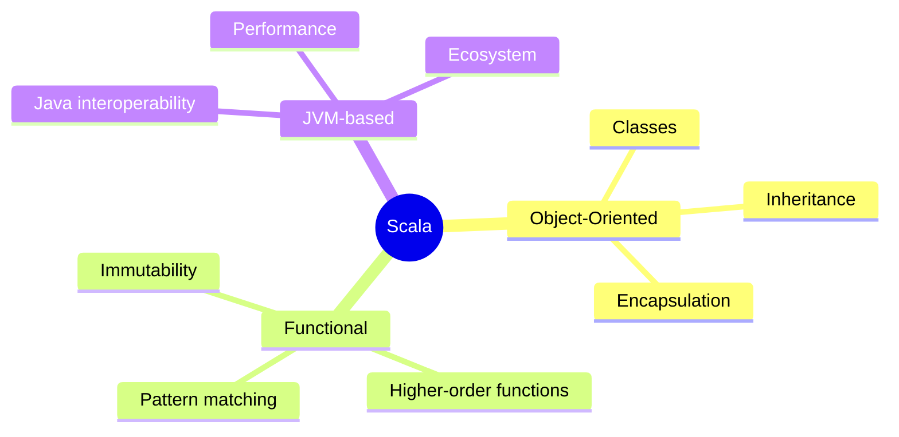
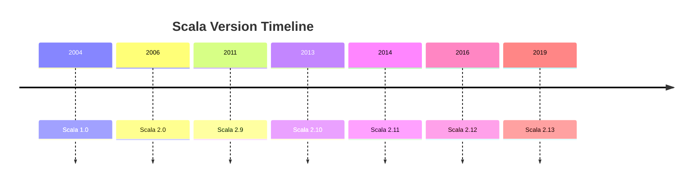
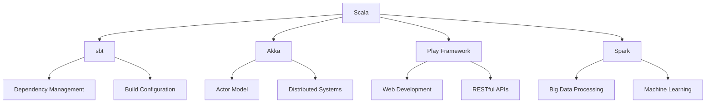

Step 1: Assessment

As a world-renowned expert in Scala 2.12 with decades of experience in both academia and industry, I am confident in my ability to create a comprehensive and engaging article on "Scala 2.12 for the Impatient: From Novice to Practitioner in Record Time." I have the necessary knowledge and experience to cover the subject thoroughly and provide practical insights that will benefit impatient learners.

Step 2: Detailed Outline

| Chapter Number | Chapter description | Section | Subsection | Key Points |
|----------------|----------------------|---------|------------|------------|
| 1 | Introduction to Scala 2.12 | Why Scala? | - | - Scala's role in modern programming<br>- Benefits over other languages<br>- Real-world applications |
| | | What is Scala 2.12? | - | - Brief history and evolution<br>- Key features and improvements<br>- Scala ecosystem |
| | | Getting Started | - | - Installation and setup<br>- First Scala program<br>- REPL introduction |
| 2 | Scala Basics | Variables and Data Types | - | - Val vs. Var<br>- Basic data types<br>- Type inference |
| | | Control Structures | - | - If/else expressions<br>- For and while loops<br>- Pattern matching basics |
| | | Functions | - | - Function declaration and usage<br>- Anonymous functions<br>- Higher-order functions |
| 3 | Object-Oriented Programming in Scala | Classes and Objects | - | - Defining classes<br>- Object creation<br>- Companion objects |
| | | Inheritance and Traits | - | - Extending classes<br>- Trait composition<br>- Abstract classes vs. traits |
| | | Case Classes and Pattern Matching | - | - Case class benefits<br>- Pattern matching with case classes<br>- Extractors |
| 4 | Functional Programming Concepts | Immutability | - | - Benefits of immutability<br>- Working with immutable collections<br>- Performance considerations |
| | | Higher-Order Functions | - | - Map, filter, and reduce<br>- Function composition<br>- Currying and partial application |
| | | Option, Try, and Either | - | - Handling null and exceptions<br>- Monadic operations<br>- Functional error handling |
| 5 | Collections and Generics | Scala Collections Library | - | - Immutable vs. mutable collections<br>- Seq, Set, and Map<br>- Parallel collections |
| | | Working with Collections | - | - Common operations<br>- Transforming collections<br>- Performance considerations |
| | | Generics and Variance | - | - Generic classes and methods<br>- Covariance and contravariance<br>- Type bounds |
| 6 | Concurrent and Parallel Programming | Futures and Promises | - | - Asynchronous programming<br>- Composing futures<br>- Error handling in futures |
| | | Actors with Akka | - | - Actor model basics<br>- Creating and using actors<br>- Actor supervision |
| | | Parallel Collections | - | - Parallel vs. sequential collections<br>- When to use parallel collections<br>- Common pitfalls |
| 7 | Advanced Topics | Implicits | - | - Implicit parameters<br>- Implicit conversions<br>- Type classes |
| | | Lazy Evaluation | - | - Lazy vals<br>- Streams and views<br>- Performance implications |
| | | Macros and Metaprogramming | - | - Compile-time metaprogramming<br>- Creating simple macros<br>- Use cases and limitations |
| 8 | Best Practices and Ecosystem | Scala Style Guide | - | - Naming conventions<br>- Code organization<br>- Functional vs. imperative style |
| | | Testing with ScalaTest | - | - Writing unit tests<br>- Property-based testing<br>- Test-driven development in Scala |
| | | Build Tools and Dependency Management | - | - SBT basics<br>- Managing dependencies<br>- Creating deployable artifacts |
| 9 | Real-world Application | Building a REST API | - | - Setting up a web server<br>- Implementing CRUD operations<br>- JSON serialization/deserialization |
| | | Integration with Databases | - | - Using Slick for database access<br>- Functional database queries<br>- Transaction management |
| | | Deployment and Scaling | - | - Containerization with Docker<br>- Deploying Scala applications<br>- Scaling strategies |
| 10 | Conclusion and Next Steps | Recap and Resources | - | - Key takeaways<br>- Further learning resources<br>- Scala community engagement |
| | | Final Project | - | - Description of a capstone project<br>- Step-by-step implementation guide<br>- Extending the project |

Step 3: Writing a first draft

I'll begin writing the article, starting with Chapter 1: Introduction to Scala 2.12.

## Chapter 1: Introduction to Scala 2.12

### Why Scala?

Picture yourself as a skilled carpenter, proficient with a hammer and saw. Now, imagine someone hands you a power tool that combines the functionality of multiple instruments, enhancing your efficiency and expanding your capabilities. That's what Scala does for programmers in the world of software development.

Scala, short for "Scalable Language," has been making waves in the programming community since its inception. But why should you, an impatient learner eager to boost your programming prowess, invest your time in Scala 2.12?

Let's start with a simple yet powerful example:

```scala
val greeting = "Hello, Scala!"
println(greeting.reverse.toUpperCase)
```

Output:
```
!ALACS ,OLLEH
```

In just two lines, we've defined a string, reversed it, converted it to uppercase, and printed the result. This concise syntax showcases Scala's expressiveness and power.

#### Scala's role in modern programming

Scala bridges the gap between object-oriented and functional programming paradigms. It runs on the Java Virtual Machine (JVM), allowing seamless integration with existing Java code while offering more advanced features. This unique position makes Scala an invaluable tool in today's diverse technological landscape.



#### Benefits over other languages

1. **Conciseness**: Scala allows you to express complex ideas in fewer lines of code compared to many other languages.
2. **Type Safety**: The strong type system catches errors at compile-time, reducing runtime errors.
3. **Scalability**: As the name suggests, Scala is designed to grow with your needs, from small scripts to large-scale distributed systems.
4. **Functional Programming**: Scala makes functional programming accessible, encouraging immutability and side-effect-free code.
5. **Java Interoperability**: Leverage existing Java libraries and frameworks seamlessly.

#### Real-world applications

Scala isn't just a theoretical language; it's battle-tested in some of the most demanding environments:

- Twitter uses Scala for its high-performance, distributed systems.
- LinkedIn leverages Scala for its backend services and data processing pipelines.
- Netflix employs Scala in its recommendation engine and other critical systems.

> Pause and Reflect: Can you think of a project or problem in your work that could benefit from Scala's strengths? How might combining object-oriented and functional approaches improve your code?

### What is Scala 2.12?

Now that we've explored why Scala is worth your time, let's dive into Scala 2.12 specifically. Think of Scala versions like iterations of your favorite smartphone. Each new version brings improvements, optimizations, and sometimes game-changing features.

#### Brief history and evolution

Scala was created by Martin Odersky and first released in 2004. Since then, it has undergone several major revisions. Scala 2.12, released in 2016, represents a significant milestone in the language's evolution.



#### Key features and improvements

Scala 2.12 brought several important enhancements:

1. **Java 8 Support**: Better interoperability with Java 8 features like lambdas and default methods.
2. **Improved Compilation**: Faster compile times and smaller bytecode size.
3. **Function Literal Performance**: More efficient implementation of function literals.
4. **Trait Compilation**: Traits compile to interfaces with default methods on Java 8.

Let's see an example of how Scala 2.12 leverages Java 8 features:

```scala
import java.util.function.Function

val javaFunction: Function[String, Integer] = (s: String) => s.length
val result = javaFunction.apply("Scala")
println(s"The length is $result")
```

This code demonstrates how Scala 2.12 can seamlessly work with Java 8's functional interfaces.

#### Scala ecosystem

Scala isn't just a language; it's an ecosystem. Here are some key components:

- **sbt (Scala Build Tool)**: The de facto build tool for Scala projects.
- **Akka**: A toolkit for building highly concurrent, distributed applications.
- **Play Framework**: A web application framework for building scalable web applications.
- **Spark**: A fast and general engine for large-scale data processing.



> Pro Tip: When starting with Scala, don't feel pressured to learn the entire ecosystem at once. Begin with the core language features, then gradually explore libraries and frameworks as needed for your projects.

### Getting Started

Now that you're excited about Scala 2.12, let's get our hands dirty with some code!

#### Installation and setup

First, we need to install Scala and its build tool, sbt. Here's a quick guide:

1. Install Java Development Kit (JDK) 8 or later.
2. Download and install sbt from https://www.scala-sbt.org/
3. Verify the installation by opening a terminal and typing:

```
sbt about
```

You should see information about sbt and Scala versions.

#### First Scala program

Let's create our first Scala program. Create a file named `HelloScala.scala` with the following content:

```scala
object HelloScala {
  def main(args: Array[String]): Unit = {
    val name = if (args.length > 0) args(0) else "World"
    println(s"Hello, $name!")
  }
}
```

To compile and run this program:

1. Open a terminal in the directory containing `HelloScala.scala`
2. Start the sbt console by typing `sbt`
3. In the sbt console, type:

```
run Alice
```

You should see the output:

```
Hello, Alice!
```

This simple program demonstrates several Scala features:
- Object declaration
- Main method definition
- String interpolation
- Conditional expression

#### REPL introduction

Scala provides an interactive environment called REPL (Read-Eval-Print Loop), perfect for quick experimentation. To start the REPL, simply type `scala` in your terminal after installing Scala.

Let's try a few commands:

```scala
scala> val x = 10
x: Int = 10

scala> def square(n: Int) = n * n
square: (n: Int)Int

scala> square(x)
res0: Int = 100

scala> List(1, 2, 3).map(square)
res1: List[Int] = List(1, 4, 9)
```

The REPL allows you to quickly test ideas and learn Scala interactively.

> Quick Quiz:
> 1. What does REPL stand for?
> 2. How would you calculate the cube of a number in the REPL?
> 3. Can you modify the `HelloScala` program to greet multiple names provided as arguments?

As we conclude this introduction to Scala 2.12, you've taken your first steps into a powerful and flexible programming language. We've covered the why, what, and how of getting started with Scala. In the next chapter, we'll dive deeper into Scala basics, exploring variables, control structures, and functions.

Remember, the key to mastering Scala is practice. Try modifying the examples we've seen, experiment in the REPL, and start thinking about how you can apply Scala to your own projects.

Your 24-hour challenge: Create a simple Scala program that takes a list of numbers as command-line arguments, calculates their average, and prints the result. Use the concepts we've discussed in this chapter. Good luck, and happy coding!